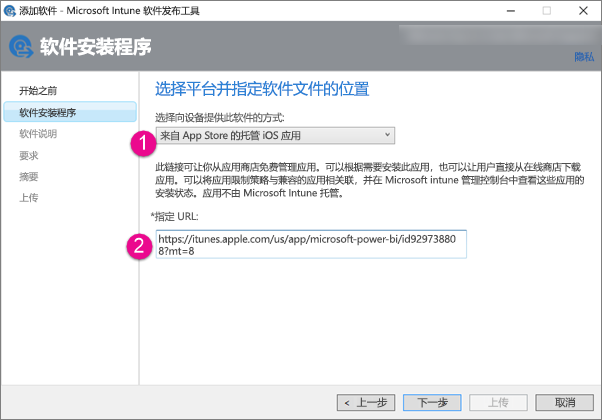
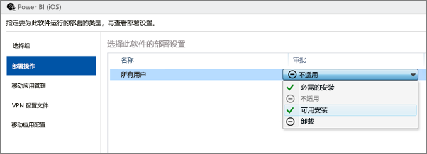
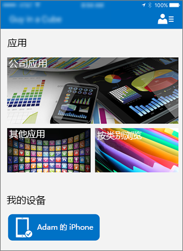
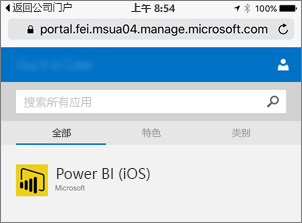
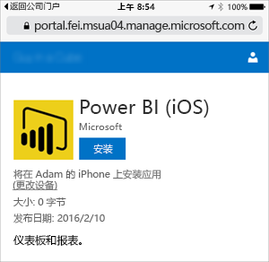

# 使用 Microsoft Intune 配置移动应用

Microsoft Intune 使组织可以管理设备和应用程序。 iOS 版和 Android 版 Power BI 移动应用与 Intune 集成。 借助此集成，用户可以管理设备上的应用，并控制安全性。 通过配置策略，可以控制各项配置，如要求提供访问 PIN、应用如何处理数据，甚至包括在无法使用应用时加密应用数据。

## 常规移动设备管理配置

本文假定 Intune 配置正确，并且你向 Intune 注册了设备。 本文并是完整的 Microsoft Intune 配置指南。 若要详细了解 Intune，请参阅[什么是 Intune？](/intune/introduction-intune/)。

Microsoft Intune 可以在 Office 365 中与移动设备管理 (MDM) 共存。 如果使用的是 MDM，设备显示已在 MDM 中注册，但可供在 Intune 中管理。

> [!NOTE]
> 当你配置 Intune 后，iOS 或 Android 设备上的 Power BI 移动应用便会禁用后台数据刷新。 Power BI 在你进入应用时刷新 Power BI 服务网页版中的数据。

## 第 1 步：获取应用 URL

必须先获取应用 URL，然后才能在 Intune 中创建应用。 对于 iOS，我们会从 iTunes 收到此 url。 对于 Android，可以从 Power BI 移动页面获取它。

请保存 URL，因为稍后创建应用时会用到它。

### 获取 iOS URL

若要获取 iOS 版应用 URL，需要从 iTunes 中获取它。

1. 打开 iTunes。

1. 搜索 Power BI。 

1. 你应看到在 **iPhone 应用**和 **iPad 应用**下列出了 **Microsoft Power BI**。 两个选项都可以使用，因为获取的 URL 是相同的。

1. 选择**获取**下拉列表，然后选择**复制链接**。

    

应用 URL 如下所示： *https://itunes.apple.com/us/app/microsoft-power-bi/id929738808?mt=8* 。

### 获取 Android URL

可以从 [Power BI 移动页](https://powerbi.microsoft.com/mobile/)获取 Google Play URL。 选择“从 Google Play 下载”  即可转到应用页。 可以从浏览器地址栏复制 URL。 应用 URL 如下所示： *https://play.google.com/store/apps/details?id=com.microsoft.powerbim* 。

## 步骤 2：创建移动应用程序管理策略

移动应用程序管理策略使你可以强制实施访问 PIN 这类项目。 可以在 Intune 门户中创建策略。

可以先创建应用程序或策略。 添加它们的顺序并不重要。 它们只需在部署步骤中同时存在。

1. 在 Intune 门户中，依次选择“策略”   > “配置策略”  。

    

1. 选择**添加…** 。

1. 在**软件**下，可以为 Android 或 iOS 选择移动应用程序管理。 若要快速开始，可以选择**创建带有推荐设置的策略**，也可以创建自定义策略。

1. 编辑策略以对应用程序配置所需限制。

## 步骤 3：创建应用程序

应用程序是保存到 Intune 中以进行部署的引用或包。 我们需要创建应用，并引用从 Google Play 或 iTunes 获取的应用 URL。

可以先创建应用程序或策略。 添加它们的顺序并不重要。 它们只需在部署步骤中同时存在。

1. 转到 Intune 门户，然后从左侧菜单中选择**应用**。

1. 选择**添加应用**。 这会启动**添加软件**应用程序。

### 创建 iOS 版应用

1. 从下拉菜单中选择**来自应用程序商店的托管 iOS 应用程序**。

1. 输入从[第 1 步](#step-1-get-the-url-for-the-application)中获取的应用 URL，再选择“下一步”  。

    

1. 提供**发布者**、**名称**和**说明**。 你可以根据需要提供**图标**。 **类别**用于公司门户应用。 完成之后，可选择**下一步**。

1. 可以决定是要将应用作为**任何**（默认值）、**iPad** 还是 **iPhone**进行发布。 默认情况下，它会显示**任何**，并且会同时适用于这两种设备类型。 对于 iPhone 和 iPad，Power BI 应用 URL 是相同的。 选择“下一步”  。

1. 选择“上传”。 

1. 如果列表中没有列出此应用，请刷新页面：先转到“概述”  ，再返回到“应用”  。

    

### 创建 Android 版应用

1. 从下拉菜单中选择**外部链接**。

1. 输入从[第 1 步](#step-1-get-the-url-for-the-application)中获取的应用 URL，再选择“下一步”  。

    

1. 提供**发布者**、**名称**和**说明**。 你可以根据需要提供**图标**。 **类别**用于公司门户应用。 完成之后，可选择**下一步**。

1. 选择“上传”。 

1. 如果列表中没有列出此应用，请刷新页面：先转到“概述”  ，再返回到“应用”  。

    

## 步骤 4：部署应用程序

添加应用程序之后，你需要部署它，以便它可供最终用户使用。 这是将创建的策略与应用绑定的步骤。

### 部署 iOS 版应用

1. 在应用屏幕上，选择创建的应用。 然后选择**管理部署...** 链接。

    

1. 在**选择组**屏幕上，可以选择你要将此应用部署到的组。 选择“下一步”  。

1. 在**部署操作**屏幕上，可以选择要如何部署此应用。 选择**可用安装**或**所需的安装**会使应用在公司门户中可供用户按需安装。 进行选择之后，选择**下一步**。

    

1. 在**移动应用程序管理**屏幕上，可以选择我们在[步骤 2](#step-2-create-a-mobile-application-management-policy) 中创建的移动应用管理策略。 它会默认为你创建的策略（如果这是唯一可用的 iOS 策略）。 选择“下一步”  。

    

1. 在 **VPN 配置文件**屏幕上，可以选择策略（如果你具有用于组织的策略）。 它会默认为**无**。 选择“下一步”  。

1. 在**移动应用程序配置**屏幕上，可以选择**应用程序配置策略**（如果你创建了一个）。 它会默认为**无**。 这不是必需的。 选择**完成**。

部署应用之后，应在应用页面上对已部署显示**是**。

### 部署 Android 版应用

1. 在应用屏幕上，选择创建的应用。 然后选择**管理部署...** 链接。

    
1. 在**选择组**屏幕上，可以选择你要将此应用部署到的组。 选择“下一步”  。

1. 在**部署操作**屏幕上，可以选择要如何部署此应用。 选择**可用安装**或**所需的安装**会使应用在公司门户中可供用户按需安装。 进行选择之后，选择**下一步**。

    

1. 在**移动应用程序管理**屏幕上，可以选择我们在[步骤 2](#step-2-create-a-mobile-application-management-policy) 中创建的移动应用管理策略。 它会默认为你创建的策略（如果这是唯一可用的 Android 策略）。 选择**完成**。

    

部署应用之后，应在应用页面上对已部署显示**是**。

## 步骤 5：在设备上安装应用程序

通过“公司门户”  应用安装应用。 如果你尚未安装公司门户，则可以通过 iOS 平台上的 App Store 或 Android 平台上的应用商店获取它。 你会使用组织登录名登录公司门户。

1. 打开公司门户应用。

1. 如果看不到 Power BI 应用列为特色应用，请选择**公司应用**。

    

1. 选择部署的 Power BI 应用。

    

1. 选择**安装**。

    

1. 如果你在使用 iOS，则它会将应用推送给你。 在推送对话框中选择**安装**。

    

1. 安装应用后，便会看到“应用由公司管理”  。 如果在策略中启用了使用 PIN 进行的访问，则你会看到以下内容。

    

## 后续步骤

[在 Microsoft Intune 控制台中配置和部署移动应用程序管理策略](/intune/app-protection-policies/)  

[适用于移动设备的 Power BI 应用](../consumer/mobile/mobile-apps-for-mobile-devices.md)  

更多问题？ [尝试咨询 Power BI 社区](https://community.powerbi.com/)  
