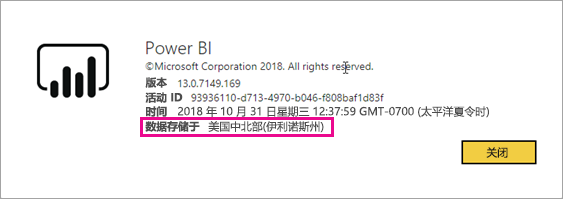

# 我的 Power BI 租户位于何处？

<iframe width="560" height="315" src="https://www.youtube.com/embed/0fOxaHJPvdM?showinfo=0" frameborder="0" allowfullscreen></iframe>

了解 Power BI 租户所处的位置及选择该位置的操作过程。 了解位置很重要，因为它可能会影响你与服务的交互。

## 如何确定 Power BI 租户所处的位置

若要查找租户所在的区域，请按以下步骤操作。

1. 在 Power BI 服务的顶部菜单栏中，依次选择帮助图标 (?)和“关于 Power BI”。

1. 查看“**您的数据存储于**”旁的值。 这是租户所在的区域。 该值也是存储数据的区域，除非你为工作区的不同区域使用专用容量。

    

## 选择该数据区域的操作过程

数据区域是以你在创建租户时所选的国家/地区为依据。 此选择应用于 Powe BI 和 Microsoft 365 注册，因为此类信息是共享的。 如果这是新租户，请在注册时从列表中选择相应的国家/地区。

Power BI 选取最靠近你的选择的数据区域，这决定了租户数据存储位置。

> [!IMPORTANT]
> 创建租户后，便无法更改此选择。

更多问题？ [尝试参与 Power BI 社区](https://community.powerbi.com/)

