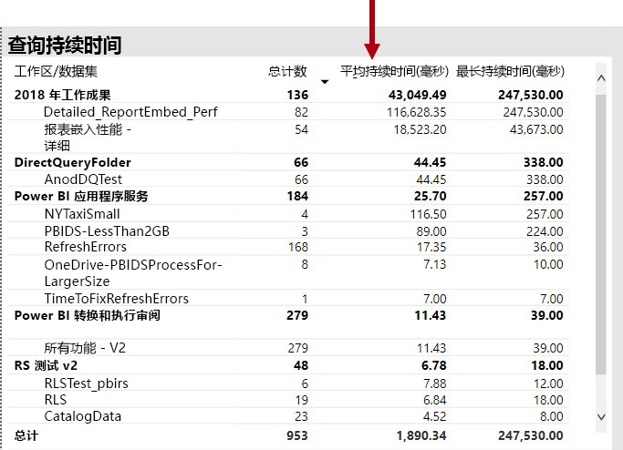
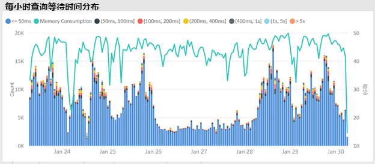

# 高级容量方案

本文介绍已实现 Power BI Premium 容量的实际方案。 其中介绍了常见问题和挑战以及如何确定问题，并帮助解决这些问题：

- [使数据集保持最新](#keeping-datasets-up-to-date)
- [确定响应缓慢的数据集](#identifying-slow-responding-datasets)
- [确定数据集偶尔响应缓慢的原因](#identifying-causes-for-sporadically-slow-responding-datasets)
- [确定是否有足够的内存](#determining-whether-there-is-enough-memory)
- [确定是否有足够的 CPU](#determining-whether-there-is-enough-cpu)

相关步骤以及图表和表格示例来自 **Power BI Premium 容量指标应用**，Power BI 管理员将有权访问该应用。

## 使数据集保持最新

在此方案中，如果用户抱怨报表数据有时看起来陈旧或“过时”，则触发调查。

在应用中，管理员与“刷新”视觉对象交互，并按“最大等待时间”以降序对数据集进行排序   。 此视觉对象可帮助他们揭示等待时间最长的数据集，并按工作区名称进行分组。

在“每小时平均刷新等待时间”视觉对象中，他们注意到刷新等待时间始终在每天下午 4 点左右达到峰值  。

这些结果有几种可能的解释：

- 可能同时发生过多刷新尝试，超出容量节点定义的限制。 在此案例中，具有默认内存分配的 P1 上出现了六个并发刷新。

- 要刷新的数据集可能太大，而无法被可用内存容纳（内存至少需要为完全刷新所需内存的 2 倍）。
- 低效的 Power Query 逻辑可能会导致数据集刷新期间内存使用量激增。 在忙碌的容量中，此激增可能偶尔达到物理限制，导致刷新失败，并可能影响容量上的其他报表视图操作。
- 由于可用内存有限，需要保留在内存中的经常查询的数据集可能会影响其他数据集的刷新能力。

为了帮助调查，Power BI 管理员可注意以下情况：

- 当可用内存小于要刷新的数据集的 2 倍大小时，数据刷新时可用内存不足。
- 数据集未在刷新且刷新前不在内存中，但在繁忙的刷新期间开始显示交互式流量。 若要查看在任何给定时间内加载到内存中的数据集，Power BI 管理员可查看应用中“数据集”选项卡的数据集区域  。 管理员随后可通过单击“每小时加载的数据集计数”中的条形图之一来交叉筛选到给定时间  。 下图所示的局部激增指示多个数据集加载到内存中的某个小时，这可能推迟计划刷新的开始时间。
- 计划的数据刷新要开始时，数据集逐出次数增加。 逐出可能指示因在刷新前服务过多不同的交互式报表而导致的高度内存压力。 “每小时数据集逐出和内存占用率”视觉对象可明确指示逐出激增  。

下图显示已加载数据集中的局部激增，这表明交互式查询推迟了刷新的开始。 选择“每小时加载的数据集计数”视觉对象中的某个时间段将对“数据集大小”视觉对象进行交叉筛选   。

Power BI 管理员可通过采取以下步骤来尝试解决问题，以确保数据刷新开始时有足够的内存可用：

- 联系数据集所有者，要求他们交错安排数据刷新计划。
- 通过删除不需要的仪表板或仪表板磁贴（尤其是那些强制执行行级安全性的仪表板或仪表板磁贴），减少数据集查询负载。
- 通过优化 Power Query 逻辑来加速数据刷新。 改进对计算列或计算表的建模。 减少数据集大小或配置更大的数据集用于执行增量数据刷新。

## 确定响应缓慢的数据集

在此方案中，如果用户抱怨某些报表的打开时间过长并有时会挂起，则调查开始。

在应用中，Power BI 管理员可使用“查询持续时间”视觉对象，通过按“平均持续时间”对数据集进行降序排序来确定性能最差的数据集   。 此视觉对象还显示数据集查询计数，因此，可查看数据集的查询频率。

管理员可参考“查询持续时间分布”视觉对象，该视觉对象显示已筛选时间段内存储查询性能（<= 30 毫秒、0-100 毫秒）的总体分布情况  。 通常情况下，大多数用户将耗时一秒或更短的查询视为有响应；耗时更长的查询往往会给人留下性能不佳的印象。

借助“每小时查询持续时间分布”视觉对象，Power BI 管理员可确定容量性能被视为不佳的某个小时  。 表示查询持续时间超过一秒的条段越大，用户视之为性能不佳的风险就越大。

视觉对象是交互式的，在选定条段的情况下，报表页面上相应的“查询持续时间”表视觉对象会进行交叉筛选，以显示其表示的数据集  。 这种交叉筛选使 Power BI 管理员可以轻松确定响应缓慢的数据集。

下图显示按“每小时查询持续时间分布”进行筛选的视觉对象，重点关注在一小时 Bucket 中性能最差的数据集  。 

在特定的一小时时间范围内确定性能不佳的数据集后，Power BI 管理员可调查性能不佳是由容量重载引起，还是由设计不当的数据集或报表引起。 他们可参考“查询等待时间”视觉对象，并按平均查询等待时间对数据集进行降序排序  。 如果有大量查询正在等待，则对数据集的高需求可能是过多查询等待的原因。 如果平均查询等待时间很长（> 100 毫秒），则可能需要检查数据集和报表以了解是否可进行优化。 例如，减少给定报表页面上的视觉对象或进行 DAX 表达式优化。

查询等待时间在数据集中累积的可能原因有如下几个：

- 非最优的模型设计、度量值表达式甚或报表设计，所有可能导致消耗大量 CPU 并长时间运行的查询的情况。 这会迫使新查询等待，直到 CPU 线程变为可用，并可能导致护航效应 (convoy effect)（类似于交通拥堵），这在高峰业务时段很常见。 “查询等待”页面将是确定数据集是否具有较高的平均查询等待时间的主要资源  。
- 大量并发容量用户（数百至数千个）使用同一报表或数据集。 即使是设计精良的数据集也会在超出并发阈值时性能不佳。 这通常由显示的查询计数值远高于其他数据集显示的查询计数值的单个数据集指示（例如，一个数据集的查询数为 300,000，而所有其他数据集的查询数均低于 30,000）。 在某些时候，等待此数据集的查询将开始错开，这可在“查询持续时间”视觉对象中看到  。
- 并发查询许多不同的数据集，进而导致抖动，因为数据集频繁循环进出内存。 当数据集加载到内存中时，这会导致用户遇到性能降低的情况。 若要进行确认，Power BI 管理员可参考“每小时数据集逐出和内存占用率”视觉对象，该视觉对象可指示正在重复逐出大量加载到内存中的数据集  。

## 确定数据集偶尔响应缓慢的原因

在此方案中，如果用户提到报表视觉对象有时响应缓慢或可能变得无响应，但其他时候的响应速度可以接受，则应该开始调查。

在应用中，“查询持续时间”部分用于通过以下方式查找导致问题的数据集  ：

- 在“查询持续时间”视觉对象中，管理员逐个筛选数据集（从最上方的已查询数据集开始），并在“每小时查询分布”视觉对象中检查经过交叉筛选的条形   。
- 如果单个一小时条形显示的所有查询持续时间组与该数据集其他一小时条形之间的比率出现显著变化（例如，颜色之间的比率显著变化），这表示此数​​据集的性能展示散发性变化。
- 如果一小时条形显示的性能不佳查询部分不规则，则指示该数据集受到其他数据集活动引起的坏邻居效应 (noisy neighbor effect) 影响的时间范围。

下图显示 1 月 30 日的某个小时，其中数据集的性能发生了重大退步，由“(3,10s]”执行持续时间 Bucket 的大小指示。 单击该一小时条形可显示在此期间加载到内存中的所有数据集，揭示可能导致坏邻居效应的数据集。

确定有问题的时间范围后（例如，上图中的 1 月 30 日期间），Power BI 管理员可删除所有数据集筛选器，然后仅按该时间范围进行筛选，以确定在此时间范围内被主动查询的数据集。 导致坏邻居效应的数据集通常是被查询最多的数据集或平均查询持续时间最长的数据集。

可通过将导致问题的数据集分布在不同高级容量或共享容量（如果数据集大小、占用率要求和数据刷新模式受到支持）的不同工作区中来解决此问题。

反之亦然。 Power BI 管理员可确定数据集查询性能大幅提升的时间，然后查找缺失的信息。 如果此时缺少某些信息，则可能有助于指向引起问题的原因。

## 确定是否有足够的内存

若要确定是否有足够的内存供容量完成其工作负荷，Power BI 管理员可在应用的“数据集”选项卡中参考“已用内存百分比”视觉对象   。 **全部**（总）内存表示加载到内存中的数据集消耗的内存，而无论它们是否被主动查询或处理。 **活动**内存表示正在被主动处理的数据集所消耗的内存。

在容量正常的情况下，视觉对象将如下所示，显示全部（总）内存与活动内存之间的差距：

在容量遇到内存压力的情况下，同一视觉对象将清楚显示活动内存和总内存的融合，这意味着不可能再将其他数据集加载到内存中。 在这种情况下，Power BI 管理员可单击“容量重启”（在管理门户的容量设置区域的“高级选项”中）   。 重启容量会导致从内存中刷新所有数据集，并允许它们根据需要重载到内存中（通过查询或数据刷新）。

## 确定是否有足够的 CPU

通常情况下，容量的平均 CPU 利用率应保持在 80% 以下。 超过此值表示容量正在接近 CPU 饱和。

CPU 饱和的影响通过比应该花费的时间更长的操作表示，这是因为在尝试处理所有操作时，容量会执行许多 CPU 上下文切换。 在具有大量并发查询的高级容量中，这由较长的查询等待时间表示。 较长的查询等待时间导致响应速度比平常慢。 通过查看“每小时查询等待时间分布”视觉对象，Power BI 管理员可以轻松确定 CPU 何时饱和  。 查询等待时间计数的周期性峰值表明潜在的 CPU 饱和度问题。

如果它们是导致 CPU 饱和的原因，则有时可在后台操作中检测到​​类似的模式。 Power BI 管理员可查找特定数据集在刷新时间的周期性峰值，这可表示当时的 CPU 饱和度（可能是因为其他正在进行的数据集刷新和/或交互式查询）。 在此实例中，参考应用中的“系统”视图不一定能够揭示 CPU 利用率处于 100%  。 “系统”视图显示每小时平均值，但 CPU 可能在几分钟的繁重操作中变得饱和，这显示为等待时间激增  。

CPU 饱和的影响还有更多细微差别。 虽然等待的查询数很重要，但查询等待时间将始终在某种程度上出现，而不会导致明显的性能下降。 一些数据集（平均查询时间更长，表明复杂性或大小）比其他数据集更容易受到 CPU 饱和的影响。 若要轻松确定这些数据集，Power BI 管理员可在“每小时等待时间分布”视觉对象中寻找条形的颜色组合变化  。 发现异常条形后，他们可以查找在此时间段内具有查询等待的数据集，还可以查看与平均查询持续时间相比的平均查询等待时间。 当这两个指标的数量级相同并且数据集的查询工作负荷很重要时，数据集可能会受到 CPU 不足的影响。

当数据集被多个用户在短时间内突发用于高频查询时（例如，在训练会话中），此影响尤为明显，并会导致 CPU 在每个突发期间饱和。 在这种情况下，此数据集可能会经历大量查询等待时间，并且会影响容量上的其他数据集（坏邻居效应）。

在某些情况下，Power BI 管理员可要求数据集所有者通过创建仪表板（使用任何数据集刷新定期查询缓存的磁贴）来创建较少波动的查询工作负荷。 这可帮助防止仪表板加载时出现峰值。 对于给定业务需求，此解决方案并非始终可行，但是，它是避免 CPU 饱和而无需更改数据集的有效方法。

## 致谢

本文由 Peter Myers、数据平台 MVP 和独立的 BI 专家通过 [Bitwise Solutions](https://www.bitwisesolutions.com.au/) 撰写。

## 后续步骤

> [!div class="nextstepaction"]
> [使用应用监视高级容量](service-admin-premium-monitor-capacity.md)    
> [!div class="nextstepaction"]
> [在管理门户中监视容量](service-admin-premium-monitor-portal.md)   

更多问题？ [尝试咨询 Power BI 社区](https://community.powerbi.com/)

||||||