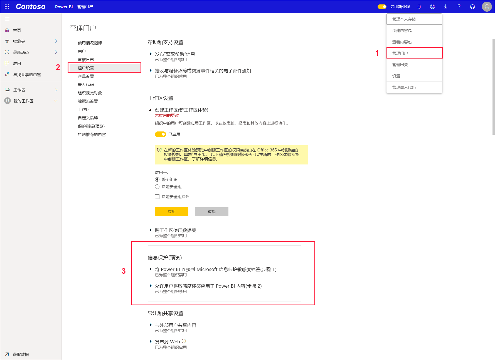
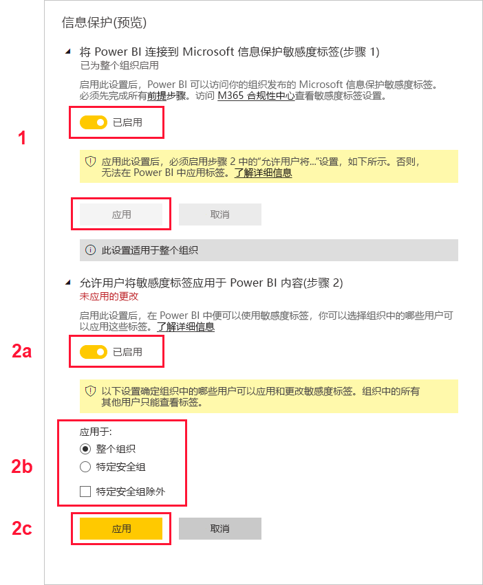

# 在 Power BI 中启用数据敏感度标签（预览）

在 Power BI 中启用 [Microsoft 信息保护数据敏感度标签](https://docs.microsoft.com/microsoft-365/compliance/sensitivity-labels)时，以下内容适合：

* 组织中的某些用户和安全组可以分类并[应用敏感标签](../designer/service-security-apply-data-sensitivity-labels.md)到其 Power BI 仪表板、报表、数据集和数据流（后文简称为“资产”）  。
* 组织中的所有成员都可以查看这些标签。

数据敏感度标签通过使 Power BI 创建者和用户知道数据敏感度，并向他们提供有关分类含义以及如何处理该分类的数据信息，从而促进数据保护。

将具有数据敏感度标签的 Power BI 数据导出到 Excel、PowerPoint 或 PDF 文件时，其数据敏感度也会一起导出。 这意味着，由于敏感度标签策略而无权访问带标签的数据的用户将无法在 Power BI（在 Excel、PowerPoint 或 PDF 应用中）外部打开文件  。

启用数据敏感度标签需要 Azure 信息保护许可证。 有关更多详细信息，请参阅[授权](#licensing)。

## 启用数据敏感度标签

若要在 Power BI 中使用 Microsoft 信息保护数据敏感度标签，请转到 Power BI 管理门户，打开“租户设置”窗格，并找到“信息保护”部分。

在“信息保护”部分，执行以下步骤  ：
1.  启用“启用 Microsoft 信息保护敏感度标签”开关，并点击“应用”   。 此步骤仅使敏感度标签对整个组织可见；它不会应用任何标签  。 若要定义哪些用户可以在 Power BI 中应用这些标签，需要完成步骤 2。
2.  定义哪些用户可以在 Power BI 资产中应用和更改敏感度标签。 此步骤包括三个操作：
    1.  启用“设置 Power BI 内容和数据的敏感度标签”开关  。
    2.  选择相关的安全组。 默认情况下，组织中的每个人都能够应用敏感度标签。 但是，可以选择仅为特定用户或安全组启用敏感度标签。 选择整个组织或特定安全组后，可以排除特定的用户或安全组子集。
    * 为整个组织启用敏感度标签时，例外情况通常是安全组。
    * 只为特定用户或安全组启用敏感度标签时，例外通常是特定的用户。  
    该方法可以防止某些用户在 Power BI 中应用敏感度标签，即使他们不属于有权执行此操作的组。
    
    3. 点击“应用”  。

> [!IMPORTANT]
> 只有拥有“创建”和“编辑”资产权限，以及在本部分中设置的相关安全组成员的 Power BI Pro 用户，才能设置和编辑敏感度标签   。 不属于本组的用户无法设置或编辑标签。 

## 注意事项和限制

Power BI 使用 Microsoft 信息保护敏感度标签。 因此，如果在尝试启用敏感度标签时遇到错误信息，则可能是由下列原因之一造成的：

* 没有 Azure 信息保护[许可证](#licensing)。
* 敏感度标签尚未迁移到 Power BI 支持的 Microsoft 信息保护版本。 了解关于[迁移敏感度标签](https://docs.microsoft.com/azure/information-protection/configure-policy-migrate-labels)的详细信息。
* 组织中未定义 Microsoft 信息保护敏感度标签。 此外，标签必须是已发布策略的一部分才能使用。 [了解敏感度标签的详细信息](https://docs.microsoft.com/Office365/SecurityCompliance/sensitivity-labels)，或访问 [Microsoft 安全与合规中心](https://sip.protection.office.com/sensitivity?flight=EnableMIPLabels)，了解如何为组织定义标签和发布策略。

## 授权

* 如需查看或应用 Power BI 中的 Microsoft 信息保护标签，用户必须有 Azure 信息保护高级版 P1 或高级版 P2 许可证。 Microsoft Azure 信息保护可以单独购买，也可以通过 Microsoft 许可套件之一购买。 有关详细信息，请参阅 [Azure 信息保护定价](https://azure.microsoft.com/pricing/details/information-protection/)。
* 需要在 Power BI 资产上应用标签的用户必须具有 Power BI Pro 许可证。

## 后续步骤

本文介绍如何在 Power BI 中启用数据敏感度标签。 以下文章提供了有关 Power BI 中数据保护的详细信息。 

* [Power BI 中的数据保护概述](service-security-data-protection-overview.md)
* [在 Power BI 中应用数据敏感度标签](../designer/service-security-apply-data-sensitivity-labels.md)
* [在 Power BI 中使用 Microsoft Cloud App Security 控件](service-security-using-microsoft-cloud-app-security-controls.md)
* [数据保护指标报表](service-security-data-protection-metrics-report.md)