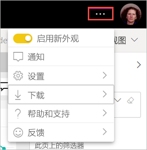

# 选择使用工作区“新外观”（预览）

工作区具有与 Power BI 服务的[新外观](../consumer/service-new-look.md)一致的新外观。 使用 Power BI 服务 (app.powerbi.com) 的任何用户均可选择使用。 在黑色标题栏中打开“新外观”后，即选择对报表和工作区使用新外观  。 所有工作区（无论是经典工作区还是新工作区）都可以从新外观中获益。

正在查找有关 Power BI Desktop 中新外观的信息  ？ 请参阅[在 Power BI Desktop 中使用更新后的功能区](../create-reports/desktop-ribbon.md)。

## 新外观的功能

:::image type="content" source="media/service-workspaces-new-look/power-bi-workspace-new-look-numbered.png" alt-text="工作区的新外观（使用标注编号提供说明）":::

|数字  |工作原理 |
|---------|---------|
|    | 获取数据  ：更容易将内容添加到工作区。 选择“+ 新建”按钮可连接到数据、打开文件并创建报表和仪表板等  。  |
|   | 视图切换器  ：若要查看你的数据流、数据集、报表和仪表板之间的连接，以及它们与其他数据源的连接，请在“列表”视图和“世系”视图之间切换   。 |
|  | 在工作区内搜索  ：在新搜索框中搜索工作区中的所有内容。  |
|   | 列表和选项卡  ：工作区中的所有内容都位于仪表板、报表、数据集等的平面列表中，如 SharePoint。 你不会在打开工作区时得到一个可能是空的“仪表板”选项卡，并搞不清楚内容所在的位置  。 下面是新的选项卡顺序：  **全部**：在工作区中显示所有内容（仪表板、报表、工作簿、分页报表、数据集和数据流）。  **内容**：收集工作区中创建的用于消耗的所有内容（仪表板、报表、工作簿和分页报表）。  **数据集 + 数据流**：收集工作区中的所有数据集和数据流，以便轻松进行数据管理。 |
|  | 筛选器  ：对于具有数百个项目的工作区，可以在“筛选器”窗格中筛选内容。 应用筛选器后，内容列表顶部会出现筛选器。 |

快速操作  ：将鼠标悬停在列表中的内容上时，会看到该项目的最常见操作，以及“更多选项”(...) 菜单中提供的其他操作  。

:::image type="content" source="media/service-workspaces-new-look/power-bi-workspace-new-look-quick-actions.png" alt-text="新工作区中的快速操作":::

## 选择启用新外观

任何 Power BI 服务用户都可以选择启用新外观。 只需将开关从“禁用新外观”滑动到“启用新外观”即可   。

如果需要返回旧外观，只需将开关滑动回到“关”  。 如果看不到此开关，请选择右上角的省略号菜单。

## 后续步骤

- [在 Power BI Desktop 中使用更新后的功能区](../create-reports/desktop-ribbon.md)
- [Power BI 服务的“新外观”](../consumer/service-new-look.md)
- 是否有任何问题? [尝试参与 Power BI 社区](https://community.powerbi.com/)
