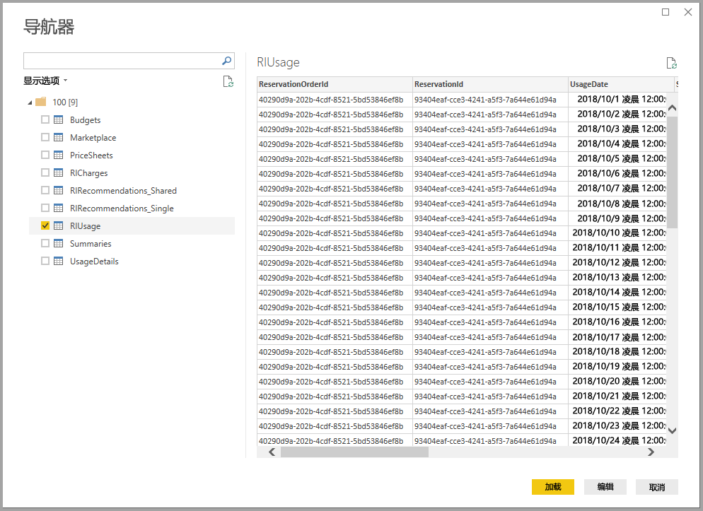

# 在 Power BI Desktop 中连接到 Azure 使用见解数据

可以使用 Power BI Desktop 连接到 Azure，并获取有关组织的 Azure 服务使用情况的深度数据。 可以使用这些数据创建自定义报表和度量值，从而更好地了解和分析 Azure 支出。

> [!NOTE]
> 对 Microsoft Azure 使用见解 (Beta) 的支持有限。 对于新功能，请使用[适用于 Power BI 的 Azure 成本管理连接器](desktop-connect-azure-cost-management.md)。

## 使用 Azure 使用见解连接

通过 Azure 使用见解可连接到 Azure 企业协议计费帐户。

本部分介绍如何使用 Azure 企业连接器获取需要迁移的数据。 还可以在 ACI（Azure 使用见解）API 中找到可用的使用情况详细信息列映射   。

要成功使用 Azure 使用见解连接器，需要能够访问 Azure 门户企业功能  。

要使用 Power BI Desktop 中的 Azure 使用见解连接器，请执行以下操作   ： 

1. 从“开始”功能区选择“获取数据”   。

1. 从左侧的类别中选择“联机服务”  。  

1. 选择“Microsoft Azure 使用见解 (Beta)”  。 

1. 选择“连接”  。

   

   在出现的对话框中，输入你的“Azure 注册号”  。

   

   * 可以从 [Azure Enterprise Portal](https://ea.azure.com) 获取合约编号，获取位置如下图所示：

  

   此版本的连接器仅支持来自 https://ea.azure.com 的企业合约。 目前尚不支持中国合约。

   接下来，提供“访问密钥”  进行连接。

   

   * 合约的访问密钥可在 [Azure Enterprise Portal](https://ea.azure.com) 上找到。

  

提供“访问密钥”并选择“连接”后，将出现“导航”窗口并显示九个可用的表    ：

| 表        | 说明 |
|------------- | -------------------------------------------------------------|
| **预算** | 提供预算详细信息，以查看针对现有预算目标的实际成本或使用情况。 |
| **市场** | 基于使用情况的 Azure 市场费用。 |
| **价目表** | 为注册提供适用的费率（由指示器计费）。 |
| **RICharges** | 过去 24 个月与预留实例相关联的费用。 |
| **RIRecommendations_Single** | 根据过去 7 天、30 天或 60 天单个订阅的使用趋势得出的预留实例购买建议。 |
| **RIRecommendations_Shared** | 根据过去 7 天、30 天或 60 天所有订阅的使用趋势得出的预留实例购买建议。 |
| **RIUsage** | 上个月现有预留实例的使用情况详细信息。 |
| **摘要** | 余额、新购买、Azure 市场服务费用、调整和超额费用的月度摘要。 |
| **UsageDetails** | 已使用量的明细和估算的注册费用。 |

可以选中任意表旁边的复选框来查看预览。 可以通过勾选表名称旁边的框来选择一个或多个表，然后选择“加载”  。

> [!NOTE]
> “摘要”和“价目表”这两个表仅适用于注册级 API 密钥   。 此外，这些表中的数据默认包含“使用情况”  和“价目表”  的当前月份数据。 未将“摘要”  和“市场”  这两个表限制到当前月份。
>
>

选择“加载”时，数据将加载到 Power BI Desktop   。

加载所选数据后，可以在“字段”  窗格中看到选择的表和字段。

## 使用 Azure 使用情况见解
要使用 Azure 使用见解连接器，请访问 Azure 门户企业功能  。

使用 Azure 使用见解连接器成功加载数据后，可以使用“查询编辑器”创建自己的自定义度量值和列   。 并且可以创建可在 Power BI 服务中共享的视觉对象、报表和仪表板  。

使用空查询可以检索 Azure 自定义查询集合示例。 可以通过两种方法执行此检索： 

在 Power BI Desktop 中执行以下操作  ： 

1. 选择“开始”功能区  
2. 选择“获取数据” > “空查询”   

或者在“查询编辑器”中执行以下操作  ： 

1. 单击左侧的“查询”窗格  
2. 从显示的菜单中选择“新建查询”>“空查询” 

在编辑栏中键入以下内容  ：

    = MicrosoftAzureConsumptionInsights.Contents

下图展示的是出现的示例集合。

处理报表和创建查询时，可以：

* 要定义从当前日期开始的月数，请使用 numberOfMonth 
  * 使用介于 1 到 36 之间的值。 表示自当前日期开始要导入的月数。 建议不要获取超过 12 个月的数据。 此限制可避免 Power BI 查询导入约束和数据量阈值。
* 要在历史时间窗口中定义一段时间内的月份，请使用 startBillingDataWindow  和 endBillingDataWindow 
* 请勿将 numberOfMonth 与 startBillingDataWindow 或 endBillingDataWindow 一起使用   

## 从 Azure 企业连接器迁移

一些客户使用 Azure 企业连接器 (Beta) 创建视觉对象  。 最终它将替换为 Azure 使用见解连接器  。 新的连接器具有以下功能和增强：

* “余额汇总”  和“市场购买”  可用的其他数据来源
* 新增参数和高级参数，如 startBillingDataWindow  和 endBillingDataWindow 
* 更好的性能和响应能力

接下来的步骤演示如何转换为 Azure 使用见解连接器  。 这些步骤保留在创建自定义仪表板或报表时已完成的工作。

### 步骤 1：使用新的连接器连接到 Azure
第一步是使用前文介绍过的 Azure 使用见解连接器  。 在此步骤中，在 Power BI Desktop  的“主页”  功能区中选择“获取数据”>“空查询”  。

### 步骤 2：使用高级编辑器创建查询
在“查询编辑器”中，从“开始”功能区的“查询”部分选择“高级编辑器”     。 在出现的“高级编辑器”窗口中，输入此查询  ：

    let    
        enrollmentNumber = "100",
        optionalParameters = [ numberOfMonth = 6, dataType="DetailCharges" ],
        data = MicrosoftAzureConsumptionInsights.Contents(enrollmentNumber, optionalParameters)   
    in     
        data

需要将 enrollmentNumber 值替换为自己的注册号  。 可以从 [Azure Enterprise 门户](https://ea.azure.com)获取该编号。 numberOfMonth 参数表示要从当前日期返回几个月的数据  。 当前月份用零 (0) 表示。

在“高级编辑器”窗口中选择“完成”后，预览将会刷新，表中会显示指定月份范围的数据   。 选择“关闭并应用”  ，然后返回。

### 步骤 3：将度量值和自定义列移动到新报表
接下来，需要将创建的全部自定义列或度量值移动到新的详细信息表中。 步骤如下。

1. 打开记事本（或其他文本编辑器）。
2. 选择要移动的度量值，从“公式”字段中复制文本并粘贴到记事本中  。

   
3. 将 Query1  重命名为原始详细信息表名称。
4. 若要创建新的表度量值和自定义列，请右键单击表，然后选择“新建度量值”  。 然后剪切并粘贴存储的度量值和列，直到全部完成。

### 步骤 4：重新关联具有关系的表
许多仪表板包含用于查找或筛选的其他表，例如日期表或用于自定义项目的表。 重新建立这些关系可解决大部分遗留问题。 下面介绍如何执行该操作。

- 在 Power BI Desktop  的“建模”  选项卡中，选择“管理关系”  会弹出允许你管理模型中关系的窗口。 根据需要重新关联表。

    

### 步骤 5：验证视觉对象，并根据需要调整字段格式
此时大部分原始视觉对象、表和向下钻取应该按预期方式工作。 不过可能需要进行一些小调整，才能精确地设置外观和风格。 花点时间查看每个仪表板和视觉对象，确保它们按预期显示。

## 使用 Azure 使用情况和见解 (ACI) API 获取使用情况数据
Azure 还提供了 [Azure 使用情况和见解 (ACI) API  ](https://azure.microsoft.com/blog/announcing-general-availability-of-consumption-and-charge-apis-for-enterprise-azure-customers/)。 用户可以使用 ACI API 创建自己的自定义解决方案来收集、报告和直观显示 Azure 使用情况信息。

### 映射门户、连接器和 API 之间的名称和使用情况详细信息
Azure 门户列和详细名称与 API 和连接器中的相关信息类似，但并不总是完全一致。 为了阐明这一点，下表提供了一个映射。 还指示了列是否已过时。 若要了解详细信息和术语定义，请查看 [Azure 帐单数据字典](https://docs.microsoft.com/azure/billing/billing-enterprise-api-usage-detail)。

| ACI 连接器/ContentPack ColumnName | ACI API 列名称 | EA 列名称 | 已过时/用于向后兼容 |
| --- | --- | --- | --- |
| AccountName |accountName |Account Name |否 |
| AccountId |accountId | |是 |
| AcccountOwnerId |accountOwnerEmail |AccountOwnerId |否 |
| AdditionalInfo |additionalInfo |AdditionalInfo |否 |
| AdditionalInfold | | |是 |
| Consumed Quantity |consumedQuantity |Consumed Quantity |否 |
| Consumed Service |consumedService |Consumed Service |否 |
| ConsumedServiceId |consumedServiceId | |是 |
| 开销 |cost |ExtendedCost |否 |
| Cost Center |costCenter |Cost Center |否 |
| 日期 |date |日期 |否 |
| 日 | |日 |否 |
| DepartmentName |departmentName |Department Name |否 |
| DepartmentID |departmentId | |是 |
| Instance ID | | |是 |
| InstanceId |instanceId |Instance ID |否 |
| 位置 | | |是 |
| Meter Category |meterCategory |Meter Category |否 |
| Meter ID | | |是 |
| Meter Name |meterName |Meter Name |否 |
| Meter Region |meterRegion |Meter Region |否 |
| Meter Sub-Category |meterSubCategory |Meter Sub-Category |否 |
| MeterId |meterId |Meter ID |否 |
| 月 | |月 |否 |
| 产品 |产品 |产品 |否 |
| ProductId |productId | |是 |
| Resource Group |resourceGroup |Resource Group |否 |
| Resource Location |resourceLocation |Resource Location |否 |
| ResourceGroupId | | |是 |
| ResourceLocationId |resourceLocationId | |是 |
| ResourceRate |resourceRate |ResourceRate |否 |
| ServiceAdministratorId |serviceAdministratorId |ServiceAdministratorId |否 |
| ServiceInfo1 |serviceInfo1 |ServiceInfo1 |否 |
| ServiceInfo1Id | | |是 |
| ServiceInfo2 |serviceInfo2 |ServiceInfo2 |否 |
| ServiceInfo2Id | | |是 |
| Store Service Identifier |storeServiceIdentifier |Store Service Identifier |否 |
| StoreServiceIdentifierId | | |是 |
| 订阅名称 |subscriptionName |订阅名称 |否 |
| 标记 |标记 |标记 |否 |
| TagsId | | |是 |
| Unit Of Measure |unitOfMeasure |Unit Of Measure |否 |
| 年份 | |年份 |否 |
| SubscriptionId |subscriptionId |SubscriptionId |是 |
| SubscriptionGuid |subscriptionGuid |SubscriptionGuid |否 |

## 后续步骤

可使用 Power BI Desktop 连接到多个不同数据源。 有关详细信息，请参阅以下文章：

* [在 Power BI Desktop 中连接到 Azure 成本管理数据](desktop-connect-azure-cost-management.md)
* [什么是 Power BI Desktop？](../fundamentals/desktop-what-is-desktop.md)
* [Power BI Desktop 中的数据源](desktop-data-sources.md)
* [使用 Power BI Desktop 调整和合并数据](desktop-shape-and-combine-data.md)
* [通过 Power BI Desktop 连接到 Excel 工作簿](desktop-connect-excel.md)   
* [直接将数据输入到 Power BI Desktop 中](desktop-enter-data-directly-into-desktop.md)   
