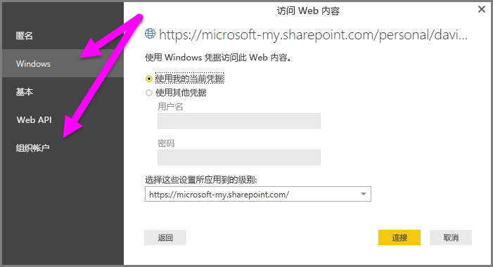

# 在 Power BI Desktop 中使用 OneDrive for Business 链接
很多人将 Excel 工作簿存储在 OneDrive for Business 中，这在 Power BI Desktop 中使用起来非常方便。 通过 Power BI Desktop，你可以使用 OneDrive for Business 中存储的 Excel 文件的联机链接来创建报表和视觉对象。 你可以使用 OneDrive for Business 组帐户或 OneDrive for Business 个人帐户。

从 OneDrive for Business 获取联机链接时需执行几个特定步骤。 以下各节将说明这些步骤。这些步骤允许你在组之间、不同计算机之间以及与同事之间共享文件链接。

## 从 Excel 获取链接
1. 使用浏览器导航到你的 OneDrive for Business 位置。 右键单击你要使用的文件，并选择**在 Excel 中打开**。
   
   > [!NOTE]
   > 你的浏览器界面可能与以下图像不完全相同。 可以通过多种方法为 OneDrive for Business 浏览器界面中的文件选择“在 Excel 中打开”  。 可使用任何允许你在 Excel 中打开文件的选项。
   > 
   > 
   
   
2. 在 Excel 中，选择“文件” **“信息”，然后选择“保护工作簿”上方的“复制路径”**  >     。
   
   

## 在 Power BI Desktop 中使用链接
在 Power BI Desktop 中，你可以使用刚刚复制到剪贴板的链接。 可执行以下步骤：

1. 在 Power BI Desktop 中，选择“获取数据” **“Web”**  >   。
   
   
2. 选中“基本”选项后，将链接粘贴到“从 Web”对话框中   。
3. 删除链接末尾的“?web=1”字符串，以便 Power BI Desktop 可以正确导航到文件，然后选择“确定”   。
   
     
4. 如果 Power BI Desktop 提示你输入凭据，请选择“Windows”（适用于本地 SharePoint 站点）或“组织帐户”（适用于 Office 365 或 OneDrive for Business 站点）   。
   
   

   随机将出现“导航器”对话框，供你从 Excel 工作簿中的表、工作表和范围的列表中进行选择  。 在此处，你可以像使用任何其他 Excel 文件一样使用 OneDrive for Business 文件。 你可以创建报表并将其用于数据集，就像处理任何其他数据源一样。

> [!NOTE]
> 若要将 OneDrive for Business  文件用作 Power BI 服务中的数据源，在已为该文件启用“服务刷新”  的情况下，请务必在配置刷新设置时选择“OAuth2”  作为“身份验证方法”。 否则，你可能会在尝试连接或刷新时看到错误消息（如“无法更新数据源凭据”  ）。 选择“**OAuth2**”作为身份验证方法可修复此凭据错误。
> 
> 

