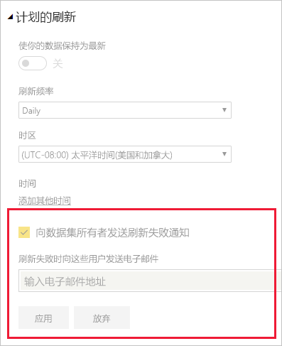

# 刷新方案故障排除

此处介绍了关于在 Power BI 服务中刷新数据时可能会遇到的各种情况的信息。

> [!NOTE]
> 如果遇到导致问题但未在下面列出的方案，可以在[社区站点](https://community.powerbi.com/)上寻求进一步帮助，也可以创建[支持票证](https://powerbi.microsoft.com/support/)。
>
>

## 电子邮件通知

如果通过电子邮件通知转到本文，并且不再希望收到有关刷新问题的电子邮件，请与 Power BI 管理员联系。要求他们从 Power BI 中的相应数据集中删除你的订阅电子邮件或电子邮件列表。 他们可以从 Power BI 管理门户的以下区域执行此操作。

## 使用 Web 连接器进行刷新的操作未能正常运行

如果有正在使用 [**Web.Page**](https://msdn.microsoft.com/library/mt260924.aspx) 函数的 Web 连接器脚本，且在 2016 年 11 月 18 日后更新过数据集或报表，则必须使用网关才能让刷新正常工作。

## 刷新不支持的数据源

配置数据集时，可能会收到一个错误，指示此数据集使用了刷新不支持的数据源。 有关详细信息，请参阅[不支持刷新的数据源故障排除](service-admin-troubleshoot-unsupported-data-source-for-refresh.md)。

## 仪表板在刷新完成后不反映所做的更改

请等待大约 10-15 分钟，以便刷新在仪表板磁贴中反映。 如果仍未显示，请重新固定仪表板的可视化效果。

## 设置凭据时出现 GatewayNotReachable

尝试设置数据源的凭据时可能会遇到 `GatewayNotReachable`。 这可能是网关过时导致的。 安装最新网关，然后重试。

## 处理错误：出现以下系统错误：类型不匹配

这可能是由于 Power BI Desktop 文件或 Excel 工作簿中的 M 脚本出现问题。 也可能是由于 Power BI Desktop 版本已过时。

## 磁贴刷新错误

有关使用仪表板磁贴遇到的错误列表和说明，请参阅[磁贴错误故障排除](refresh-troubleshooting-tile-errors.md)。

## 更新使用 AAD OAuth 的源中的数据时刷新失败

Azure Active Directory (**AAD**) OAuth 令牌由许多不同的数据源使用，并在大约一小时后过期。 你可能会遇到加载数据所用时间长于令牌到期时间（超过一小时）的情况，这是因为 Power BI 服务在数据加载时等待时间长达两个小时。 在这种情况下，数据加载过程可能失败，并显示凭据错误。

使用 AAD OAuth 的数据源包括 **Microsoft Dynamics CRM Online**、**SharePoint Online** (SPO) 等。 如果你要连接到此类数据源，但在数据加载超过一小时后获取凭据失败，这可能正是原因所在。

Microsoft 正在研究一个解决方案，允许数据加载过程刷新令牌并继续。 但是，如果 Dynamics CRM Online 或 SharePoint Online 实例（或其他 AAD OAuth 数据源）较大，则可能会达到两小时的数据加载阈值，此时也可能会遇到 Power BI 服务中数据加载超时的情况。

另请注意，为了使刷新正常工作，请在使用 AAD OAuth 连接到 SharePoint Online  数据源时，务必使用与用于登录 Power BI 服务  相同的帐户。

## 未经压缩数据的刷新限制

导入到 **Power BI 服务**的数据集的最大大小为 1 GB。 为确保实现高性能，对这些数据集进行了深度压缩。 此外，在共享容量中，服务设定的刷新期间处理的未压缩数据量限制为 10GB。 此限制将压缩考虑在内，因此远大于 1 GB。 Power BI Premium 中的数据集不受此限制的制约。 如果 Power BI 服务中的刷新由于此原因失败，请减少要导入到 Power BI 的数据量，然后重试。

## 计划的刷新超时

导入数据集的计划刷新在两个小时后超时。 对于高级  工作区中的数据集，此超时增加到五个小时。 如果遇到此限制，请考虑减小数据集大小或降低数据集复杂性，或者考虑将数据集拆分为更小的部分。

## 计划刷新失败

如果计划刷新连续四次失败，Power BI 会禁用刷新。 解决潜在问题，然后重新启用计划刷新。

## 禁止访问该资源  

缓存凭据过期可能导致发生此错误。 转到 Power BI 签名并转到 `https://app.powerbi.com?alwaysPromptForContentProviderCreds=true`，以清除 Internet 浏览器缓存。 这将强制更新你的凭据。

## 密码更改或凭据过期会导致数据刷新失败

数据刷新也可能因缓存凭据过期而失败。 转到 Power BI 签名并转到 `https://app.powerbi.com?alwaysPromptForContentProviderCreds=true`，以清除 Internet 浏览器缓存。 这将强制更新你的凭据。

## 后续步骤

- [Power BI 中的数据刷新](refresh-data.md)  
- [本地数据网关故障排除](service-gateway-onprem-tshoot.md)  
- [Power BI Gateway - Personal 故障排除](service-admin-troubleshooting-power-bi-personal-gateway.md)  

更多问题？ [尝试咨询 Microsoft Power BI 社区](https://community.powerbi.com/)
