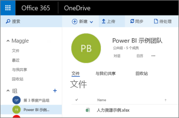
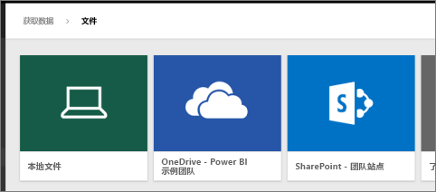
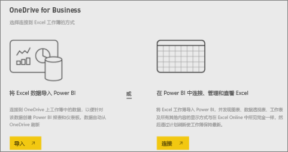
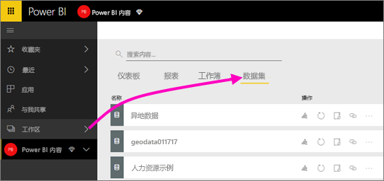
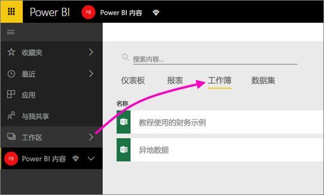

# 连接到用于 Power BI 工作区的 OneDrive 中存储的文件
[在 Power BI 中创建工作区](../collaborate-share/service-create-distribute-apps.md)后，可以将 Excel、CSV 和 Power BI Desktop 文件存储在 Power BI 工作区的 OneDrive for Business 上。 可以继续更新已存储在 OneDrive 中的文件。 这些更新会按文件自动反映在 Power BI 报表和仪表板中。 

> [!NOTE]
> 新工作区体验会更改 Power BI 工作区与 Office 365 组之间的关系。 每次创建新工作区时，不会自动创建 Office 365 组。 了解如何[创建新工作区](../collaborate-share/service-create-the-new-workspaces.md)

将文件添加到工作区是一个分两步执行的过程： 

1. 首先[将文件上传到工作区的 OneDrive for Business](service-connect-to-files-in-app-workspace-onedrive-for-business.md#1-upload-files-to-the-onedrive-for-business-for-your-workspace)。
2. 然后[从 Power BI 连接到这些文件](service-connect-to-files-in-app-workspace-onedrive-for-business.md#2-import-excel-files-as-datasets-or-as-excel-online-workbooks)。

> [!NOTE]
> 工作区仅适用于 [Power BI Pro](../fundamentals/service-features-license-type.md)。
> 

## 1 将文件上传到工作区的 OneDrive for Business
1. 在 Power BI 服务中，选择“工作区”旁边的箭头，然后选择你的工作区名称旁边的省略号（“…”  ）。 
   
   
2. 选择“文件”以在 Office 365 上打开工作区的 OneDrive for Business  。
   
   > [!NOTE]
   > 如果在工作区菜单上看不到“文件”，请选择“成员”以打开工作区的 OneDrive for Business   。 然后，选择“文件”  。 Office 365 为你的应用的组工作区文件设置 OneDrive 存储位置。 此过程可能需要一段时间才能完成。 
   > 
   > 
3. 可以在此处将文件上传到工作区的 OneDrive for Business。 选择“上传”  ，并导航到你的文件。
   
   

## 2 导入 Excel 文件作为数据集或 Excel Online 工作簿
现在文件位于你的工作区的 OneDrive for Business 中，你可以进行选择。 你可以： 

* [从 Excel 工作簿导入数据作为数据集](service-get-data-from-files.md)。 然后使用数据生成可以在 Web 浏览器和移动设备上查看的报表和仪表板。
* 或者，[在 Power BI 中连接整个 Excel 工作簿](service-excel-workbook-files.md)，并完全按照 Excel Online 那样显示工作簿。

### 导入或连接到你的工作区中的文件
1. 在 Power BI 中，切换到工作区，让工作区名称显示在左上角。 
2. 在导航窗格底部，选择“获取数据”  。 
   
   
3. 在  “文件”框中，选择  “获取”。
   
   
4. 选择“OneDrive” **“工作区名称”**  -   。
   
    
5. 选择所需的文件，然后选择“连接”  。
   
    这时候需要你决定是[从 Excel 工作簿导入数据](service-get-data-from-files.md)，还是[连接到整个 Excel 工作簿](service-excel-workbook-files.md)。
6. 选择“导入”  或“连接”  。
   
    
7. 如果选择“导入”  ，则该工作簿会显示在“数据集”  选项卡上。 
   
    
   
    如果选择“连接”  ，则该工作簿会位于“工作簿”  选项卡上。
   
    

## 后续步骤
* [在 Power BI 中创建应用和工作区](../collaborate-share/service-create-distribute-apps.md)
* [从 Excel 工作簿导入数据](service-get-data-from-files.md)
* [连接到整个 Excel 工作簿](service-excel-workbook-files.md)
* 更多问题？ [尝试参与 Power BI 社区](https://community.powerbi.com/)
* 想要提供反馈？ 请访问 [Power BI Ideas](https://ideas.powerbi.com/forums/265200-power-bi)
