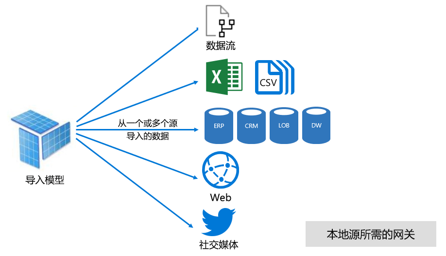
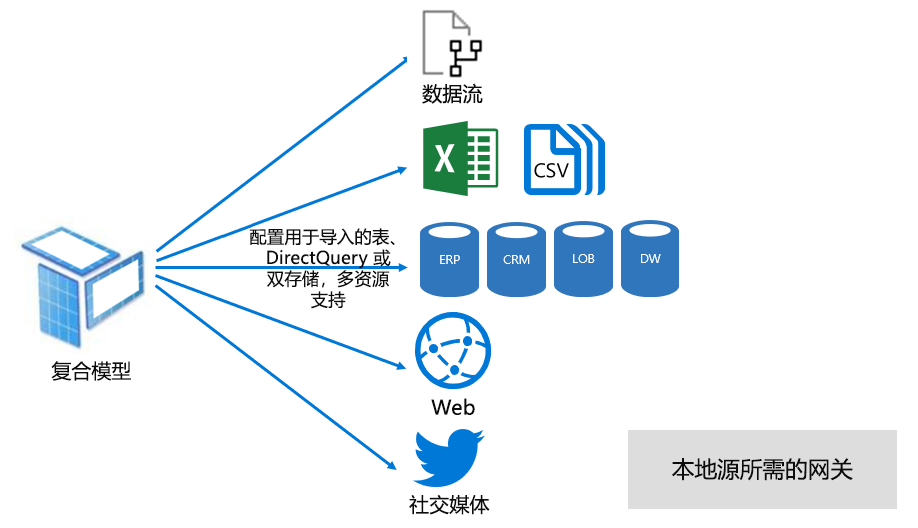

# Power BI 服务中的数据集模式

本文提供 Power BI 数据集模式的技术说明。 它适用于表示与外部托管 Analysis Services 模型的实时连接的数据集，还适用于在 Power BI Desktop 中开发的模型。 本文重点介绍了每种模式的基本原理，以及对 Power BI 容量资源可能产生的影响。

这三个数据集模式为：

- [导入](#import-mode)
- [DirectQuery](#directquery-mode)
- [复合](#composite-mode)

## 导入模式

“导入”模式是用于开发模型的最常见模式  。 由于是内存中查询，此模式可提供极快的性能。 它还为建模者提供设计灵活性，并支持特定 Power BI 服务功能（常见问题、快速见解等）。 由于这些优势，它成为新建 Power BI Desktop 解决方案时的默认模式。

必须了解导入的数据始终存储到磁盘中。 在查询或刷新时，必须将数据完全加载到 Power BI 容量的内存中。 一旦进入内存，“导入”模型就非常快速地获得查询结果。 还必须了解，不能将“导入”模型部分加载到内存中。

当刷新时，数据经过压缩和优化，由 VertiPaq 存储引擎存储到磁盘。 从磁盘加载到内存中时，可以实现 10 倍压缩。 因此，可以合理地预计 10 GB 的源数据可压缩到大约 1 GB 大小。 磁盘上的存储大小在压缩后可减少 20%。 （大小的差异可通过将 Power BI Desktop 文件大小与文件的任务管理器内存使用量比较来确定。）

可以通过三种方式实现设计灵活性。 数据建模者可以：

- 通过缓存数据流和外部数据源中的数据来集成数据（无论数据源类型或格式是什么）
- 当创建数据准备查询时利用整套 [Power Query 公式语言](/powerquery-m/)（非正式称为 M）函数
- 当使用业务逻辑增强模型时利用整套[数据分析表达式 (DAX)](/dax/) 函数。 支持计算列、计算表和度量值。

如下图所示，“导入”模型可以集成任意数量受支持数据源类型的数据。

不过，虽然“导入”模型有很大的优势，但也存在一些缺点：

- 在 Power BI 可以查询模型之前必须将整个模型加载到内存中，这可能会对可用容量资源施加压力（尤其是随着导入模型的数量和大小的增加）
- 模型数据仅在最新刷新后才是最新的数据，因此通常需要按计划刷新“导入”模型
- 完全刷新会从所有表中删除所有数据，并从数据源重新加载数据。 此操作在 Power BI 服务的时间和资源以及数据源方面成本高昂。

    > [!NOTE]
    > Power BI 可以实现增量刷新，以避免截断和重新加载整个表。 但是，仅当数据集托管在高级容量的工作区中时，才支持此功能。 有关详细信息，请参阅 [Power BI Premium 中的增量刷新](../admin/service-premium-incremental-refresh.md)一文。

从 Power BI 服务资源的角度来看，“导入”模型需要：

- 足够内存以在查询或刷新时加载模型
- 处理资源和额外的内存资源以刷新数据

## DirectQuery 模式

DirectQuery 模式是“导入”模式的替代方法  。 在 DirectQuery 模式下开发的模型不会导入数据。 相反，它们只包含定义模型结构的元数据。 查询模型时，本机查询用于从基础数据源中检索数据。

考虑开发 DirectQuery 模型有两个主要原因：

- 当数据量太大（即使应用了[数据缩减方法](../guidance/import-modeling-data-reduction.md)）而无法加载到模型中或实际刷新时
- 当报表和仪表板需要超出计划的刷新限制范围来提供“近实时”数据时。 （共享容量的计划刷新限制是每天 8 次，高级容量则是每天 48 次。）

DirectQuery 模型有一些优点：

- “导入”模型大小限制不适用
- 模型不需要刷新
- 当与报表筛选器和切片器交互时，报表用户将看到最新的数据。 此外，报表用户还可以刷新整个报表以检索当前数据。
- 可以使用[自动页刷新](../create-reports/desktop-automatic-page-refresh.md)功能来开发实时报表
- 如果仪表板磁贴基于 DirectQuery 模型，则可以每 15 分钟自动更新一次

但是，DirectQuery 模型也有许多限制：

- 对 DAX 公式进行限制，只使用可转置为数据源所理解的本机查询的函数。 不支持计算表。
- 不支持问答和快速见解功能

从 Power BI 服务资源的角度来看，DirectQuery 模型需要：

- 最小内存以在查询时加载模型（仅元数据）
- 有时 Power BI 服务必须使用大量处理器资源来生成和处理发送到数据源的查询。 出现这种情况时，可能会影响吞吐量，尤其是在并发用户查询模型时。

有关详细信息，请参阅[在 Power BI Desktop 中使用 Direct Query](desktop-use-directquery.md)。

## 复合模型

“复合”  模式可以混合使用“导入”模式和 DirectQuery 模式，或集成多个 DirectQuery 数据源。 复合模式下开发的模型支持配置每个模型表的存储模式。 此模式还支持计算表（使用 DAX 进行定义）。

表存储模式可以采用“导入”、DirectQuery 或者双模式进行配置。 配置为双存储模式的表同时具有“导入”和 DirectQuery，此设置允许 Power BI 服务确定要在逐个查询基础上使用的最高效模式。

复合模型致力于提供最理想的“导入”模式和 DirectQuery 模式。 如果配置得当，则可以将内存中模型的高查询性能与从数据源中检索近实时数据的功能结合起来。

开发复合模型的数据建模者可能会在“导入”或“双模式”存储模式下配置维度类型表，并在 DirectQuery 模式下配置事实类型表。 有关模型表角色的详细信息，请参阅[了解星型架构和 Power BI 的重要性](../guidance/star-schema.md)。

例如，请考虑一个模型，该模型在“双模式”下有一个“产品”维度类型表，在 DirectQuery 模式下有一个“销售”事实类型表   。 可以从内存中高效快速地查询“产品”  表，以呈现报表切片器。 还可以在包含相关“产品”表的 DirectQuery 模式下查询“销售”表   。 后一种查询可以生成单个高效的本机 SQL 查询，该查询联接“产品”和“销售”表，并按切片器值进行筛选   。

通常，对于复合模型，与“导入”和 DirectQuery 关联的优点和缺点取决于每个表的配置方式。

有关详细信息，请参阅[在 Power BI Desktop 中使用复合模型](../transform-model/desktop-composite-models.md)。

## 后续步骤

- [Power BI 服务中的数据集](service-dataset-modes-understand.md)
- [Power BI Desktop 中的存储模式](../transform-model/desktop-storage-mode.md)
- [在 Power BI 中使用 DirectQuery](desktop-directquery-about.md)
- [在 Power BI Desktop 中使用复合模型](../transform-model/desktop-composite-models.md)
- 更多问题？ [尝试咨询 Power BI 社区](https://community.powerbi.com/)
