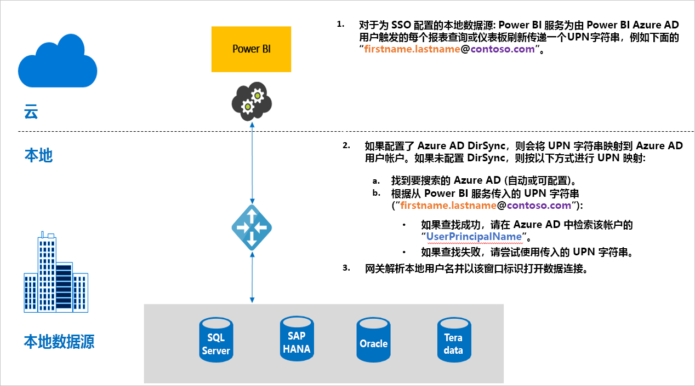

# Power BI 中网关的单一登录 (SSO) 概述

通过配置本地数据网关，可以获得无缝的单一登录连接，从而使 Power BI 报表和仪表板可以从本地数据进行实时更新。 可选择使用 [Kerberos](service-gateway-sso-kerberos.md) 约束委派或安全断言标记语言 ([SAML](service-gateway-sso-saml.md)) 来配置网关。 本地数据网关使用连接到本地数据源的 [DirectQuery](desktop-directquery-about.md) 或进行刷新来支持 SSO。 

Power BI 支持以下数据源：

* SQL Server (Kerberos)
* SAP HANA（Kerberos 和 SAML）
* SAP BW 应用程序服务器 (Kerberos)
* SAP BW 消息服务器 (Kerberos) 
* Oracle (Kerberos) 
* Teradata (Kerberos)
* Spark (Kerberos)
* Impala (Kerberos)

[M-extensions](https://github.com/microsoft/DataConnectors/blob/master/docs/m-extensions.md) 当前不支持 SSO。

当用户与 Power BI 服务中的 DirectQuery 报表进行交互时，每个交叉筛选、切片、排序和报表编辑操作都可能会导致针对基础的本地数据源执行实时查询。 为数据源配置 SSO 时，查询将以与 Power BI 交互的用户标识（即通过 Web 体验或 Power BI 移动应用）执行。 因此，每个用户都能精准查看他们在基础数据源中具有权限的数据。 

还可以将设置为在 Power BI 服务中进行刷新的报表配置为使用 SSO。 为此数据源配置 SSO 后，将以 Power BI 中的数据集所有者的身份执行查询。 因此，根据数据集所有者对基础数据源的权限进行刷新。 目前只能为使用 [Kerberos](service-gateway-sso-kerberos.md) 约束委派的数据源启用使用 SSO 的刷新 

## 运行 SSO 时的查询步骤

使用 SSO 运行的查询由三个步骤组成，如下图所示。

以下是有关每个步骤的其他详细信息：

1. 对于每个查询，在向配置的网关发送查询请求时，Power BI 服务包括用户主体名称 (UPN)，即当前登录到 Power BI 服务的用户的完全限定用户名  。

2. 网关必须将 Azure Active Directory UPN 映射到本地 Active Directory 标识：

   a. 如果已配置 Azure AD DirSync（也称为“Azure AD Connect”），则会自动在网关中进行映射  。

   b.  或者，网关可以通过在本地 Active Directory 域进行查找的方式来查找 Azure AD UPN，并将其映射到本地 AD 用户。

3. 网关服务进程模拟映射的本地用户，打开与基础数据库的连接，然后发送查询。 不需要将网关与数据库安装在同一台计算机上。

## 后续步骤

现在，你已了解通过网关启用 SSO 的基础知识，请阅读有关 Kerberos 和 SAML 的更多详细信息：

* [单一登录 (SSO) - Kerberos](service-gateway-sso-kerberos.md)
* [单一登录 (SSO) - SAML](service-gateway-sso-saml.md)
