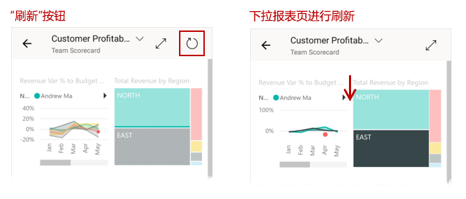
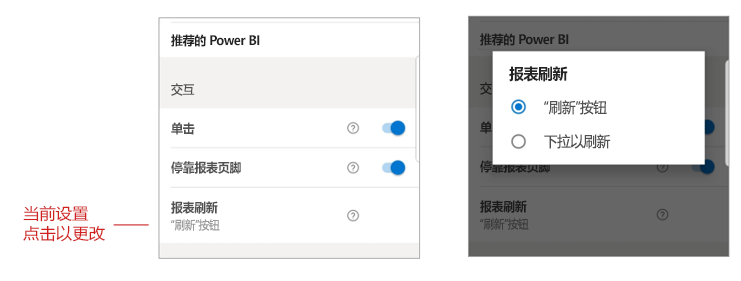

# 配置报表交互设置

## 概述

Power BI 移动应用具有许多可配置的“交互”设置，使你可以控制与数据交互的方式，并定义 Power BI 移动应用中某些元素的行为方式。 当前存在用于以下方面的设置
* [报表视觉对象上的单击与双击交互](#single-tap)
* [停靠与动态报表页脚](#docked-report-footer-android-phones) (Android)
* [按钮启动的报表刷新与下拉以刷新](#report-refresh-android-phones) (Android)

若要转到交互设置，请点击个人资料图片以打开[侧面板](./mobile-apps-home-page.md#header)，选择“设置”  ，并找到“交互”  部分。

>[!NOTE]
>刷新按钮的交互设置和用于停靠报表页脚的交互设置当前对报表服务器报表没有影响。 这将随着 2020 年 1 月报表服务器版本而更改。

## 交互设置

### 单击
下载 Power BI 移动应用时，会针对单击交互进行设置。 这意味着，在视觉对象中点击以执行某个操作（如选择切片器项、交叉突出显示、单击链接或按钮等）时，点击会同时选择视觉对象并执行所需操作。

如果愿意，可以关闭双击交互。 随后会使用双击交互。 使用双击交互时，首先点击一个视觉对象以选择它，然后再次点击视觉对象以执行所需操作。

### 停靠报表页脚（Android 手机）

停靠报表页脚设置确定报表页脚是保持停靠（即固定并始终可见）在报表底部，还是基于报表中的操作（如滚动）隐藏和重新显示。

在 Android 手机上，停靠报表页脚设置在默认情况下为“开启”  ，这意味着报表页脚会停靠并且始终显示在报表底部。 如果更喜欢根据报表中的操作而显示和消失的动态报表页脚，请将设置切换为“关闭”  。

### 报表刷新（Android 手机）

报表刷新设置定义启动报表刷新的方式。 可以选择使所有报表页眉上具有刷新按钮，或是在报表页面上使用下拉以刷新操作（从上到下稍微下拉）来刷新报表。 下图说明了这两种方法。 

在 Android 手机上，默认情况下会添加刷新按钮。

若要更改报表刷新设置，请转到交互设置中的报表刷新项。 会显示当前设置。 点击值以打开一个弹出窗口，在其中可以选择新值。

## 远程配置

管理员还可以通过应用配置文件使用 MDM 工具来远程配置交互。 通过这种方式，可以标准化整个组织或组织中特定用户组的报告交互体验。 有关详细信息，请参阅[使用移动设备管理配置交互](./mobile-app-configuration.md)。

## 后续步骤
* [与报表进行交互](./mobile-reports-in-the-mobile-apps.md#interact-with-reports)
* [使用移动设备管理配置交互](./mobile-app-configuration.md)
