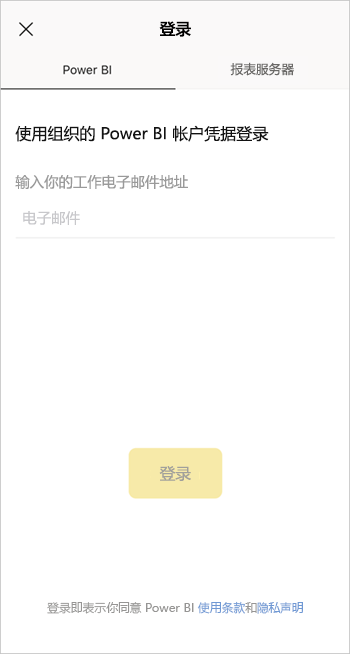
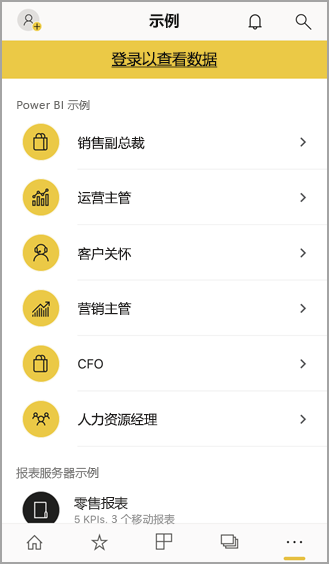

# iOS 设备上的 Power BI 移动应用入门
iPhone 和 iPad 上的 iOS 版 Microsoft Power BI 应用提供了 Power BI、Power BI 报表服务器和 Reporting Services 的移动 BI 体验。 通过触控移动设备实现的实时访问，可以随时随地查看本地和云中的公司仪表板，并与之进行交互。 然后，可以浏览仪表板中的数据，并通过电子邮件或短信的方式将数据与同事共享。 在你的 [Apple Watch](mobile-apple-watch.md) 上保持最新的数据。  

可以在 Power BI Desktop 中创建 Power BI 报表，然后发布报表：

* [将报表发布到 Power BI 服务中](../../service-get-started.md)，并创建仪表板。
* [在本地将报表发布到 Power BI 报表服务器中](../../report-server/quickstart-create-powerbi-report.md)。

然后，即可在 iOS 版 Power BI 移动应用中与本地或云中的仪表板和报表进行交互。

查找 [Power BI 移动应用中的新功能](mobile-whats-new-in-the-mobile-apps.md)。

## 下载应用
从 Apple App Store [下载 iOS 应用](https://go.microsoft.com/fwlink/?LinkId=522062 "下载 iOS 应用")到 iPhone 或 iPad。

可在运行 iOS 11 或更高版本的任意设备上运行适用于 iOS 的 Power BI 移动应用。 

## 注册 Power BI 服务
如果还没有注册，请转到 [powerbi.com](https://powerbi.microsoft.com/get-started/)，在“Power BI - 云协作和共享”下，选择“免费试用”   。

## Power BI 应用入门
1. 在 iOS 设备中，打开 Power BI 应用。
2. 若要登录 Power BI，请点击 Power BI 选项卡并填写登录详细信息  。  
   若要登录到 Reporting Services 移动报表和 KPI，请单击“报表服务器”选项卡并填写登录详细信息  。
   
   
   
   在应用中，只需点击屏幕左上角的帐户个人资料图像，即可在 Power BI 和报表服务器之间切换。 

## 体验 Power BI 和 Reporting Services 示例
即使没有注册，也可以查看 Power BI 和 Reporting Services 示例并与之交互。

要访问这些示例，请点击导航栏上“更多选项”(…)，然后选择“示例”   。

多个 Power BI 示例后为几个报表服务器示例。

   
   
   > [!NOTE]
   > 并非所有功能均可在示例中使用。 例如，无法查看以仪表板为基础的示例报表，则无法与其他人共享这些示例，并且无法收藏这些示例。 
   > 
   >

## 在 Power BI 移动应用中查找内容

点击标头中的放大镜，开始搜索 Power BI 内容。

## 查看你收藏的仪表板和报表
点击导航栏上的“收藏夹”()，查看“收藏夹”页  。 

阅读有关 [Power BI 移动应用中的收藏夹](mobile-apps-favorites.md) 的更多信息。

## Power BI 移动应用的企业支持
组织可以使用 Microsoft Intune 管理设备和应用程序，包括适用于 Android 和 iOS 的 Power BI 移动应用。

使用 Microsoft Intune，组织可以控制各项事务，如要求提供访问 PIN、控制应用程序处理数据的方式，甚至是在未使用应用时加密应用程序数据。

> [!NOTE]
> 如果在 iOS 设备上使用 Power BI 移动应用，并且组织已配置 Microsoft Intune MAM，则会关闭后台数据刷新。 在你下次进入应用时，Power BI 会刷新 Power BI 服务 Web 数据。
> 

详细了解[如何使用 Microsoft Intune 配置 Power BI 移动应用](../../service-admin-mobile-intune.md)。 

## 后续步骤

* [什么是 Power BI？](../../fundamentals/power-bi-overview.md)
* 是否有任何问题? [尝试咨询 Power BI 社区](https://community.powerbi.com/)

