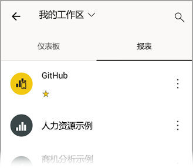
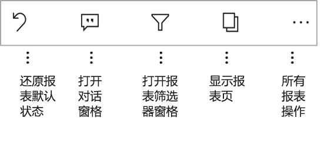
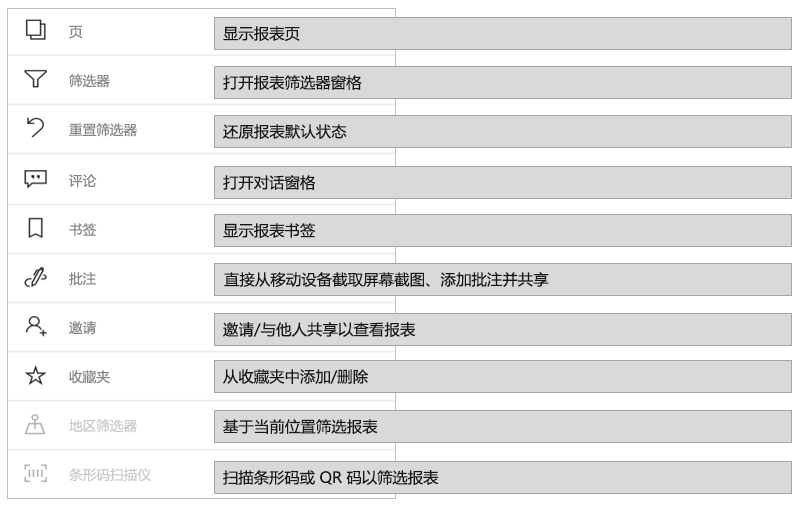
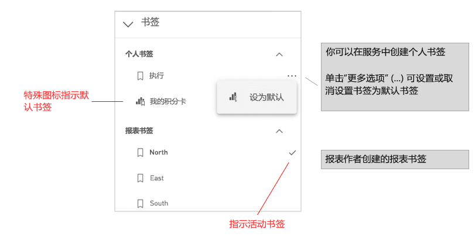
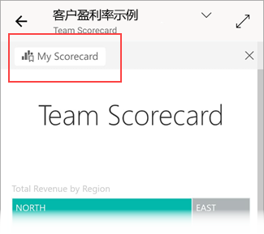

# 在 Power BI 移动应用中浏览报表
适用于：

|  |  |  |  |  |
|:---: |:---: |:---: |:---: |:---: |
| iPhone |iPad |Android 手机 |Android 平板电脑 |Windows 10 设备 |

Power BI 报表是一个交互式数据视图，它使用视觉对象来表示不同的数据发现和见解。 在 Power BI 移动应用中查看报表是三步流程中的第三步：

1. [在 Power BI Desktop 中创建报表](../../desktop-report-view.md)。 甚至可以在 Power BI Desktop 中[优化报表，使之更适合在手机中显示](mobile-apps-view-phone-report.md)。
2. 将这些报表发布到 Power BI 服务 [(https://powerbi.com)](https://powerbi.com) 或 [Power BI 报表服务器](../../report-server/get-started.md)。  
3. 在 Power BI 移动应用中与报表进行交互。

## 在移动应用中打开 Power BI 报表
Power BI 报表存储在移动应用中的不同位置，具体取决于从何处获取。 可以位于“应用”、“与我共享”、“工作区”（包括“我的工作区”）或报表服务器中。 有时，可以通过相关仪表板转到报表；有时，其中也会列出报表。

在列表和菜单中，你会发现报表名称旁边有一个图标，它可帮助你了解此项是报表：

Power BI 移动应用中的报表有两个图标：

*  表示在该应用中横向显示的报表。 此图标与浏览器中的图标一样。

*  表示至少包含一个手机优化版报表页的报表，该报表将纵向显示。

> [!NOTE]
> 横向放置手机时，即使报表页处于手机布局，也会始终以横向布局显示。

若要从仪表板转到报表，请点击磁贴右上角的“更多选项”(…)，然后点击“打开报表”   ：
  
  
  
  并非所有磁贴都能以报表形式打开。 例如，点击在问答框中提问时创建的磁贴不会打开报表。
  
## 与报表交互
在应用中打开报表后，就可开始使用该报表了。 你可对报表及其数据执行许多操作。 报表页脚中显示有可对报表执行的操作。 通过点击并长按报表中显示的数据，还可以对数据进行切片和切块。

### 单击与双击交互
下载 Power BI 移动应用时，会针对单击交互进行设置。 这意味着，在视觉对象中点击以执行某个操作（如选择切片器项、交叉突出显示、单击链接或按钮等）时，点击会同时选择视觉对象并执行所需操作。

如果愿意，可以切换到双击交互。 使用双击交互时，首先点击一个视觉对象以选择它，然后再次点击视觉对象以执行所需操作。

若要切换到双击交互，或切换回单击交互，请转到[应用交互设置](./mobile-app-interaction-settings.md)。

### 使用点击和长按
点击与鼠标单击效果相同。 因此，如果要基于数据点交叉突出显示报表，请点击该数据点。
点击一个切片器值即可选中该值，且此报表的其余部分会根据该值进行切片。
点击链接、按钮或书签时，报表作者所定义的操作会随即发生。

你可能已经注意到，点击视觉对象时会出现一个边框。 在边框的右上角，可以看到“更多选项”(…)  。如果点击此省略号，你将看到一个菜单，其中显示了可对此视觉对象执行的操作：

### 工具提示和钻取操作
长按（点击并按住）数据点时，会出现一个工具提示，显示此数据点所代表的值：

如果报表作者配置了报表页工具提示，则默认工具提示将替换为该报表页工具提示：

> [!NOTE]
> 至少具有 640 × 320 像素视区的设备才支持报表工具提示。 如果设备低于此像素视区，应用会显示默认工具提示。

报表作者可以定义各报表页间数据和关系的层次结构。 通过层次结构，可从视觉对象和值向下钻取、向上钻取以及钻取浏览到其他报表页。 因此，长按某个值时，除工具提示外，相关的钻取选项也将显示在页脚中：

当你点击视觉对象的特定部分并点击“钻取”选项时，Power BI 会转到报表中的另一页，筛选出点击的值  。 报表作者可定义一个或多个钻取操作，每个操作分别转到不同页面。 在这种情况下，可选择所需的钻取操作。 使用返回按钮可返回到上一页。

有关详细信息，请参阅[在 Power BI Desktop 中添加钻取](../../desktop-drillthrough.md)。
   
   > [!IMPORTANT]
   > 在 Power BI 移动应用中，矩阵和表视觉对象的钻取操作仅可通过单元格值启用，无法通过列或行标题启用。
   
   
   
### 在报表页脚使用操作
从报表页脚中，你可以对当前报表页或整个报表执行多个操作。 可通过页脚快速访问最常用的操作。 点击“更多选项”(…) 按钮可访问其他操作  ：

可从页脚执行的操作包括：
* 将报表筛选器和交叉突出显示选项重置回其原始状态。
* 打开对话窗格，添加或查看报表注释。
* 打开筛选器窗格，查看或修改当前应用于报表的筛选器。
* 列出报表的所有页面。 点击页名称将加载并显示该页。
可以通过从屏幕边缘向中心轻扫在表页间移动。
* 查看所有报表操作。

#### 所有报表操作
点击报表页脚中的“更多选项”(…) 可查看能对报表执行的所有操作  ：

某些操作可能会被禁用，因为这些操作依赖于特定的报表功能。
例如：

仅当在报表中设置了[书签](mobile-reports-in-the-mobile-apps.md#bookmarks)时，才会显示“书签”  。 可在 Power BI 服务中定义的个人书签和报表创建者定义的书签都将显示出来。 如果已将其中一个书签定义为默认书签，则报表将在加载时打开该视图。

如果组织中存在禁止通过 Power BI 移动应用共享的 [Intune 保护策略](https://docs.microsoft.com/intune/app-protection-policies)，则可能会禁用“批注并共享”  。

只有在你有权与他人共享报表时才会启用“邀请”  。 只有当你是报表所有者或所有者授予你重新共享权限时，你才有此权限。

如果报表作者按地理数据对报表进行了分类，则“按当前位置筛选”处于启用状态  。 有关详细信息，请阅读[标识报表中的地理数据](https://docs.microsoft.com/power-bi/desktop-mobile-geofiltering)。

只有当报表中的数据集被标记为条形码时，才会启用“扫描以按条形码筛选报表”   。 有关详细信息，请阅读[在 Power BI Desktop 中标记条形码](https://docs.microsoft.com/power-bi/desktop-mobile-barcodes)。

### 书签

Power BI 移动应用支持报表创建者已定义的报表书签和可在 Power BI 服务中定义的个人书签。 可以在[报表操作工具栏](mobile-reports-in-the-mobile-apps.md#all-report-actions)上的“更多选项”(…) 下找到书签菜单  。

默认书签由特殊图标进行指示。 对于个人书签，可以通过点击要更改的书签旁的“更多选项(...)”  ，然后选择“设为默认值”  或“清除默认值”  ，来设置、取消设置或更改默认设置。

当报表的书签视图处于打开状态时，该书签的名称将显示在报表的顶部。

[了解有关 Power BI 服务中书签的详细信息](https://docs.microsoft.com/power-bi/consumer/end-user-bookmarks)。

## 配置报表体验
Power BI 移动应用提供许多设置，使你可以控制报表体验。 当前可以配置
* **与报表视觉对象的交互**：可以选择使用单点击或双击交互。
* **数据刷新方法**：可以选择使用刷新按钮或下拉操作来刷新报表数据。
* **报表页脚可见性**：可以选择使用始终可见的停靠页脚，或根据操作（例如滚动）隐藏和重新显示的动态页脚。

有关如何更改这些设置的信息，请参阅[应用交互设置](./mobile-app-interaction-settings.md)。

## 后续步骤
* [查看手机优化版 Power BI 报表并与之交互](mobile-apps-view-phone-report.md)
* [创建手机优化版报表](../../desktop-create-phone-report.md)
* 是否有任何问题? [尝试咨询 Power BI 社区](https://community.powerbi.com/)

