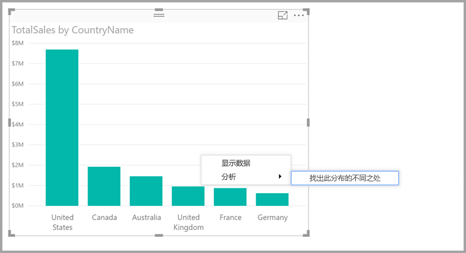

# 在 Power BI Desktop 中应用见解以发现分配发生变化的位置（预览）

在视觉对象中，你通常会看到一个数据点，并想知道不同类别的分布是否相同。 借助 **Power BI Desktop** 中的**见解**，只需单击几下即可了解。

以下面的视觉对象为例，它显示了*不同国家/地区*的*总销售额*。 如图所示，大部分销售额来自美国，占所有销售额的 57%，余下的销售额则来自其他国家/地区。 在这种情况下，探索是否会在不同的亚群中看到与之相同的分布通常很有趣。 例如，所有年份、所有销售渠道和所有产品类别的分布是否与之相同？  虽然可以应用不同的筛选器并直观地比较结果，但这样做可能非常耗时且容易出错。 

可以让 **Power BI Desktop** 找出分布的不同之处，并获得有关数据的快速、自动化且深入的分析。 只需右键单击数据点，然后选择“分析”>“找出分布的不同之处”，就可以在易用窗口中收到见解  。

在此示例中，自动化分析快速显示，就*旅行车*而言，美国和加拿大的销售额比例降低，而其他国家/地区的比例升高。   

> [!NOTE]
> 此功能处于预览状态，可能会发生更改。 从 Power BI Desktop  2017 年 9 月版本开始，见解功能将默认启用并打开（无需勾选“预览”框来启用它）。
> 
> 

## 使用见解
若要使用见解找出图表上显示的分布的不同之处，只需右键单击任意数据点（或整个视觉对象），然后选择“分析”>“找出分布的不同之处”  。

然后，**Power BI Desktop** 针对数据运行其机器学习算法，并使用视觉对象和说明（介绍哪些类别（列）以及这些列的哪些值导致产生差异最明显的分布）填充窗口。 见解以柱形图形式提供，如下图所示。 

应用了选定筛选器的值以普通的默认颜色显示。 原始起始视觉对象上所示的总体值以灰色显示，以便进行比较。 最多可包含三个不同的筛选器（此示例中为*旅行车*、*山地车*、*公路车*），可通过单击选择不同的筛选器（或使用 ctrl-单击选择多个筛选器）。

对于简单的累加性度量值，例如此示例中的*总销售额*，将根据相对值而非绝对值进行比较。 因此，虽然旅行车的销售额低于所有类别的总销售额，但默认情况下，视觉对象使用双轴来比较不同国家/地区的旅行车与所有类别的自行车的销售额比例。  通过切换视觉对象下方的切换按钮，可在同一轴上显示两个值，从而可以轻松地比较绝对值（如下图所示）。    

通过给定与筛选器匹配的记录数，描述性文本还指示了可能附加到筛选器值的重要性级别。 因此在此示例中，你可以看到，虽然*旅行车*的分布可能大不相同，但它们只占记录数的 16.6%。

在页面顶部提供“很棒”  和“很差”  图标，这样你就可以提供关于视觉对象和功能的反馈。 这样做虽然可以提供反馈，但它目前不会训练算法来影响下次使用该功能时返回的结果。

请注意，视觉对象顶部的“ **”+** 按钮可让你将选定的视觉对象添加到报表中，就像你手动创建视觉对象一样。 然后，可以格式化或调整添加的视觉对象，类似于在报表上对任何其他视觉对执行的操作。 在 Power BI Desktop  中编辑报表时，只能添加选定的见解视觉对象。

如果报表处于阅读或编辑模式，则可以将见解用于分析数据和创建可轻松添加到报表中的视觉对象。

## 返回结果的详细信息
可以将算法设想为采用模型中的所有其他列，将这些列的所有值作为筛选器应用于原始视觉对象，并找出其中哪个筛选器值生成的结果与原始视觉对象的*差异*最大。

你可能想知道差异  表示的意义。 例如，假设美国与加拿大的销售额总体分配如下：

|国家/地区  |销售额（百万美元）|
|---------|----------|
|美国      |15        |
|加拿大   |5         |

而对于特定类别的产品 *“公路车”* ，销售额分配可能为：

|国家/地区  |销售额（百万美元）|
|---------|----------|
|美国      |3        |
|加拿大   |第 1 个         |

虽然各个表中的数字不同，但美国与加拿大的相对值是相同的（总体为 75% 和 25%，公路车也为 75% 和 25%）。 因此不会将这些数字视为不同。 因此，对于这种简单的累加性度量值，算法会查找*相对*值的差异。  

与此相反，以利润率这样的度量值为例（计算公式为利润/成本），假设美国和加拿大的总利润率如下

|国家/地区  |利润率 (%)|
|---------|----------|
|美国      |15        |
|加拿大   |5         |

而对于特定类别的产品 *“公路车”* ，销售额分配可能为：

|国家/地区  |利润率 (%)|
|---------|----------|
|美国      |3        |
|加拿大   |第 1 个         |

鉴于此类度量值的性质，这些数字被认为*是*不同且有趣的。 因此，对于非累加性度量值，比如此利润率示例，算法会查找绝对值的差异。

因此，所显示的视觉对象旨在清晰地显示在整体分布（如原始视觉对象中所示）与应用了特定筛选器的值之间找到的差异。  

因此，对于累加性度量值，如上一示例中的*销售额*，应使用行列图，图中采用双轴和适当的缩放比例，以便轻松比较相对值。 列显示应用了筛选器的值，行显示总体值（正常情况下，列轴位于左侧，行轴位于右侧）。 行以阶梯  样式显示，虚线用灰色填充。 对于上一个示例，如果列轴最大值为 4，行轴最大值为 20，那么它将允许轻松比较美国与加拿大的筛选值和总体值的相对值。 

同样，对于非累加性度量值，如上一示例中的*利润率*，应使用行列图，图中采用单轴，这意味着可以轻松地比较绝对值。 行（用灰色填充）同样显示总体值。 无论是比较实际数字还是相对数字，确定两种分布的差异程度不仅仅是计算值之间的差异的问题。 例如：

* 将群体规模考虑在内，因为占总群体的比例越小，差异在统计上就越不显著，也越无意义。 例如，对于某个特定产品，不同国家/地区的销售额分布可能有很大差异，但如果有数千种产品，而该特定产品仅占总销售额的一小部分，那么其销售额分布差异就毫无意义。

* 原始值非常高或最接近于零的那些类别的差异的权重高于其他类别。 例如，如果某个国家/地区的总体贡献仅占销售额的 1%，但对某个特定类型的产品的贡献率为 6%，那么，相比贡献率从 50% 变为 55% 的国家/地区，其差异在统计上更显著，因此被认为更有趣。 

* 使用各种启发法来选择最有意义的结果，例如通过考虑数据之间的其他关系。
     
在检查完各个列以及这些列的值之后，选择提供最大差异的值集。 为了便于理解，随后按列输出这些列/值，其值提供最大差异的列最先列出。 每列最多显示三个值，但如果具有较大影响的值少于三个，或者某些值的影响力远高于其他值，则可能会显示更少的值。 

不一定会在可用时间内检查模型中的所有列，因此不保证显示影响最大的列和值。 但是，可使用各种启发法来确保首先检查最有可能的列。 例如，假设在检查完所有列之后，确定以下列/值对分布的影响最大（影响力从大到小）：

    Subcategory = Touring Bikes
    Channel = Direct
    Subcategory = Mountain Bikes
    Subcategory = Road Bikes
    Subcategory = Kids Bikes
    Channel = Store

将按列顺序输出这些列/值，如下所示：

    Subcategory: Touring Bikes, Mountain Bikes, Road Bikes (only three listed, with the text including “...amongst others” to indicate that more than three have a significant impact) 

    Channel = Direct (only Direct listed, if it’s level of impact was much greater than Store)

## 注意事项和限制
以下列表列出了见解  目前不受支持的所有情形：

* 前 n 个筛选器
* 度量值筛选器
* 非数值度量值
* 使用“值显示为”
* 筛选后的度量值：筛选后的度量值是指应用了特定筛选器的视觉对象级计算（例如，法国总销售额），用于见解功能创建的某些视觉对象 

此外，目前不支持见解的以下模型类型和数据源：

* 直接查询
* 实时连接
* 本地 Reporting Services
* 嵌入

## 后续步骤
有关 Power BI Desktop  以及如何入门的详细信息，请查看以下文章。

* [什么是 Power BI Desktop？](../fundamentals/desktop-what-is-desktop.md)
* [Power BI Desktop 的查询概述](../transform-model/desktop-query-overview.md)
* [Power BI Desktop 中的数据源](../connect-data/desktop-data-sources.md)
* [连接到 Power BI Desktop 中的数据](../connect-data/desktop-connect-to-data.md)
* [使用 Power BI Desktop 调整和合并数据](../connect-data/desktop-shape-and-combine-data.md)
* [Power BI Desktop 中的常见查询任务](../transform-model/desktop-common-query-tasks.md)   
