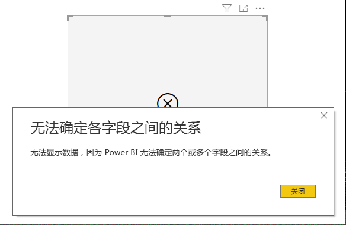
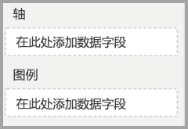
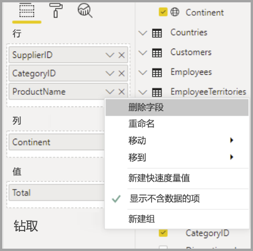

# 显示 Power BI 中不含数据的项目

Power BI 允许你可视化来自各种源的各种数据。 创建视觉对象时，Power BI 仅显示与创建视觉对象相关的数据，以便正确地管理数据的显示方式。 Power BI 根据视觉对象的配置和基础数据模型确定相关的具体数据。 本文介绍 Power BI 在确定相关数据时的具体行为方式，并通过示例说明如何进行确定。

## 确定相关数据

若要开始了解 Power BI 如何确定要显示的相关数据，让我们将表作为一个简单的示例。 使用本文末尾的[示例数据模型](#example-data-model)部分中介绍的模型，考虑通过以下设置生成一个表：

**1.来自同一个表的组：** *Product[Color] - Product[Size]*

|*Product[Color]*  |*Product[Size]*  |
|---------|---------|
|蓝色     |大         |
|蓝色     |中         |
|蓝色     |小         |
|红色     |大         |

在此示例中，Power BI 显示表“[Product]”  中存在的“[Color-Size]”  的组合。 

现在让我们看看其他组合：

**2.来自不同但直接相关的表的组且包含一个度量值：** *ProductStyle[Finish] - Product[Color] - Sum(Sales[Quantity])*

|*ProductStyle[Finish]*  |*Product[Color]*  |*[SumQuantity]*  |
|---------|---------|---------|
|光泽     |蓝色         |10         |
|亚光     |蓝色         |15         |

在此示例中，Power BI 仅显示存在的组合。 例如，不会显示（“无”+“蓝色”）或（“亚光”+“红色”），因为模型中不存在这些组合。 确定存在哪些组合的条件是  “Sum(Sales[Quantity])”的值不为空。

让我们看看其他情况： 

**3.来自不同但相关的表的组且不含度量值：** *ProductStyle[Finish] - Product[Color]*

|*ProductStyle[Finish]*  |*Product[Color]*  |
|---------|---------|
|光泽     |蓝色         |
|光泽     |红色         |
|亚光     |蓝色         |

由于没有显式度量值且这两个表直接相关，因此 Power BI 尝试注入度量值来约束生成的组合。 在这种情况下，Power BI 会注入 CALCULATE(COUNTROWS('Product'))  度量值，该值不应为空，因为  “产品”是两个表共有的表。

因此，Power BI 将显示“产品”表中包含条目的组合，   不会显示（“无”+“蓝色”）和（“亚光”+“红色”）的组合。

**4.来自不同且不相关的表的组**

示例模型没有此组合，但如果存在来自不同且不相关的表的组，Power BI 将无法关联两个列。 结果将是每个列的所有值的叉积。 在这种情况下，Power BI 会引发  “无约束联接”类型的错误，因为此类叉积在数据库中计算的成本很高，并且不会向用户提供非常多的信息。 

## 显示不含数据的项目

前面部分介绍了 Power BI 如何确定要显示的相关数据。 但是，有时候可能需要  显示不含数据的项目。 

 通过“显示不含数据的项目”功能，就可以完全实现上述目的 - 包括不含度量值数据（空度量值）的数据行和列。

若要启用  “显示不含数据的项目”功能，请选择一个视觉对象，然后在“字段”  中，右键单击该字段并从显示的菜单中选择  “显示不含数据的项目”，如下图所示：

 “显示不含数据的项目”功能在以下情况下  不起作用：

* 未向视觉对象添加度量值，分组列来自同一个表
* 各个组不相关；Power BI 不会为具有不相关的组的视觉对象运行查询
* 度量值与任何组都无关；这是因为对于仅某些组的组合，该度量值永不为空
* 有一个用户定义的不含空度量值的度量值筛选器，例如：*销售总额 > 0*

### “显示不含数据的项目”的工作原理

 “显示不含数据的项目”的最有趣用例是存在度量值的情况。 让我们看看组来自同一个表或可以通过模型中的路径进行关联的情况。 例如，  “产品样式”与  “产品”直接相关且与  “销售额”间接相关，  “产品样式”和  “产品类别”可以通过  “产品”表进行关联等。

让我们看看以下几个有趣的情况，并在关闭和打开  “显示不含数据的项目”时进行比较。 

**1.来自同一个表的分组列：** *Product[Color] - Product[Size] - Sum(Sales[Quantity])*

关闭  “显示不含数据的项目”功能时的显示方式：

|*Product[Color]*  |*Product[Size]*  |*[SumQuantity]*  |
|---------|---------|---------|
|蓝色     |中         |15         |
|蓝色     |小         |10         |

打开  “显示不含数据的项目”功能时的显示方式：

|*Product[Color]*  |*Product[Size]*  |*[SumQuantity]*  |
|---------|---------|---------|
|蓝色     |大         |         |
|蓝色     |中         |15         |
|蓝色     |小         |10         |
|红色     |大         |         |

注意两个新组合在打开此功能时的显示方式：  “蓝色 - 大”和“红色-大”  。 这两个条目在  “Sales”表中没有相应的“Quantity”  。 但是，它们显示在“Product”  表中。

**2.来自相关表的分组列：** *ProductStyle[Finish] - Product[Color] - Sum(Sales[Quantity])*

关闭  “显示不含数据的项目”功能时的显示方式：

|*ProductStyle[Finish]*  |*Product[Color]*  |*[SumQuantity]*  |
|---------|---------|---------|
|光泽     |蓝色         |10         |
|亚光     |蓝色         |15         |

打开  “显示不含数据的项目”功能时的显示方式：

|*ProductStyle[Finish]*  |*Product[Color]*  |*[SumQuantity]*  |
|---------|---------|---------|
|光泽     |蓝色         |10         |
|光泽     |红色         |         |
|亚光     |蓝色         |15         |
|无     |         |         |

注意  “（光泽-红色）”和“（无、空白）”  显示为组合的方式。 下面是它们显示的原因：
* Power BI 首先考虑了“ProductStyle[Finish]”，然后选择了所有要显示的值，这样就生成了“光泽、亚光、无”。
* 使用其中的每个值，Power BI 选择了所有相应的“Product[Color]”  条目 
* 由于  “无”与任何“Product[Color]”  都不对应，因此该值显示为空白

值得注意的是，选择列值的机制依赖于顺序，并且可以将其视为表之间的“左外部联接”  操作。 如果列的顺序更改，那么结果也将更改。

让我们看看更改顺序的示例，以及此更改对结果的影响。 这与此部分中的第 2  项相同，但更改了顺序。

**Product[Color] - ProductStyle[Finish] - Sum(Sales[Quantity])**

打开  “显示不含数据的项目”功能时的显示方式：

|*Product[Color]* |*ProductStyle[Finish]*  |*[SumQuantity]*  |
|---------|---------|---------|
|蓝色     |光泽         |10         |
|蓝色     |亚光         |15         |
|红色     |光泽         |         |

在这种情况下，注意  “ProductStyle[Finish]=None”没有显示在表中。 这是因为，在这种情况下，Power BI 先选择了  “Product”表中的所有  “Color”值。 然后，对于每种颜色，Power BI 选择了相应的  “Finish”值，其中包含数据。 由于  “无”未显示在“Color”  的任何组合中，因此未选中该项。

## Power BI 视觉对象行为

在视觉对象中的一个字段上启用“显示无数据的项目”后，将自动为该同一视觉对象 Bucket 或层次结构中的其他所有字段启用该功能   。 视觉对象 Bucket 或层次结构可以是其轴或图例，也可以是类别、行或列      。

例如，在“行”Bucket 中的带有四个字段的矩阵视觉对象上，如果一个字段启用“显示无数据的项目”，则矩阵中的所有项目都将启用它   。 在下图中，在“行”Bucket 的第一个字段“SupplierID”字段中启用了“显示无数据的项目”    。 “行”Bucket 中的其他字段也会自动启用该功能  。

相反，“列”Bucket 中显示的“洲”字段不会自动启用“显示无数据的项目”     。 

视觉对象转换为不同类型（例如，将矩阵视觉对象转换为表格视觉对象）时，通常会看到此视觉对象行为。 在此类转换中，移动到 Bucket 中的任何字段都将自动启用“显示无数据的项目”，其中 Bucket 中的字段已启用该功能  。 在上述示例中，如果“SupplierID”启用了“显示无数据的项目”功能且视觉对象转换为表格，则“列”Bucket 中的“洲”字段（以及“行”Bucket 中的字段）将移动到表视觉对象所使用的唯一 Bucket（即“值”Bucket）中       。 因此，“值”Bucket 中的所有字段都将启用“显示无数据的项目”   。

### 导出数据

使用“导出汇总数据”功能时，“显示无数据的项目”功能的行为与导出转换为表格视觉对象时的行为相同   。 因此，在导出图表矩阵视觉对象等视觉对象时，导出的数据可能与显示的视觉对象不同。 这是因为作为导出过程的一部分，转换为表视觉对象将为要导出的所有字段启用“显示无数据的项目”  。 

## 示例数据模型

本部分介绍本文中的示例使用的示例数据模型。

**模型**：

**数据**：

|Product[ProductId]|    Product[ProductName]|   Product[Color]| Product[Size]|  Product[CategoryId]|    Product[StyleId]|
|---------|---------|---------|---------|---------|---------|
|1  |Prod1  |蓝色   |小  |1  |1 |
|2  |Prod2  |蓝色   |中 |2  |2 |
|3  |Prod3  |红色    |大  |1  |1 |
|4  |Prod4  |蓝色   |大  |2  |2 |

|ProductCategory[CategoryId]|   ProductCategory[CategoryName]|
|---------|---------|
|1  |电话   |
|2  |相机 |
|3  |电视 |

|ProductStyle[StyleId]| ProductStyle[Finish]|   ProductStyle[Polished]|
|---------|---------|---------|
|1  |光泽  |是 |
|2  |亚光  |否 |
|3  |无   |否 |

|Sales[SaleId]| Sales[ProductId]|   Sales[Date]|    Sales[Quantity]|
|---------|---------|---------|---------|
|1  |1  |2012 年 1 月 1 日 0:00| 10 |
|2  |2  |2013 年 1 月 1 日 0:00| 15 |

## 后续步骤

本文介绍了如何在 Power BI 中启用  “显示不含数据的项目”功能。 你可能还会对以下文章感兴趣： 

* [Power BI 中多维模型的默认成员](../connect-data/desktop-default-member-multidimensional-models.md)
