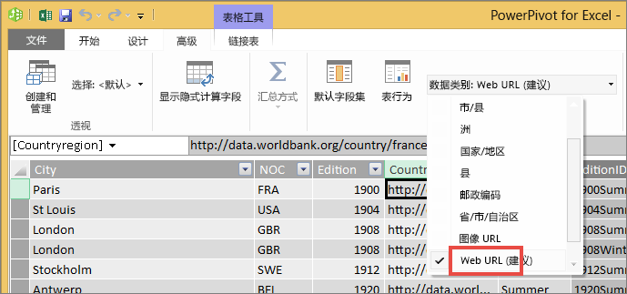

# 向表或矩形图添加超链接 (URL)
本主题介绍如何向表添加超链接 (URL)。 使用 Power BI Desktop 向数据集添加超链接 (URL)。 可以在 Power BI Desktop 或 Power BI 服务中将这些超链接添加到报表表格和矩形图。 然后，可以显示 URL 或链接图标，或将另一列的格式设置为链接文本。

还可以在 Power BI 服务和 Power BI Desktop 的[报表中的文本框](service-add-hyperlink-to-text-box.md)中创建超链接。 在 Power BI 服务中，可以向[仪表板上的磁贴](service-dashboard-edit-tile.md)和[仪表板上的文本框](service-dashboard-add-widget.md)添加超链接。 

## 在 Power BI Desktop 中将 URL 的格式设置为超链接

可以在 Power BI Desktop 中将带 URL 的字段格式设置为超链接，但不能在 Power BI 服务中进行此操作。 在将工作簿导入 Power BI 之前，还可以[在 Excel Power Pivot 中设置超链接格式](#create-a-table-or-matrix-hyperlink-in-excel-power-pivot)。

1. 在 Power BI Desktop 中，如果数据集中尚不存在带超链接的字段，则将其添加为[自定义列](../transform-model/desktop-common-query-tasks.md)。

    > [!NOTE]
    > 无法在 DirectQuery 模式下创建列。  但是，如果数据已包含 URL，可以将这些数据转变为超链接。

2. 在“数据”视图或“报表”视图中，选择列。 

3. 在“建模”  选项卡上，选择“数据类别”   > “Web URL”  。
   
    

    > [!NOTE]
    > URL 必须以某些前缀开头。 有关完整列表，请参阅本文中的[注意事项和疑难解答](#considerations-and-troubleshooting)。

## 创建包含超链接的表或矩形图

1. 将[超链接格式化为 URL](#format-a-url-as-a-hyperlink-in-power-bi-desktop) 后，请切换到“报表”视图。
2. 使用分类为 Web URL 的字段创建表或矩形图。 超链接为蓝色并带有下划线。

    

## 显示超链接图标而不是 URL

如果不想在表中显示长 URL，则可以改为显示超链接  。 

> [!NOTE]
> 不能在矩形图中显示图标。
   
1. 首先，[使用超链接创建一个表](#create-a-table-or-matrix-with-a-hyperlink)。

2. 选择表，使其处于活动状态。

    选择“格式”  图标，打开“格式”选项卡。

    展开“值”  ，找到“URL 图标”  并将其“打开”  。

    

1. （可选）从 Power BI Desktop [将报表发布到](desktop-upload-desktop-files.md) Power BI 服务。 在 Power BI 服务中打开报表时，超链接也将在此工作。

## 将链接文本格式设置为超链接

还可以将表中的另一个字段的格式设置为超链接，而不能为 URL 设置列。 在这种情况下，不会将列设置为 Web URL 格式。

> [!NOTE]
> 不能将另一字段的格式设置为矩形图中的超链接。

1. 如果数据集中还没有超链接字段，则使用 Power BI Desktop 将其添加为[自定义列](../transform-model/desktop-common-query-tasks.md)。 同样，无法在 DirectQuery 模式下创建列。  但是，如果数据已包含 URL，可以将这些数据转变为超链接。

2. 在“数据”视图或“报表”视图中，选择包含 URL 的列。 

3. 在“建模”选项卡上，选择“数据类别”   。 确保列的格式设置为“未分类”  。

2. 在“报表”视图中，创建一个表或矩形图，其中包含 URL 列和要设置为链接文本的列。

3. 选择表后，选择“格式”  图标以打开“格式”选项卡。

4. 展开“条件格式”  ，确保框中的名称是要作为链接文本的列。 找到 Web URL，并将其“打开”   。

    

    > [!NOTE]
    > 如果没看到“Web URL”选项，请确保在“数据类别”下拉框中，包含超链接的列未设置为“Web URL”格式     。

5. 在“Web URL”  对话框中，选择“基于字段”  框中包含 URL 的字段，然后选择“确定”  。

    

    现在，该列中的文本格式设置为链接。

    

1. （可选）从 Power BI Desktop [将报表发布到](desktop-upload-desktop-files.md) Power BI 服务。 在 Power BI 服务中打开报表时，超链接也将在此工作。

## 在 Excel Power Pivot 中创建表或矩形图超链接

向 Power BI 表和矩形图添加超链接的另一个方法是从 Power BI 导入/连接到数据集前，在该数据集中创建超链接。 本示例使用 Excel 工作簿。

1. 在 Excel 中打开工作簿。
2. 选择 **PowerPivot** 选项卡，然后选择**管理**。
   
   
1. Power Pivot 打开时，选择“**高级**”选项卡。
   
   
4. 将光标置于包含你想要将其转换为 Power BI 表中的超链接的 URL 的列。
   
   > [!NOTE]
   > URL 必须以某些前缀开头。 有关完整列表，请参阅[注意事项和疑难解答](#considerations-and-troubleshooting)。
   > 
   
5. 在 **Reporting 属性**组中，选择**数据类别**下拉列表，然后选择 **Web URL**。 
   
   

6. 从 Power BI 服务或 Power BI Desktop 连接到或导入此工作簿。
7. 创建一个包含 URL 字段的表可视化效果。
   
   

## 注意事项和疑难解答

URL 必须以下列前缀之一开头：
- http
- https
- -mailto
- file
- ftp
- news
- telnet

问：是否可以使用自定义 URL 作为表或矩阵中的超链接？    
答：不可以。 可以使用链接图标。 如需为你的超链接使用自定义文本且你的 URL 列表较短，请考虑改用文本框。

## 后续步骤
[Power BI 报表中的可视化效果](../visuals/power-bi-report-visualizations.md)

[Power BI 服务中设计器的基本概念](../fundamentals/service-basic-concepts.md)

更多问题？ [尝试参与 Power BI 社区](https://community.powerbi.com/)
