# <a name="work-with-filters-in-power-bi-reports"></a>使用 Power BI 报表中的筛选器

[!INCLUDE [applies-to](../includes/applies-to.md)] [!INCLUDE [yes-desktop](../includes/yes-desktop.md)] [!INCLUDE [yes-service](../includes/yes-service.md)]

Power BI 中的筛选器新增了功能，并采用了新设计。 选择启用新筛选器体验后，可以将“筛选器”窗格的格式设置为，与报表的其余部分类似。 可以锁定甚至隐藏筛选器。 设计报表时，根本不会再在“可视化效果”窗格中看到旧“筛选器”窗格。 可以在一个“筛选器”窗格中执行所有筛选器编辑和格式设置操作。 

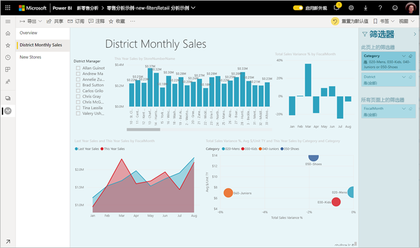

作为报表设计人员，可以在全新的“筛选器”窗格中执行某些任务：

- 添加和删除要筛选的字段。 
- 更改筛选器状态。
- 设置和自定义“筛选器”窗格的格式，让它与报表融为一体。
- 定义当使用者打开报表时，筛选器窗格在默认情况下为打开状态还是折叠状态。
- 隐藏不想让报表使用者看到的整个筛选器窗格或特定筛选器。
- 控制新“筛选器”窗格的可见、打开和折叠状态，甚至为之添加书签。
- 锁定你不希望使用者编辑的筛选器。

借助新筛选器体验，报表使用者还可以将鼠标悬停在任意视觉对象之上，以查看影响相应视觉对象的所有筛选器或切片器的只读列表。

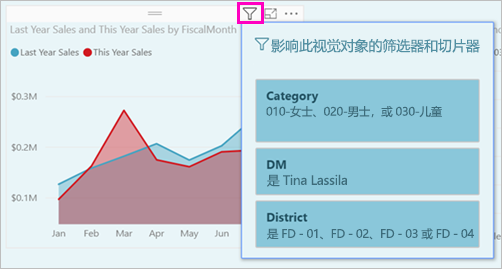

## <a name="turn-on-the-new-filter-experience"></a>打开新筛选器体验 

新报表默认启用新筛选器体验。 可在 Power BI Desktop 或 Power BI 服务中为现有报表启用新体验。

### <a name="turn-on-new-filters-for-an-existing-report-in-power-bi-desktop"></a>在 Power BI Desktop 中为现有报表启用新筛选器

1. 在 Power BI Desktop 的现有报表中，选择“文件”   > “选项和设置”   > “选项” 
2. 在导航窗格的“当前文件”下方，选择“报表设置”   。
3. 在“筛选体验”  下，选择“启用更新后的‘筛选器’窗格，并在此报表的视觉对象标头中显示筛选器”  。

### <a name="turn-on-new-filters-for-an-existing-report-in-the-service"></a>在该服务中为现有报表启用新筛选器

如果已在 Power BI 服务中启用新外观 ，则会自动启用新筛选体验  。 详细了解 [Power BI 服务的新外观](../consumer/service-new-look.md)。

如果尚未启用新外观，按照如下步骤操作也可启用新筛选体验。

1. 在 Power BI 服务中，打开工作区的内容列表。
2. 找到要启用的报表，选择“更多选项(…)”，然后选择相应报表的“设置”   。

    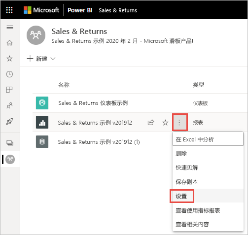

3. 在“筛选体验”  下，选择“启用更新后的‘筛选器’窗格，并在此报表的视觉对象标头中显示筛选器”  。

    

## <a name="view-filters-for-a-visual-in-reading-mode"></a>在阅读模式下查看视觉对象的筛选器

在阅读模式下，将鼠标悬停在视觉对象的筛选器图标上方，可看到一个弹出式筛选器列表，其中含有影响该视觉对象的所有筛选器、切片器等。 弹出式筛选器列表的格式设置与“筛选器”窗格的格式设置相同。 


以下是此视图显示的筛选器类型： 
- 基本筛选器
- 切片器
- 交叉突出显示 
- 交叉筛选
- 高级筛选器
- 前 N 个筛选器
- 相对日期筛选器
- 同步切片器
- 包括/排除筛选器
- 通过 URL 传递的筛选器

## <a name="build-the-new-filters-pane"></a>生成新“筛选器”窗格

启用新“筛选器”窗格后，便会在报表页右侧看到此窗格，它的格式设置默认基于当前报表设置。 可以使用新“筛选器”窗格来配置要添加的筛选器，并在新窗格中更新现有筛选器。 新“筛选器”窗格显示，报表使用者在报表发布后看到的内容。 

1. 默认情况下，报表使用者可以看到“筛选器”窗格。 如果你不希望报表使用者看到此窗格，请选择“筛选器”  旁边的睛形图标。

    

2. 若要开始生成新“筛选器”窗格，请将相关字段作为视觉对象级别、报表页级别或报表级别筛选器拖到新“筛选器”窗格中。

当你将视觉对象添加到报表画布后，Power BI 会为视觉对象中的每个字段，自动将筛选器添加到“筛选器”窗格中。 

## <a name="hide-the-filters-pane-while-editing"></a>编辑时隐藏“筛选器”窗格

Power BI Desktop 以预览版的形式提供了一个新功能区。 在“视图”选项卡上，使用“筛选”切换按钮，可以显示或隐藏“筛选器”窗格   。 当无需使用“筛选器”窗格并且需要屏幕上有额外的空间时，此功能很有用。 使用此新增功能，可以使“筛选器”窗格与其他可以打开和关闭的窗格（例如“书签”和“选择”窗格）对齐。 

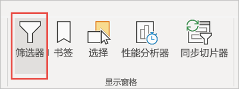

此设置仅在 Power BI Desktop 中隐藏“筛选器”窗格。 如果要为最终用户隐藏“筛选器”窗格，请改为选择“筛选器”旁边的“眼睛”图标   。

 

## <a name="lock-or-hide-filters"></a>锁定或隐藏筛选器

可以锁定或隐藏单个筛选器卡。 如果锁定某个筛选器，则报表使用者可以查看它，但不能更改它。 如果隐藏它，则报表使用者甚至无法看到它。 当你需要隐藏排除空值或意外值的数据清除筛选器时，隐藏筛选器卡很有用。 

- 在新“筛选器”窗格中，选择或取消选择筛选器卡片中的“锁定筛选器”  或“隐藏筛选器”  图标。

   

在新“筛选器”窗格中启用和禁用这些设置时，便会看到报表反映这些更改。 隐藏的筛选器不会显示在视觉对象的弹出式筛选器列表中。

还可以将新“筛选器”窗格状态配置为，可添加报表书签。 窗格的打开、关闭和可见性状态都可以使用书签进行标记。
 
## <a name="format-the-new-filters-pane"></a>设置新筛选器窗格的格式

此新体验的重要组成部分是，可以将“筛选器”窗格的格式设置为，与报表外观匹配。 可以为报表中的每个报表页设置不同格式的“筛选器”窗格。 以下是可以设置格式的元素： 

- 背景色
- 背景透明度
- 启用或禁用边框
- 边框颜色
- 标题和标头字体、颜色和文本大小

也可以设置这些筛选器卡的元素的格式，具体取决于是否应用了这些元素（设置为某些内容）或其是否可用（清除）： 

- 背景色
- 背景透明度
- 边框：打开或关闭
- 边框颜色
- 字体、颜色和文本大小
- 输入框颜色

### <a name="format-the-filters-pane-and-cards"></a>设置“筛选器”窗格和卡片的格式

1. 在报表中，单击报表本身或背景（墙纸  ），然后在“可视化效果”  窗格中，选择“格式”  。 
    此时会看到报表页、壁纸以及“筛选器”窗格和“筛选器”卡片的格式设置选项。

1. 展开“筛选器窗格”  以设置背景色、图标和左边框，以补充报表页。

    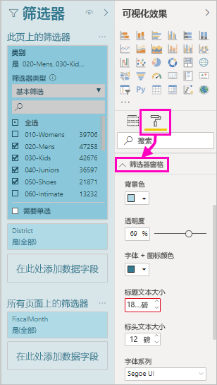

1. 展开“筛选器卡”  以设置“可用”  的“已应用”  颜色和边框。 如果将可用和已应用卡设置为不同的颜色，则可以明显地区分所应用的筛选器。 
  
    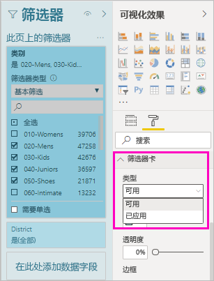

## <a name="theming-for-filters-pane"></a>“筛选器”窗格的主题设置
现在可以使用主题文件来修改“筛选器”窗格的默认设置。 下面是入门示例主题片段：

 
```
"outspacePane": [{ 

"backgroundColor": {"solid": {"color": "#0000ff"}}, 

"foregroundColor": {"solid": {"color": "#00ff00"}}, 

"transparency": 50, 

"titleSize": 35, 

"headerSize": 8, 

"fontFamily": "Georgia", 

"border": true, 

"borderColor": {"solid": {"color": "#ff0000"}} 

}], 

"filterCard": [ 

{ 

"$id": "Applied", 

"transparency": 0, 

"backgroundColor": {"solid": {"color": "#ff0000"}}, 

"foregroundColor": {"solid": {"color": "#45f442"}}, 

"textSize": 30, 

"fontFamily": "Arial", 

"border": true, 

"borderColor": {"solid": {"color": "#ffffff"}}, 

"inputBoxColor": {"solid": {"color": "#C8C8C8"}} 

}, 

{ 

"$id": "Available", 

"transparency": 40, 

"backgroundColor": {"solid": {"color": "#00ff00"}}, 

"foregroundColor": {"solid": {"color": "#ffffff"}}, 

"textSize": 10, 

"fontFamily": "Times New Roman", 

"border": true, 

"borderColor": {"solid": {"color": "#123456"}}, 

"inputBoxColor": {"solid": {"color": "#777777"}} 

}] 
```

## <a name="sort-the-filters-pane"></a>对“筛选器”窗格进行排序

新“筛选器”窗格体验提供自定义排序功能。 报表创建者可以拖放筛选器，以按照任意顺序重新排列它们。


筛选器的默认排序顺序是按字母顺序。 若要启动自定义排序模式，只需将任意筛选器拖到新位置即可。 只能在筛选器所属的级别内对筛选器进行排序（例如，视觉对象级别、报表页级别或报表级别筛选器）。

## <a name="improved-filters-pane-accessibility"></a>改进了“筛选器”窗格辅助功能

我们改进了新“筛选器”窗格的键盘导航。 可以按 Tab 键遍历“筛选器”窗格的各个部分，并使用键盘上的上下文快捷键或 Shift+F10 来打开上下文菜单。

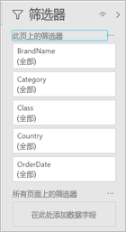

## <a name="rename-filters"></a>重命名筛选器
编辑“筛选器”窗格时，可以双击标题进行编辑。 若要更新“筛选器”卡片以更易于最终用户理解，就会发现重命名非常实用。 请注意，重命名“筛选器”卡片不会  重命名字段在字段列表中的显示名称。 它只会更改“筛选器”卡片中使用的显示名称。

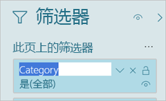

## <a name="filters-pane-search"></a>筛选器窗格搜索

使用筛选器窗格搜索功能，可以跨筛选器卡按标题进行搜索。 如果“筛选器”窗格中有多个不同的筛选器卡，并且需要有关查找相关筛选器的帮助，此功能很有用。

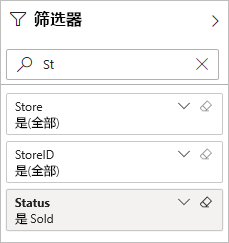

还可以设置搜索框的格式，就像设置“筛选器”窗格中其他元素的格式一样。

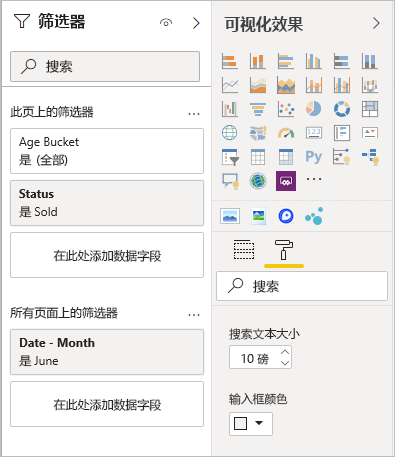

尽管默认情况下此筛选器窗格搜索功能处于启用状态，但也可以选择启用或禁用该功能，方法是在“选项”对话框的“报表”设置中选择“启用对筛选器窗格搜索”  。

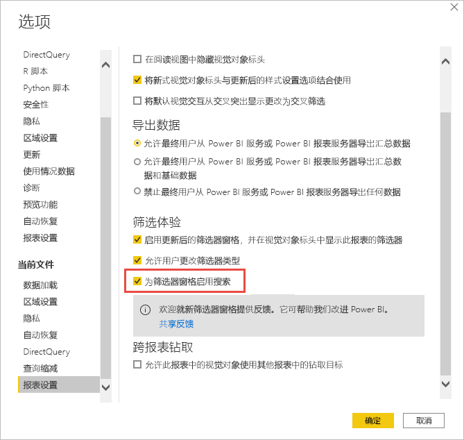

## <a name="restrict-changes-to-filter-type"></a>限制更改筛选器类型

在报表设置的“筛选体验”部分下，可控制用户能否更改筛选器类型。

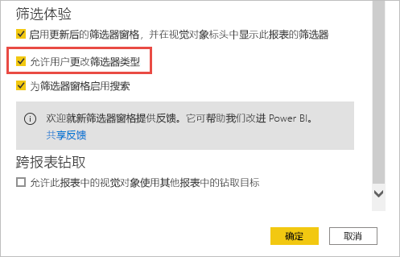

## <a name="considerations-and-limitations"></a>注意事项和限制

发布到 Web 不显示“筛选器”窗格。 如果计划将报表发布到 Web，请考虑添加切片器进行筛选。

## <a name="next-steps"></a>后续步骤

试用新筛选器体验。 在 [Power BI Ideas 网站](https://ideas.powerbi.com/forums/265200-power-bi)上，提供有关此功能的反馈，以及如何继续改进它。 

- [如何使用报表筛选器](../consumer/end-user-report-filter.md)
- [报表中的筛选器和突出显示](power-bi-reports-filters-and-highlighting.md)
- [Power BI 中不同种类的筛选器](power-bi-report-filter-types.md)

更多问题？ [尝试参与 Power BI 社区](https://community.powerbi.com/)
