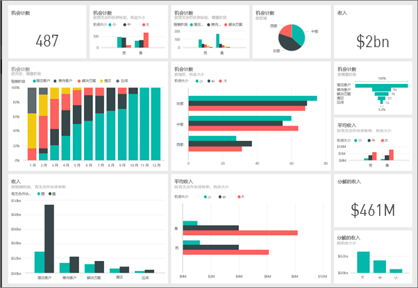
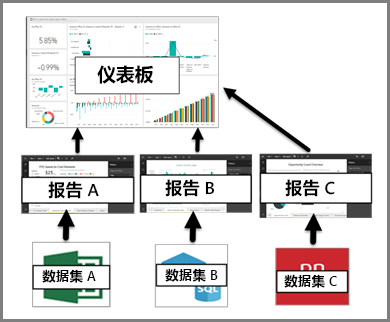

# Power BI 设计器的仪表板简介

Power BI“仪表板”是通过可视化效果讲述故事的单个页面，常被称为画布。 因为它被限制为一页，设计精良的仪表板仅包含该故事的亮点。 读者可查看相关报表了解详细信息。

仪表板只是 Power BI 服务的一个功能。 Power BI Desktop 中无此功能。 尽管无法在移动设备上创建仪表板，但可以[查看和共享]../consumer/mobile/mobile-apps-view-dashboard.md)仪表板。

## 仪表板基础知识 

仪表板上的可视化效果称为“磁贴”。 从报表将磁贴“固定”到仪表板。 如果你不熟悉 Power BI，可阅读 [Power BI 服务中设计器的基本概念](../fundamentals/service-basic-concepts.md)来详细了解基础知识。

仪表板上的可视化效果源自报表，并且每个报表基于一个数据集。 对于仪表板，一种看法是它是基础报表和数据集的入口。 选择一个可视化效果即可转到其所基于的报表（和数据集）。

## 仪表板的优点
仪表板是监控业务，以及查看所有最重要指标的绝佳方法。 仪表板上的可视化效果可能来自一个或许多个基础数据集，也可能来自一个或多个基础报表。 仪表板将本地数据和云数据合并到一起，提供合并视图（无论数据源自哪里）。

仪表板不仅仅是美观的图片。 它具有高度互动性，并且磁贴随着基础数据的更改而更新。

## 谁可以创建仪表板？
创建仪表板的能力被视为创建者功能，需要拥有报表编辑权限。 报表创建者及其所授予访问权限的同事拥有编辑权限。 例如，如果 David 在 workspace ABC 中创建了一个报表，然后将你添加为该工作区的成员，则你和 David 都将拥有编辑权限。 另一方面，如果报表已与你直接共享或作为 [Power BI 应用](../collaborate-share/service-create-distribute-apps.md)的一部分（你正在使用该报表）， 则可能无法将磁贴固定到仪表板。 

> [!IMPORTANT]
> 需要 [Power BI Pro](../fundamentals/service-features-license-type.md) 许可证方可在工作区中创建仪表板。 可以在你自己的“我的工作区”中创建仪表板，而无需 Power BI Pro 许可证。

## 仪表板与报表
[报表](../consumer/end-user-reports.md)与仪表板类似，这是因为二者都是填充可视化效果的画布。 但有一些主要区别，如下表所示。

| **功能** | **仪表板** | **报表** |
| --- | --- | --- |
| 页数 |一个页面 |一个或多个页面 |
| 数据源 |每个仪表板的一个或多个报表和一个或多个数据集 |每个报表的单个数据集 |
| 可用于 Power BI Desktop |否 | 是。 可在 Power BI Desktop 中生成和查看报表 |
| 订阅 |是。 可订阅仪表板 |是。 可订阅报表页面 |
| 筛选 |否。 无法筛选或切片 |是。 许多不同的方式来筛选、突出显示和切片 |
| 特别推荐 |是。 可将一个仪表板设置为精选仪表板 |否 |
| 收藏夹 | 是。 可将多个仪表板设置为“收藏夹” | 是。 可将多个报表设置为“收藏夹”
| 设置警报 |是。 可在某些情况下用于仪表板磁贴 |否 |
| 自然语言查询（“问答”） |是 | 是，前提是你有权编辑报表及基础数据集 |
| 可以看到基础数据集表和字段 |否。 可以导出数据，但看不到仪表板本身的表和字段 |是 |

## 后续步骤
* 通过参观我们的[示例仪表板](sample-tutorial-connect-to-the-samples.md)之一，轻松了解仪表板的使用。
* 了解[仪表板磁贴](service-dashboard-tiles.md)。
* 想要跟踪单个仪表板磁贴并在该磁贴达到某个阈值时接收电子邮件？ [创建有关磁贴的警报](service-set-data-alerts.md)。
* 了解如何使用 [Power BI 问答](power-bi-tutorial-q-and-a.md)询问有关你的数据的问题，并以可视化效果的形式获得答案。
