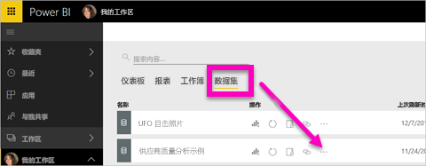
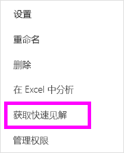
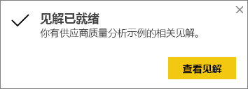
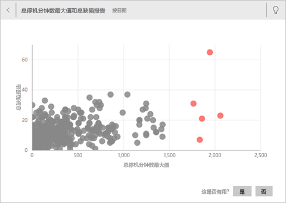
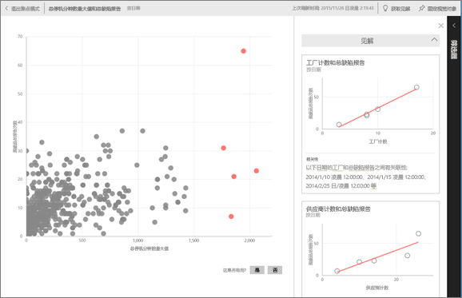

# 通过 Power BI 自动生成数据见解
你有新数据集，但不太确定要从何处着手？  需要快速生成仪表板？  想要查找你可能错失的见解？

运行快速见解便可基于你的数据生成有趣的交互式可视化效果。 你可以对整个数据集（快速见解）或对特定仪表板磁贴（作用域内见解）运行快速见解。 甚至可以在某个见解上运行见解！

> [!NOTE]
> 见解不适用于 DirectQuery；仅适用于上传到 Power BI 的数据。
> 

见解功能以一组与 Microsoft Research 联合开发且数量不断增长的[高级分析算法](../consumer/end-user-insight-types.md)为基础构建而成，我们将继续通过该功能让更多人以新颖直观的方式从其数据中寻找见解。

## 对数据集运行快速见解
观看 Amanda 如何对数据集运行快速见解，在焦点模式下打开见解，将其中一个见解作为磁贴固定到仪表板中，然后为仪表板磁贴获取见解。

<iframe width="560" height="315" src="https://www.youtube.com/embed/et_MLSL2sA8" frameborder="0" allowfullscreen></iframe>

现在轮到你了。 使用[供应商质量分析示例](sample-supplier-quality.md)探索见解。

1. 从“数据集”选项卡中选择“更多选项”(…)，然后选择“获取快速见解”    。
   
    
   
    
2. Power BI 使用[各种算法](../consumer/end-user-insight-types.md)来搜索数据集中的趋势。
   
    
3. 你的见解会在几秒内准备就绪。  选择“查看见解”  以显示可视化效果。
   
    
   
    > [!NOTE]
    > 某些数据集不能生成见解，因为数据不具有统计学意义。  若要了解详细信息，请参阅[针对见解优化数据](service-insights-optimize.md)。
    > 
    
4. 可视化效果会在特殊的“快速见解”  画布中显示，最多可包含 32 个不同的见解卡片。 每张卡片会有一个图表或图形，并附上简短的说明
   
    

## 与见解卡片交互

1. 将鼠标悬停在某个卡片上，选择固定图标，以将可视化效果添加到仪表板中。

2. 将鼠标悬停在某张卡片上，选择“更多选项”(…)，然后选择“查看见解”   。 

    见解屏幕在焦点模式下打开。
   
    
3. 在“焦点”模式下，你可以：
   
   * 筛选可视化效果。 如果筛选器窗格尚未打开，则选择窗口右侧的箭头将其展开  。

       
   * 选择“固定视觉对象”将见解卡固定到仪表板  。
   * 对卡本身运行见解，这通常称为作用域内见解  。 在右上角，选择灯泡图标  或“获取见解”  。
     
       
     
     该见解显示在左侧，而完全根据该见解中的数据获得的新卡片显示在右侧。
     
       
4. 若要返回到最初的见解画布，请在左上角选择“退出焦点模式”  。

## 对仪表板磁贴运行见解
将搜索范围缩小以针对用于创建单个仪表板磁贴的数据搜索范围见解，而不是针对整个数据集搜索见解。 

1. 打开仪表板。
2. 将鼠标悬停在一个磁上。 选择“更多选项”(…)，然后选择“查看见解”   。 该磁贴以[焦点模式](../consumer/end-user-focus.md)打开，并在右侧显示见解卡片。    
   
        
3. 你是否对某个见解产生了兴趣？ 选择该见解卡片以深入进行了解。 选中的见解显示在左侧，而完全根据该见解中的数据获得的新见解卡片显示在右侧。    
4. 继续发掘数据，当你发现感兴趣的见解时，从右上角选择“固定视觉对象”  ，将其固定到仪表板上。

## 后续步骤
- 如果你拥有一个数据集，请[针对快速见解对其进行优化](service-insights-optimize.md)。
- 了解[可用的快速见解类型](../consumer/end-user-insight-types.md)。

更多问题？ [尝试参与 Power BI 社区](https://community.powerbi.com/)。
