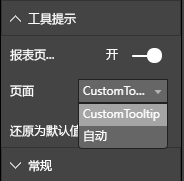

# <a name="tooltips-in-power-bi-visuals"></a>Power BI 视觉对象中的工具提示

视觉对象现可使用 Power BI 工具提示支持。 Power BI 工具提示可处理下列交互：

* 显示工具提示、
* 隐藏工具提示、
* 移动工具提示。

工具提示可在一组指定的坐标中显示带标题的文本元素和具有给定颜色和不透明度的值。 该数据被提供给 API，Power BI 主机采用其呈现本机视觉对象的工具提示的方式呈现该数据。

下图显示了示例条形图中的工具提示：


上述工具提示图显示了单个条形的类别和值。 可以扩展单个工具提示以显示多个值。

## <a name="manage-tooltips"></a>管理工具提示

用于管理工具提示的接口是“ITooltipService”。 它用于通知主机需要显示、删除或移动工具提示。

```typescript
    interface ITooltipService {
        enabled(): boolean;
        show(options: TooltipShowOptions): void;
        move(options: TooltipMoveOptions): void;
        hide(options: TooltipHideOptions): void;
    }
```

视觉对象需要侦听视觉对象中的鼠标事件，并根据需要使用 `Tooltip****Options` 对象中填充的相应内容调用 `show()`、`move()` 和 `hide()` 委托。
`TooltipShowOptions` 和 `TooltipHideOptions` 将依次定义要显示的内容以及如何在这些事件中执行操作。

由于调用这些方法会涉及用户事件，例如鼠标移动或触摸事件，因此最好为这些事件创建侦听器，由侦听器调用 `TooltipService` 成员。
我们的示例聚合在名为 `TooltipServiceWrapper` 的类中。

### <a name="the-tooltipservicewrapper-class"></a>TooltipServiceWrapper 类

此类背后的基本思路是保留 `TooltipService` 的实例，针对相关元素侦听 D3 鼠标事件，然后在需要时调用 `show()` 和 `hide()` 元素。

此类会保留并管理这些事件的任何相关状态和逻辑，主要用于与基础 D3 代码连接。 D3 连接和转换不在本文范围内。

[SampleBarChart 视觉对象存储库](https://github.com/Microsoft/PowerBI-visuals-sampleBarChart/commit/981b021612d7b333adffe9f723ab27783c76fb14)中有完整的示例代码。

### <a name="create-tooltipservicewrapper"></a>创建 TooltipServiceWrapper

条形图构造函数现有 `TooltipServiceWrapper` 成员，可在构造函数中使用主机 `tooltipService` 实例将该成员实例化。

```typescript
        private tooltipServiceWrapper: ITooltipServiceWrapper;

        this.tooltipServiceWrapper = createTooltipServiceWrapper(this.host.tooltipService, options.element);
```

`TooltipServiceWrapper` 类保留了 `tooltipService` 实例，它同样作为视觉对象和触摸参数的根 D3 元素。

```typescript
    class TooltipServiceWrapper implements ITooltipServiceWrapper {
        private handleTouchTimeoutId: number;
        private visualHostTooltipService: ITooltipService;
        private rootElement: Element;
        private handleTouchDelay: number;

        constructor(tooltipService: ITooltipService, rootElement: Element, handleTouchDelay: number) {
            this.visualHostTooltipService = tooltipService;
            this.handleTouchDelay = handleTouchDelay;
            this.rootElement = rootElement;
        }
        .
        .
        .
    }
```

此类用于注册事件侦听器的单个入口点是 `addTooltip` 方法。

### <a name="the-addtooltip-method"></a>addTooltip 方法

```typescript
        public addTooltip<T>(
            selection: d3.Selection<Element>,
            getTooltipInfoDelegate: (args: TooltipEventArgs<T>) => VisualTooltipDataItem[],
            getDataPointIdentity: (args: TooltipEventArgs<T>) => ISelectionId,
            reloadTooltipDataOnMouseMove?: boolean): void {

            if (!selection || !this.visualHostTooltipService.enabled()) {
                return;
            }
        ...
        ...
        }
```

* **selection: d3.Selection<Element>** ：用于处理工具提示的 d3 元素。

* **getTooltipInfoDelegate: (args:TooltipEventArgs<T>) => VisualTooltipDataItem[]** ：用于填充每个上下文的工具提示内容（显示内容）的委托。

* **getDataPointIdentity: (args:TooltipEventArgs<T>) => ISelectionId**：用于检索数据点 ID 的委托（此示例中未使用）。 

* **reloadTooltipDataOnMouseMove?: boolean**：指示是否在 MouseMove 事件期间刷新工具提示数据的布尔值（此示例中未使用）。

如你所见，如果 `tooltipService` 被禁用或实际未作选择，则 `addTooltip` 将退出且不执行任何操作。

### <a name="call-the-show-method-to-display-a-tooltip"></a>调用 show 方法来显示工具提示

`addTooltip` 方法接下来侦听 D3 `mouseover` 事件，如以下代码所示：

```typescript
        ...
        ...
        selection.on("mouseover.tooltip", () => {
            // Ignore mouseover while handling touch events
            if (!this.canDisplayTooltip(d3.event))
                return;

            let tooltipEventArgs = this.makeTooltipEventArgs<T>(rootNode, true, false);
            if (!tooltipEventArgs)
                return;

            let tooltipInfo = getTooltipInfoDelegate(tooltipEventArgs);
            if (tooltipInfo == null)
                return;

            let selectionId = getDataPointIdentity(tooltipEventArgs);

            this.visualHostTooltipService.show({
                coordinates: tooltipEventArgs.coordinates,
                isTouchEvent: false,
                dataItems: tooltipInfo,
                identities: selectionId ? [selectionId] : [],
            });
        });
```

* **makeTooltipEventArgs**：将 D3 选定元素的上下文提取到 tooltipEventArgs 中。 它也会计算坐标。

* **getTooltipInfoDelegate**：然后根据 tooltipEventArgs 构建工具提示内容。 这是对 BarChart 类的回调，因为它是视觉对象的逻辑。 这是在工具提示中显示的实际文本内容。

* **getDataPointIdentity**：此示例中未使用。

* **this.visualHostTooltipService.show**：用于显示工具提示的调用。  

可在 `mouseout` 和 `mousemove` 事件的示例中找到其他处理。

有关详细信息，请参阅 [SampleBarChart 视觉对象存储库](https://github.com/Microsoft/PowerBI-visuals-sampleBarChart/commit/981b021612d7b333adffe9f723ab27783c76fb14)。

### <a name="populate-the-tooltip-content-by-the-gettooltipdata-method"></a>由 getTooltipData 方法填充工具提示内容

BarChart 类添加了成员 `getTooltipData`，后者只是将数据点的 `category`、`value` 和 `color` 提取到 VisualTooltipDataItem[] 元素中。

```typescript
        private static getTooltipData(value: any): VisualTooltipDataItem[] {
            return [{
                displayName: value.category,
                value: value.value.toString(),
                color: value.color,
                header: 'ToolTip Title'
            }];
        }
```

在上面的实现中，`header` 成员是常数，但可用于需要动态值的更复杂的实现。 可使用多个元素填充 `VisualTooltipDataItem[]`，这样可在工具提示中添加多个行。 这在堆积条形图等视觉对象中非常有用，工具提示可在其中显示来自多个数据点的数据。

### <a name="call-the-addtooltip-method"></a>调用 addTooltip 方法

最后一步是在实际数据可能发生变化时调用 `addTooltip` 方法。 此调用在 `BarChart.update()` 方法中进行。 调用的目标是监视所有“bar”元素的选择，如上所述，仅传递 `BarChart.getTooltipData()`。

```typescript
        this.tooltipServiceWrapper.addTooltip(this.barContainer.selectAll('.bar'),
            (tooltipEvent: TooltipEventArgs<number>) => BarChart.getTooltipData(tooltipEvent.data),
            (tooltipEvent: TooltipEventArgs<number>) => null);
```

## <a name="add-report-page-tooltips"></a>添加报表页工具提示

要添加报表页工具提示支持，大多数更改将发生在 capabilities.json 文件中  。

示例架构是

```json
{
    "tooltips": {
        "supportedTypes": {
            "default": true,
            "canvas": true
        },
        "roles": [
            "tooltips"
        ]
    }
}
```

可以在“格式”窗格中定义报表页工具提示  。



* `supportedTypes`：工具提示配置受视觉对象支持，并且很好地在字段中反映。 
   * `default`：指定是否支持通过数据字段绑定“自动”工具提示。 
   * `canvas`：指定是否支持报表页工具提示。

* `roles`：（可选）定义后，将指示哪些数据角色将很好地绑定到字段中的选定工具提示选项。

有关详细信息，请参阅[报表页工具提示使用指南](https://powerbi.microsoft.com/blog/power-bi-desktop-march-2018-feature-summary/#tooltips)。

要显示报表页工具提示，Power BI 主机调用 `ITooltipService.Show(options: TooltipShowOptions)` 或 `ITooltipService.Move(options: TooltipMoveOptions)` 之后，将使用 selectionId（前面的 `options` 参数的 `identities` 属性）。 为了便于工具提示进行检索，SelectionId 应表示你悬停在其上方的项目的选定数据（类别、系列等）。

有关将 selectionId 发送到工具提示显示调用的示例如下代码所示：

```typescript
    this.tooltipServiceWrapper.addTooltip(this.barContainer.selectAll('.bar'),
        (tooltipEvent: TooltipEventArgs<number>) => BarChart.getTooltipData(tooltipEvent.data),
        (tooltipEvent: TooltipEventArgs<number>) => tooltipEvent.data.selectionID);
```
