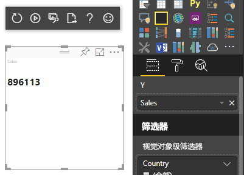
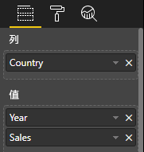
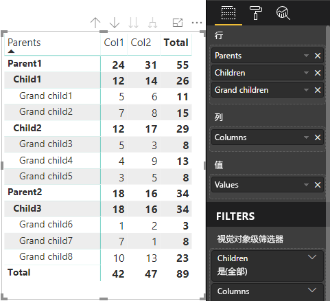

# <a name="understand-data-view-mapping-in-power-bi-visuals"></a>了解 Power BI 视觉对象中的数据视图映射

本文讨论了数据视图映射，描述了数据角色如何彼此相关，并允许你为它们指定条件要求。 本文还介绍了每种 `dataMappings` 类型。

每个有效的映射都会生成一个数据视图，但目前仅支持对每个视觉对象执行一次查询。 你通常会仅获得一个数据视图。 然而，在某些情况下可以提供多个数据映射，这允许：

```json
"dataViewMappings": [
    {
        "conditions": [ ... ],
        "categorical": { ... },
        "single": { ... },
        "table": { ... },
        "matrix": { ... }
    }
]
```

当且仅当在 `dataViewMappings` 中填充了有效映射时，Power BI 才会创建到数据视图的映射。

换句话说，`categorical` 可在 `dataViewMappings` 中定义，但其他映射（例如 `table` 或 `single` ）可能不行。 例如：

```json
"dataViewMappings": [
    {
        "categorical": { ... }
    }
]
```

Power BI 生成具有单个 `categorical` 映射的数据视图，并且 `table` 和其他映射未定义：

```javascript
{
    "categorical": {
        "categories": [ ... ],
        "values": [ ... ]
    },
    "metadata": { ... }
}
```

## <a name="conditions"></a>条件

本部分介绍特定数据映射的条件。 可以提供多组条件，如果数据与所述的一组条件相匹配，则视觉对象会将数据作为有效数据来接受。

目前，对于每个字段，可以指定最小值和最大值。 该值表示可以绑定到该数据角色的字段数。 

> [!NOTE]
> 如果条件中省略了数据角色，那么可以绑定任意数量的字段。

### <a name="example-1"></a>示例 1

可以将多个字段拖入每个数据角色。 在本示例中，类别限一个数据字段，度量值限两个数据字段。

```json
"conditions": [
    { "category": { "max": 1 }, "y": { "max": 2 } },
]
```

### <a name="example-2"></a>示例 2

在本示例中，需要满足以下两个条件之一：
* 一个类别数据字段和两个度量值
* 两个类别和一个度量值。

```json
"conditions": [
    { "category": { "min": 1, "max": 1 }, "measure": { "min": 2, "max": 2 } },
    { "category": { "min": 2, "max": 2 }, "measure": { "min": 1, "max": 1 } }
]
```

## <a name="single-data-mapping"></a>单个数据映射

单个数据映射是数据映射的最简单形式。 它接受单个度量值字段并提供总计。 如果该字段为数值字段，则它将提供总和。 否则，它将提供非重复值的计数。

要使用单个数据映射，则需要定义要映射的数据角色的名称。 此映射仅适用于单个度量值字段。 如果分配了第二个字段，则不会生成任何数据视图，因此，最好包含将数据限制为单个字段的条件。

> [!NOTE]
> 此数据映射不能与任何其他数据映射结合使用。 它旨在将数据限制为单个数值。

### <a name="example-3"></a>示例 3

```json
{
    "dataRoles": [
        {
            "displayName": "Y",
            "name": "Y",
            "kind": "Measure"
        }
    ],
    "dataViewMappings": [
        {
            "conditions": [
                {
                    "Y": {
                        "max": 1
                    }
                }
            ],
            "single": {
                "role": "Y"
            }
        }
    ]
}
```

生成的数据视图仍将包含其他类型（表、类别等），但每个映射只包含单个值。 最佳做法是只访问单个值。

```JSON
{
    "dataView": [
        {
            "metadata": null,
            "categorical": null,
            "matrix": null,
            "table": null,
            "tree": null,
            "single": {
                "value": 94163140.3560001
            }
        }
    ]
}
```

处理简单数据视图映射的代码示例

```typescript
"use strict";
import powerbi from "powerbi-visuals-api";
import DataView = powerbi.DataView;
import DataViewSingle = powerbi.DataViewSingle;
// standart imports
// ...

export class Visual implements IVisual {
    private target: HTMLElement;
    private host: IVisualHost;
    private valueText: HTMLParagraphElement;

    constructor(options: VisualConstructorOptions) {
        // constructor body
        this.target = options.element;
        this.host = options.host;
        this.valueText = document.createElement("p");
        this.target.appendChild(this.valueText);
        // ...
    }

    public update(options: VisualUpdateOptions) {
        const dataView: DataView = options.dataViews[0];
        const singleDataView: DataViewSingle = dataView.single;

        if (!singleDataView ||
            !singleDataView.value ) {
            return
        }

        this.valueText.innerText = singleDataView.value.toString();
    }
}
```

因此，视觉对象显示 Power BI 中的单个值：



## <a name="categorical-data-mapping"></a>类别数据映射

类别数据映射用于获取一个或两个独立的数据组别。

### <a name="example-4"></a>示例 4

下面是之前数据角色示例中的定义：

```json
"dataRole":[
    {
        "displayName": "Category",
        "name": "category",
        "kind": "Grouping"
    },
    {
        "displayName": "Y Axis",
        "name": "measure",
        "kind": "Measure"
    }
]
```

下面是映射：

```json
"dataViewMappings": {
    "categorical": {
        "categories": {
            "for": { "in": "category" }
        },
        "values": {
            "select": [
                { "bind": { "to": "measure" } }
            ]
        }
    }
}
```

这是一个简单的示例。 内容是“映射我的 `category` 数据角色，以便我拖入 `category` 的每个字段的数据都映射到 `categorical.categories`。 同时将 `measure` 数据角色映射到 `categorical.values`”。

* **for...in**：对于此数据角色中的所有项，将它们包含在数据查询中。
* **bind...to**：生成与 for...in  相同的结果，但预期数据角色具有将其限制为单个字段的条件。

### <a name="example-5"></a>示例 5

本示例将使用前面示例中的前两个数据角色，另外定义 `grouping` 和 `measure2`。

```json
"dataRole":[
    {
        "displayName": "Category",
        "name": "category",
        "kind": "Grouping"
    },
    {
        "displayName": "Y Axis",
        "name": "measure",
        "kind": "Measure"
    },
    {
        "displayName": "Grouping with",
        "name": "grouping",
        "kind": "Grouping"
    },
    {
        "displayName": "X Axis",
        "name": "measure2",
        "kind": "Grouping"
    }
]
```

下面是映射：

```json
"dataViewMappings":{
    "categorical": {
        "categories": {
            "for": { "in": "category" }
        },
        "values": {
            "group": {
                "by": "grouping",
                "select":[
                    { "bind": { "to": "measure" } },
                    { "bind": { "to": "measure2" } }
                ]
            }
        }
    }
}
```

此处的差别在于映射类别值的方式。 现在内容是“映射我的 `measure` 和 `measure2` 数据角色，以按照数据角色 `grouping` 进行分组”。

### <a name="example-6"></a>示例 6

下面是数据角色：

```json
"dataRoles": [
    {
        "displayName": "Categories",
        "name": "category",
        "kind": "Grouping"
    },
    {
        "displayName": "Measures",
        "name": "measure",
        "kind": "Measure"
    },
    {
        "displayName": "Series",
        "name": "series",
        "kind": "Measure"
    }
]
```

下面是数据视图映射：

```json
"dataViewMappings": [
    {
        "categorical": {
            "categories": {
                "for": {
                    "in": "category"
                }
            },
            "values": {
                "group": {
                    "by": "series",
                    "select": [{
                            "for": {
                                "in": "measure"
                            }
                        }
                    ]
                }
            }
        }
    }
]
```

类别数据视图可进行可视化，如下所示：

| 分类 |  |  | | | |
|-----|-----|------|------|------|------|
| | 年份 | 2013 | 2014 | 2015 | 2016 |
| 国家/地区 | | |
| 美国 | | x | x | 650 | 350 |
| 加拿大 | | x | 630 | 490 | x |
| 墨西哥 | | 645 | x | x | x |
| 英国 | | x | x | 831 | x |

Power BI 将其作为分类数据视图生成。 这是一组类别。

```JSON
{
    "categorical": {
        "categories": [
            {
                "source": {...},
                "values": [
                    "Canada",
                    "USA",
                    "UK",
                    "Mexico"
                ],
                "identity": [...],
                "identityFields": [...],
            }
        ]
    }
}
```

每个类别也会映射到一组值。 其中的每个值都是按序列分组的，序列以年份的形式表示。

例如，每个 `values` 数组表示每年的数据。
此外，每个 `values` 数组有 4 个值，分别是加拿大、美国、英国和墨西哥：

```JSON
{
    "values": [
        // Values for 2013 year
        {
            "source": {...},
            "values": [
                null, // Value for `Canada` category
                null, // Value for `USA` category
                null, // Value for `UK` category
                645 // Value for `Mexico` category
            ],
            "identity": [...],
        },
        // Values for 2014 year
        {
            "source": {...},
            "values": [
                630, // Value for `Canada` category
                null, // Value for `USA` category
                null, // Value for `UK` category
                null // Value for `Mexico` category
            ],
            "identity": [...],
        },
        // Values for 2015 year
        {
            "source": {...},
            "values": [
                490, // Value for `Canada` category
                650, // Value for `USA` category
                831, // Value for `UK` category
                null // Value for `Mexico` category
            ],
            "identity": [...],
        },
        // Values for 2016 year
        {
            "source": {...},
            "values": [
                null, // Value for `Canada` category
                350, // Value for `USA` category
                null, // Value for `UK` category
                null // Value for `Mexico` category
            ],
            "identity": [...],
        }
    ]
}
```

下面介绍了用于处理分类数据视图映射的代码示例。 该示例创建层次结构 `Country => Year => Value`

```typescript
"use strict";
import powerbi from "powerbi-visuals-api";
import DataView = powerbi.DataView;
import DataViewDataViewCategoricalSingle = powerbi.DataViewCategorical;
import DataViewValueColumnGroup = powerbi.DataViewValueColumnGroup;
import PrimitiveValue = powerbi.PrimitiveValue;
// standart imports
// ...

export class Visual implements IVisual {
    private target: HTMLElement;
    private host: IVisualHost;
    private categories: HTMLElement;

    constructor(options: VisualConstructorOptions) {
        // constructor body
        this.target = options.element;
        this.host = options.host;
        this.categories = document.createElement("pre");
        this.target.appendChild(this.categories);
        // ...
    }

    public update(options: VisualUpdateOptions) {
        const dataView: DataView = options.dataViews[0];
        const categoricalDataView: DataViewCategorical = dataView.categorical;

        if (!categoricalDataView ||
            !categoricalDataView.categories ||
            !categoricalDataView.categories[0] ||
            !categoricalDataView.values) {
            return;
        }

        // Categories have only one column in data buckets
        // If you want to support several columns of categories data bucket, you should iterate categoricalDataView.categories array.
        const categoryFieldIndex = 0;
        // Measure has only one column in data buckets.
        // If you want to support several columns on data bucket, you should iterate years.values array in map function
        const measureFieldIndex = 0;
        let categories: PrimitiveValue[] = categoricalDataView.categories[categoryFieldIndex].values;
        let values: DataViewValueColumnGroup[] = categoricalDataView.values.grouped();

        let data = {};
        // iterate categories/countries
        categories.map((category: PrimitiveValue, categoryIndex: number) => {
            data[category.toString()] = {};
            // iterate series/years
            values.map((years: DataViewValueColumnGroup) => {
                if (!data[category.toString()][years.name] && years.values[measureFieldIndex].values[categoryIndex]) {
                    data[category.toString()][years.name] = []
                }
                if (years.values[0].values[categoryIndex]) {
                    data[category.toString()][years.name].push(years.values[measureFieldIndex].values[categoryIndex]);
                }
            });
        });

        this.categories.innerText = JSON.stringify(data, null, 6);
        console.log(data);
    }
}
```

视觉对象的结果：


## <a name="table-data-mapping"></a>表数据映射

表数据视图是一种简单的数据映射。 实质上，它是数据点的列表，可在其中聚合数值数据点。

### <a name="example-7"></a>示例 7

如果给定功能：

```json
"dataRoles": [
    {
        "displayName": "Column",
        "name": "column",
        "kind": "Grouping"
    },
    {
        "displayName": "Value",
        "name": "value",
        "kind": "Measure"
    }
]
```

```json
"dataViewMappings": [
    {
        "table": {
            "rows": {
                "select": [
                    {
                        "for": {
                            "in": "column"
                        }
                    },
                    {
                        "for": {
                            "in": "value"
                        }
                    }
                ]
            }
        }
    }
]
```

可以按下方所示的方式可视化表数据视图：  

数据示例：

| 国家/地区| 年份 | 销售 |
|-----|-----|------|
| 美国 | 2016 | 100 |
| 美国 | 2015 | 50 |
| 加拿大 | 2015 | 200 |
| 加拿大 | 2015 | 50 |
| 墨西哥 | 2013 | 300 |
| 英国 | 2014 | 150 |
| 美国 | 2015 | 75 |

数据绑定：



Power BI 以表数据视图的形式显示数据。 不应假定数据已排序。

```JSON
{
    "table" : {
        "columns": [...],
        "rows": [
            [
                "Canada",
                2014,
                630
            ],
            [
                "Canada",
                2015,
                490
            ],
            [
                "Mexico",
                2013,
                645
            ],
            [
                "UK",
                2014,
                831
            ],
            [
                "USA",
                2015,
                650
            ],
            [
                "USA",
                2016,
                350
            ]
        ]
    }
}
```

可以通过选择所需的字段，然后选择“求和”来聚合数据。  


处理表数据视图映射的代码示例。

```typescript
"use strict";
import "./../style/visual.less";
import powerbi from "powerbi-visuals-api";
// ...
import DataViewMetadataColumn = powerbi.DataViewMetadataColumn;
import DataViewTable = powerbi.DataViewTable;
import DataViewTableRow = powerbi.DataViewTableRow;
import PrimitiveValue = powerbi.PrimitiveValue;
// other imports
// ...

export class Visual implements IVisual {
    private target: HTMLElement;
    private host: IVisualHost;
    private table: HTMLParagraphElement;

    constructor(options: VisualConstructorOptions) {
        // constructor body
        this.target = options.element;
        this.host = options.host;
        this.table = document.createElement("table");
        this.target.appendChild(this.table);
        // ...
    }

    public update(options: VisualUpdateOptions) {
        const dataView: DataView = options.dataViews[0];
        const tableDataView: DataViewTable = dataView.table;

        if (!tableDataView) {
            return
        }
        while(this.table.firstChild) {
            this.table.removeChild(this.table.firstChild);
        }

        //draw header
        const tableHeader = document.createElement("th");
        tableDataView.columns.forEach((column: DataViewMetadataColumn) => {
            const tableHeaderColumn = document.createElement("td");
            tableHeaderColumn.innerText = column.displayName
            tableHeader.appendChild(tableHeaderColumn);
        });
        this.table.appendChild(tableHeader);

        //draw rows
        tableDataView.rows.forEach((row: DataViewTableRow) => {
            const tableRow = document.createElement("tr");
            row.forEach((columnValue: PrimitiveValue) => {
                const cell = document.createElement("td");
                cell.innerText = columnValue.toString();
                tableRow.appendChild(cell);
            })
            this.table.appendChild(tableRow);
        });
    }
}
```

视觉对象样式文件 `style/visual.less` 包含表的布局：

```less
table {
    display: flex;
    flex-direction: column;
}

tr, th {
    display: flex;
    flex: 1;
}

td {
    flex: 1;
    border: 1px solid black;
}
```


## <a name="matrix-data-mapping"></a>矩阵数据映射

矩阵数据映射与表数据映射类似，但前者按层次结构显示行。 任意一个数据角色值均可用作列标题值。

```json
{
    "dataRoles": [
        {
            "name": "Category",
            "displayName": "Category",
            "displayNameKey": "Visual_Category",
            "kind": "Grouping"
        },
        {
            "name": "Column",
            "displayName": "Column",
            "displayNameKey": "Visual_Column",
            "kind": "Grouping"
        },
        {
            "name": "Measure",
            "displayName": "Measure",
            "displayNameKey": "Visual_Values",
            "kind": "Measure"
        }
    ],
    "dataViewMappings": [
        {
            "matrix": {
                "rows": {
                    "for": {
                        "in": "Category"
                    }
                },
                "columns": {
                    "for": {
                        "in": "Column"
                    }
                },
                "values": {
                    "select": [
                        {
                            "for": {
                                "in": "Measure"
                            }
                        }
                    ]
                }
            }
        }
    ]
}
```

Power BI 创建分层数据结构。 树层次结构的根包括来自 `Category` 数据角色的“父级”列数据，以及来自数据角色表的“子级”列的子项   。

数据集：

| 父级 | 子级 | 孙级 | 列 | 值 |
|-----|-----|------|-------|-------|
| Parent1 | Child1 | Grand child1 | Col1 | 5 |
| Parent1 | Child1 | Grand child1 | Col2 | 6 |
| Parent1 | Child1 | Grand child2 | Col1 | 7 |
| Parent1 | Child1 | Grand child2 | Col2 | 8 |
| Parent1 | Child2 | Grand child3 | Col1 | 5 |
| Parent1 | Child2 | Grand child3 | Col2 | 3 |
| Parent1 | Child2 | Grand child4 | Col1 | 4 |
| Parent1 | Child2 | Grand child4 | Col2 | 9 |
| Parent1 | Child2 | Grand child5 | Col1 | 3 |
| Parent1 | Child2 | Grand child5 | Col2 | 5 |
| Parent2 | Child3 | Grand child6 | Col1 | 1 |
| Parent2 | Child3 | Grand child6 | Col2 | 2 |
| Parent2 | Child3 | Grand child7 | Col1 | 7 |
| Parent2 | Child3 | Grand child7 | Col2 | 1 |
| Parent2 | Child3 | Grand child8 | Col1 | 10 |
| Parent2 | Child3 | Grand child8 | Col2 | 13 |

Power BI 的核心矩阵视觉对象将数据呈现为表。



视觉对象按以下代码所述获取其数据结构（此处仅显示前两个表行）：

```json
{
    "metadata": {...},
    "matrix": {
        "rows": {
            "levels": [...],
            "root": {
                "childIdentityFields": [...],
                "children": [
                    {
                        "level": 0,
                        "levelValues": [...],
                        "value": "Parent1",
                        "identity": {...},
                        "childIdentityFields": [...],
                        "children": [
                            {
                                "level": 1,
                                "levelValues": [...],
                                "value": "Child1",
                                "identity": {...},
                                "childIdentityFields": [...],
                                "children": [
                                    {
                                        "level": 2,
                                        "levelValues": [...],
                                        "value": "Grand child1",
                                        "identity": {...},
                                        "values": {
                                            "0": {
                                                "value": 5 // value for Col1
                                            },
                                            "1": {
                                                "value": 6 // value for Col2
                                            }
                                        }
                                    },
                                    ...
                                ]
                            },
                            ...
                        ]
                    },
                    ...
                ]
            }
        },
        "columns": {
            "levels": [...],
            "root": {
                "childIdentityFields": [...],
                "children": [
                    {
                        "level": 0,
                        "levelValues": [...],
                        "value": "Col1",
                        "identity": {...}
                    },
                    {
                        "level": 0,
                        "levelValues": [...],
                        "value": "Col2",
                        "identity": {...}
                    },
                    ...
                ]
            }
        },
        "valueSources": [...]
    }
}
```

## <a name="data-reduction-algorithm"></a>数据缩减算法

若要控制在数据视图中接收的数据量，可以应用数据缩减算法。

默认情况下，所有 Power BI 视觉对象都应用了顶级数据缩减算法，并将“count”设置为 1000 个数据点  。 这相当于在 capabilities.json 中设置了以下属性  ：

```json
"dataReductionAlgorithm": {
    "top": {
        "count": 1000
    }
}
```

可以将“count”值修改为不超过 30000 的任何整数值  。 基于 R 的 Power BI 视觉对象最多可支持 150000 行。

## <a name="data-reduction-algorithm-types"></a>数据缩减算法类型

有四种类型的数据缩减算法设置：

* `top`：如果要将数据限制为从数据集顶部获取的值。 将从数据集中获取顶部第一个“count”值  。
* `bottom`：如果要将数据限制为从数据集底部获取的值。 将从数据集中获取最后一个“count”值。
* `sample`：通过一个简单采样算法来缩减数据集，该方法将项数限制为“count”的数量  。 它意味着包含第一项和最后一项，以及一组“count”数量的项具有相等的间隔  。
例如，如果你有一个数据集 [0, 1, 2, ...100] 且“count”  值为 9，你将收到值 [0, 10, 20 ...100]。
* `window`：一次加载一个“窗口”的数据点，其中包含“count”元素   。 当前 `top` 和 `window` 等效。 我们正在努力做到完全支持窗口设置。

## <a name="data-reduction-algorithm-usage"></a>数据缩减算法使用情况

数据缩减算法可用于分类、表或矩阵数据视图映射。

可以将算法设置为 `categories` 和/或 `values` 的组部分，用于类别数据映射。

### <a name="example-8"></a>示例 8

```json
"dataViewMappings": {
    "categorical": {
        "categories": {
            "for": { "in": "category" },
            "dataReductionAlgorithm": {
                "window": {
                    "count": 300
                }
            }  
        },
        "values": {
            "group": {
                "by": "series",
                "select": [{
                        "for": {
                            "in": "measure"
                        }
                    }
                ],
                "dataReductionAlgorithm": {
                    "top": {
                        "count": 100
                    }
                }  
            }
        }
    }
}
```

可以将数据缩减算法应用于数据视图映射表的 `rows` 部分。

### <a name="example-9"></a>示例 9

```json
"dataViewMappings": [
    {
        "table": {
            "rows": {
                "for": {
                    "in": "values"
                },
                "dataReductionAlgorithm": {
                    "top": {
                        "count": 2000
                    }
                }
            }
        }
    }
]
```

可以将数据缩减算法应用于数据视图映射矩阵的 `rows` 和 `columns` 部分。

## <a name="next-steps"></a>后续步骤

阅读如何 [向 Power BI 视觉对象中的数据视图映射添加向下钻取支持](drill-down-support.md)。
