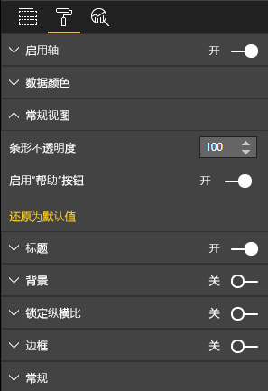

# <a name="create-a-launch-url"></a>创建启动 URL

通过创建启动 URL，可通过将实际工作委托给 Power BI 打开新的浏览器标签页（或窗口）。

> [!IMPORTANT]
> 视觉对象 API 1.9.0 中引入了 `host.launchUrl()`。

## <a name="sample"></a>示例

导入 `IVisualHost` 接口，并保存指向视觉对象构造函数中 `host` 对象的链接。

```typescript
import powerbi from "powerbi-visuals-api";
import IVisualHost = powerbi.extensibility.visual.IVisualHost;

export class Visual implements IVisual {
    private host: IVisualHost;
    // ...
    constructor(options: VisualConstructorOptions) {
        // ...
        this.host = options.host;
        // ...
    }

    // ...
}
```

## <a name="usage"></a>使用情况

使用 `host.launchUrl()` API 调用，将目标 URL 作为字符串参数传递：

```typescript
this.host.launchUrl('https://some.link.net');
```

## <a name="restrictions"></a>限制

* 仅使用绝对路径，不使用相对路径。 例如，使用绝对路径（如 `https://some.link.net/subfolder/page.html`）。 不会打开相对路径 `/page.html`。

* 目前仅支持 HTTP 和 HTTPS 协议   。 避免使用 FTP、MAILTO 等   。

## <a name="best-practices"></a>最佳做法

* 通常情况下，最好只打开一个链接作为对用户显式操作的响应。 使用户轻松了解单击链接或按钮会打开新的标签页。在无用户操作的情况下触发 `launchUrl()` 调用或者因另一操作意外触发此调用会让用户感到困惑或沮丧。

* 如果链接对视觉对象的正常运行无关紧要，建议为报表的作者提供一种禁用和隐藏链接的方法。 该建议对于一些 Power BI 特殊用例尤其有用，例如将报表嵌入第三方应用程序或将报表发布到 Web。

* 避免从循环、视觉对象的 `update` 函数或者任何其他经常重复使用的代码内触发 `launchUrl()` 调用。

## <a name="a-step-by-step-example"></a>分步示例

### <a name="add-a-link-launching-element"></a>添加链接启动元素

已在视觉对象的 `constructor` 函数中添加以下代码行：

```typescript
    this.helpLinkElement = this.createHelpLinkElement();
    options.element.appendChild(this.helpLinkElement);
```

添加了一个创建和附加 anchor 元素的私有函数：

```typescript
private createHelpLinkElement(): Element {
    let linkElement = document.createElement("a");
    linkElement.textContent = "?";
    linkElement.setAttribute("title", "Open documentation");
    linkElement.setAttribute("class", "helpLink");
    linkElement.addEventListener("click", () => {
        this.host.launchUrl("https://docs.microsoft.com/power-bi/developer/visuals/custom-visual-develop-tutorial");
    });
    return linkElement;
};
```

最后，visual.less 文件中的一个条目定义链接元素的样式  ：

```less
.helpLink {
    position: absolute;
    top: 0px;
    right: 12px;
    display: block;
    width: 20px;
    height: 20px;
    border: 2px solid #80B0E0;
    border-radius: 20px;
    color: #80B0E0;
    text-align: center;
    font-size: 16px;
    line-height: 20px;
    background-color: #FFFFFF;
    transition: all 900ms ease;

    &:hover {
        background-color: #DDEEFF;
        color: #5080B0;
        border-color: #5080B0;
        transition: all 250ms ease;
    }

    &.hidden {
        display: none;
    }
}
```

### <a name="add-a-toggling-mechanism"></a>添加切换机制

若要添加切换机制，需要添加一个静态对象，以便报表的作者可以切换链接元素的可见性。 （默认设置为“隐藏”。  ）有关详细信息，请参阅[静态对象教程](https://microsoft.github.io/PowerBI-visuals/docs/concepts/objects-and-properties)。

`showHelpLink` 布尔静态对象已添加到 capabilities.json 文件的对象条目中，如以下代码所示  ：

```typescript
"objects": {
    "generalView": {
            "displayName": "General View",
            "properties":
                "showHelpLink": {
                    "displayName": "Show Help Button",
                    "type": {
                        "bool": true
                    }
                }
            }
        }
    }
```



在视觉对象的 `update` 函数中添加了以下代码行：

```typescript
if (settings.generalView.showHelpLink) {
    this.helpLinkElement.classList.remove("hidden");
} else {
    this.helpLinkElement.classList.add("hidden");
}
```

visual.less 文件中定义了“hidden”类，用于控制元素的显示   。