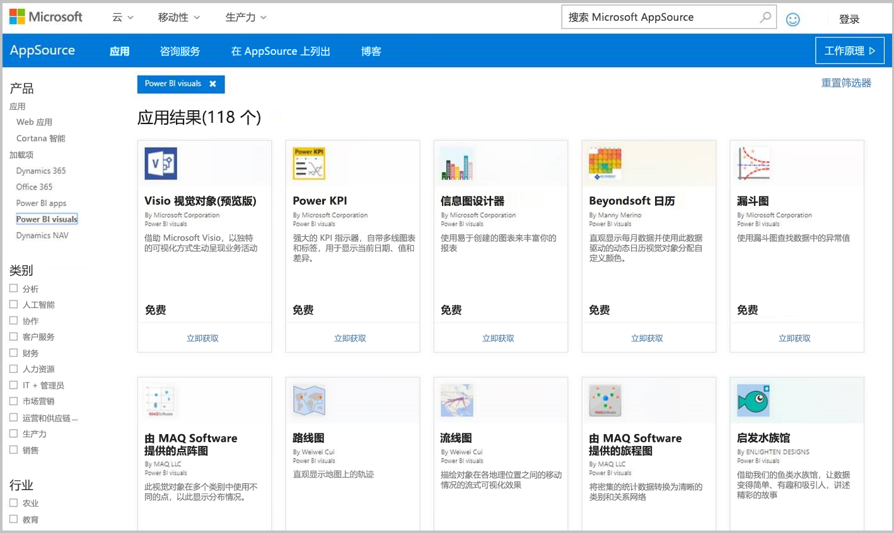
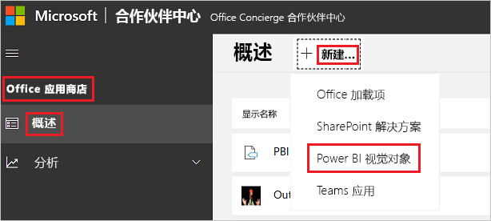

# 将 Power BI 视觉对象发布到合作伙伴中心

在创建 Power BI 视觉对象后，你可能想要将其发布到 AppSource 供其他人发现和使用。 有关创建 Power BI 视觉对象的详细信息，请参阅[开发 Power BI 视觉对象](custom-visual-develop-tutorial.md)。

## 什么是 AppSource？

[AppSource](https://appsource.microsoft.com/marketplace/apps?product=power-bi-visuals) 是查找 Microsoft 产品和服务的 SaaS 应用与加载项的位置。

## 准备提交 Power BI 视觉对象

将 Power BI 视觉对象提交到 AppSource 前，请确保你已阅读 [Power BI 视觉对象指南](guidelines-powerbi-visuals.md)以及[测试自定义视觉对象](https://github.com/Microsoft/PowerBI-visuals/blob/master/Tutorial/SubmissionTesting.md)。

准备好提交 Power BI 视觉对象时，请验证视觉对象是否符合下列所有要求。

| 项 | 必填 | 说明 |
| --- | --- | --- |
| Pbiviz 包 |是 |将 Power BI 视觉对象打包到 Pbiviz 包，其中包含所有必要的元数据。 视觉对象名称 显示名称 GUID 版本 说明 作者姓名和电子邮件 |
| 示例 .pbix 报表文件 |是 |要展示你的视觉对象，应帮助用户了解该视觉对象。 向用户突出显示该视觉对象可以带来的价值，并提供使用示例和格式设置选项。 还可以添加“提示”  页，并在页面末尾附上一些提示和技巧以及操作注意事项。 示例 .pbix 报表文件必须脱机运行且无任何外部连接。 |
| 图标 |是 |应包含将在店面中显示的自定义视觉对象徽标。 格式可以为 .png、.jpg、.jpeg 或 .gif。 它必须正好为 300 像素（宽度）x 300 像素（高度）。 **重要提示！** 在提交图标之前，请仔细查看 [AppSource 应用商店图像指南](https://docs.microsoft.com/office/dev/store/craft-effective-appsource-store-images)。 |
| 屏幕截图 |是 |至少提供一个屏幕截图。 格式可以为 .png、.jpg、.jpeg 或 .gif。 尺寸必须正好为 1366 px（宽）x 768 px（高）。 文件大小不能超过 1024 kb。 为了实现更好的利用率，添加文本气泡以阐明每个屏幕截图中所示的主要功能的价值主张。 |
| 支持下载链接 |是 |为客户提供支持 URL。 此链接作为合作伙伴中心一览的一部分输入；当用户在 AppSource 上访问你的视觉对象一览时，可以看到此链接。 URL 的格式应包含 https:// 或 http://。 |
| 隐私文档链接 |是 |提供指向视觉对象隐私策略的链接。 此链接作为合作伙伴中心一览的一部分输入；当用户在 AppSource 上访问你的视觉对象一览时，可以看到此链接。 链接的格式应包含 https:// 或 http://。 |
| 最终用户许可协议 (EULA) |是 |必须为 Power BI 视觉对象提供一个 EULA 文件。 可以使用[标准协定](https://go.microsoft.com/fwlink/?linkid=2041178)、[Power BI 视觉对象协定](https://visuals.azureedge.net/app-store/Power%20BI%20-%20Default%20Custom%20Visual%20EULA.pdf)或自己的 EULA。 |
| 视频链接 |否 |为了增加用户对自定义视觉对象的兴趣，请提供一个指向视觉对象视频的链接。 URL 的格式应包含 https:// 或 http://。 |
| GitHub 存储库 |否 |共享指向 [GitHub](https://www.github.com) 存储库的公共链接，其中包含 Power BI 视觉对象和示例数据的源。 这样其他开发人员即有机会提供反馈，并针对代码提出改进建议。 |

## 获取应用包 XML

需要从 Power BI 团队获取应用包 XML，才能提交 Power BI 视觉对象。 请向 Power BI 视觉对象提交团队 ([pbivizsubmit@microsoft.com](mailto:pbivizsubmit@microsoft.com)) 发送电子邮件，以获得应用包 XML。

必须在 pbiviz.json 文件中填写以下字段，然后才能创建 pbiviz 包：  
* 说明
* 支持 URL
* author
* name
* 电子邮件

在电子邮件中附加 pbiviz 文件  和示例报表 pbix 文件  。 Power BI 团队会回复你，并在回复邮件中添加说明以及要上传的应用包 XML 文件。 必须有此 XML 应用包，才能通过 Office 开发人员中心提交视觉对象。

> [!NOTE]
> 为了提高质量并确保现有报表不会中断，在应用商店中得到批准后，还将需要两周时间更新现有视觉对象，然后再步入生产环境。

## 提交到 AppSource

必须从 Power BI 团队获取应用包，然后将其提交到合作伙伴中心，才能将 Power BI 视觉对象提交到 AppSource。 

### 获取应用包

在将视觉对象提交到 AppSource 之前，必须先将附带 pbiviz 文件和 pbix 文件的电子邮件发送到 Power BI 团队。   这样，Power BI 团队便可将这些文件上传到公共共享服务器。 否则，应用商店将无法检索这些文件。 

Power BI 团队必须为新 Power BI 视觉对象提交、现有 Power BI 视觉对象更新和已拒绝提交的修复检查文件。

### 提交到合作伙伴中心

必须注册合作伙伴中心，才能将 Power BI 视觉对象提交到合作伙伴中心。 若尚未注册，请[在合作伙伴中心创建开发人员帐户](https://docs.microsoft.com/office/dev/store/open-a-developer-account)。

请按照以下步骤将 Power BI 视觉对象提交到合作伙伴中心。 有关提交过程的详细信息，请参阅[通过合作伙伴中心将 Office 解决方案提交到 AppSource](https://docs.microsoft.com/office/dev/store/use-partner-center-to-submit-to-appsource)。

1. 登录到合作伙伴中心。 

2. 在左侧窗格中，选择“OFFICE 应用商店”。 

3. 选择“概述”。 

4. 选择“新建”，从下拉菜单选择“Power BI 视觉对象”。  

    

5. 在“新建 Power BI 视觉对象”窗口中，输入 Power BI 视觉对象的名称，然后选择“创建”。  

6. 选择“包”，然后上传 Power BI 视觉对象 XML 应用包。 

7. 选择“属性”，并提供必要的信息。 

8. 若产品要求进行其他购买，请选择“产品设置”，然后选中“关联服务购买”复选框。  

9. （可选）若要对视觉对象进行[认证](power-bi-custom-visuals-certified.md)，请选择“产品设置”，然后选中“Power BI 认证”复选框。  
    >[!TIP]
    >Power BI 认证过程可能需要一段时间。 如果要创建新的 Power BI 视觉对象，建议在请求 Power BI 认证之前，通过合作伙伴中心发布 Power BI 视觉对象。 这样可以确保不会延迟视觉对象的发布。

10. 选择“产品设置”，单击“审阅并发布”。  

## 跟踪提交状态和使用情况

* 可以查看[验证策略](https://docs.microsoft.com/legal/marketplace/certification-policies#1180-power-bi-visuals)。

* 提交后，可以在[“应用仪表板”](https://sellerdashboard.microsoft.com/Application/Summary/)中查看提交状态。

* 要了解何时可从 AppSource 下载 Power BI 视觉对象，请查看 Power BI 视觉对象[发布时间线](power-bi-custom-visuals-certified.md#publication-timeline)。

## 认证视觉对象

创建视觉对象后，如果需要，可以让视觉对象取得[认证](power-bi-custom-visuals-certified.md)。

## 后续步骤

* [开发 Power BI 自定义视觉对象](custom-visual-develop-tutorial.md)

* [Power BI 中的可视化效果](../../visuals/power-bi-report-visualizations.md)  

* [Power BI 中的视觉对象](power-bi-custom-visuals.md)  

* [让 Power BI 视觉对象取得认证](power-bi-custom-visuals-certified.md)

* 更多问题？ [尝试咨询 Power BI 社区](https://community.powerbi.com/)
