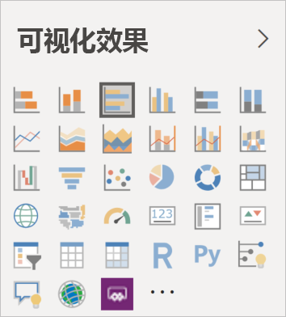

# Power BI 中的视觉对象

Power BI 附带了许多现成的 Power BI 视觉对象。 这些视觉对象可在 [Power BI Desktop ](https://powerbi.microsoft.com/desktop/)和 [Power BI 服务](https://app.powerbi.com)的可视化效果窗格中使用，可用于创建和编辑 Power BI 内容。

可以通过 Microsoft [AppSource](https://nam06.safelinks.protection.outlook.com/?url=https%3A%2F%2Fappsource.microsoft.com%2Fen-us%2Fmarketplace%2Fapps%3Fpage%3D1%26product%3Dpower-bi-visuals&data=02%7C01%7CKesem.Sharabi%40microsoft.com%7C6d9286afacb3468d4cde08d740b76694%7C72f988bf86f141af91ab2d7cd011db47%7C1%7C0%7C637049028749147718&sdata=igWm0e1vXdgGcbyvngQBrHQVAkahPnxPC1ZhUPntGI8%3D&reserved=0) 或 Power BI 获取更多 Power BI 视觉对象。 这些视觉对象由 Microsoft 和 Microsoft 合作伙伴创建，并由 AppSource 验证团队进行测试和验证。

你还可以开发自己的 Power BI 视觉对象，供你、你的组织或整个 Power BI 社区使用。

## 默认 Power BI 视觉对象

可在 Power BI Desktop 和 Power BI 服务中的“可视化效果”窗格中提供这些现成 Power BI 视觉对象   。

若要从“视觉化效果”窗格中取消固定 Power BI 视觉对象，请右键单击该视觉对象然后选择“取消固定”  。

若要在“可视化效果”窗格中还原默认 Power BI 视觉对象，单击“导入自定义视觉对象”，然后选择“还原默认视觉对象”   。 

## AppSource Power BI 视觉对象

Microsoft 和社区成员已将 Power BI 视觉对象公布到[ AppSource](https://appsource.microsoft.com/marketplace/apps?product=power-bi-visuals)。 你可以下载这些视觉对象，然后将其添加到 Power BI 报表。 这些 Power BI 视觉对象都已经过测试并通过 Microsoft 的功能和质量审核。

### 什么是 AppSource？

[AppSource](office-store.md) 是可以在其中查找与 Microsoft 软件相关的应用、加载项和扩展的地方。 AppSource 为 Office 365、Azure、Dynamics 365、Cortana 和 Power BI 等产品的数百万用户提供解决方案，帮助他们更高效、更有见地完成工作。

### 已认证的 Power BI 视觉对象

已认证的 Power BI 视觉对象是 [AppSource](https://nam06.safelinks.protection.outlook.com/?url=https%3A%2F%2Fappsource.microsoft.com%2Fen-us%2Fmarketplace%2Fapps%3Fpage%3D1%26product%3Dpower-bi-visuals&data=02%7C01%7CKesem.Sharabi%40microsoft.com%7C6d9286afacb3468d4cde08d740b76694%7C72f988bf86f141af91ab2d7cd011db47%7C1%7C0%7C637049028749147718&sdata=igWm0e1vXdgGcbyvngQBrHQVAkahPnxPC1ZhUPntGI8%3D&reserved=0) 中满足由 Microsoft Power BI 团队测试和批准的某些指定代码要求的视觉对象。 测试旨在检查并确认视觉对象不会访问外部服务或资源。

若要查看已认证的 Power BI 视觉对象列表或提交自己的 Power BI 视觉对象，请参阅[已认证的 Power BI 视觉对象](power-bi-custom-visuals-certified.md)。

### Power BI 视觉对象示例

AppSource 上的每个 Power BI 视觉对象都有一个数据示例，用于说明该视觉对象的工作原理。 若要下载该示例，请在 [AppSource](https://nam06.safelinks.protection.outlook.com/?url=https%3A%2F%2Fappsource.microsoft.com%2Fen-us%2Fmarketplace%2Fapps%3Fpage%3D1%26product%3Dpower-bi-visuals&data=02%7C01%7CKesem.Sharabi%40microsoft.com%7C6d9286afacb3468d4cde08d740b76694%7C72f988bf86f141af91ab2d7cd011db47%7C1%7C0%7C637049028749147718&sdata=igWm0e1vXdgGcbyvngQBrHQVAkahPnxPC1ZhUPntGI8%3D&reserved=0) 中选择 Power BI 视觉对象，并从“试用示例”部分，单击“示例报告”链接   。

## 组织商店

Power BI 管理员批准 Power BI 视觉对象并将其部署到其组织中。 这使报表作者可以轻松发现、更新和使用这些 Power BI 视觉对象。 管理员可以通过更新版本、禁用和启用 Power BI 视觉对象等操作轻松管理这些视觉对象。

若要访问组织商店，请在“可视化效果”窗格中单击“导入自定义视觉对象”，然后选择“从市场导入”，再在“Power BI 视觉对象”窗口的顶部，选择“我的组织”选项卡      。

[详细了解可组织的视觉对象](power-bi-custom-visuals-organization.md)。

## 视觉对象文件

Power BI 视觉对象是包含代码的包，这些代码用于呈现提供给它们的数据。 任何人都可以创建自定义视觉对象并将其打包为之后可导入 Power BI 报表的单个 `.pbiviz` 文件。

若要导入 Power BI 视觉对象，请在“可视化效果”窗格中单击“导入自定义视觉对象”，然后选择“从文件导入”    。

如果你是 web 开发人员，并有兴趣创建自己的视觉对象，然后将其添加到 AppSource，可以了解如何[开发 Power BI 视觉对象](custom-visual-develop-tutorial.md)以及[将 Power BI 视觉对象发布到 AppSource](office-store.md)。

> [!WARNING]
> Power BI 视觉对象可能包含存在安全或隐私风险的代码。 请确保创建者和 Power BI 视觉对象源可信，然后将其导入报表。

## 后续步骤

* 如果你是开发人员，请从[开发 Power BI 视觉对象](custom-visual-develop-tutorial.md)教程开始。

* 了解如何[构建 Power BI 视觉对象项目](visual-project-structure.md)。

* 浏览 [Power BI 视觉对象的准则](guidelines-powerbi-visuals.md)。

更多问题？ 请访问[关于 Power BI 视觉对象的常见问题解答](power-bi-custom-visuals-faq.md)页面或 [Power BI 社区](https://community.powerbi.com/)。