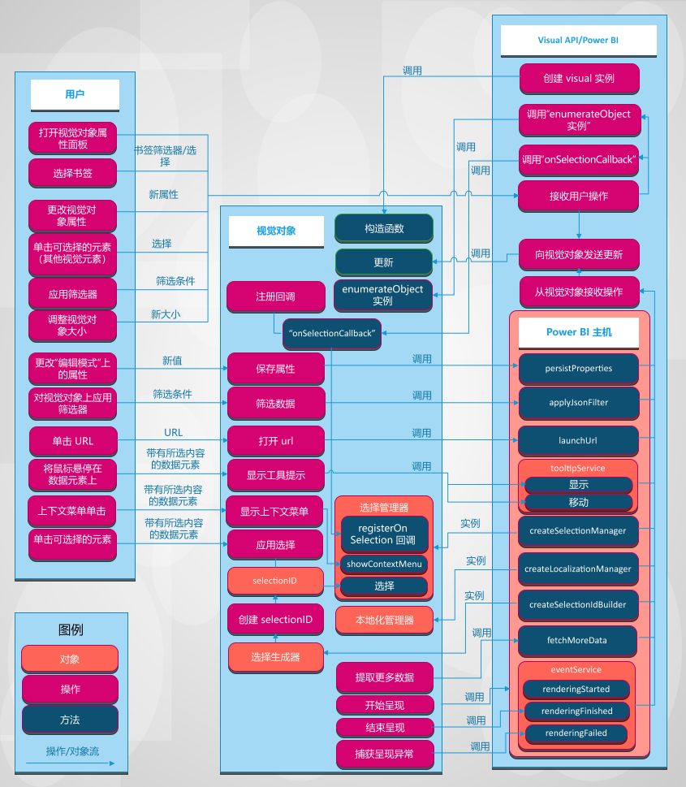

# Power BI 中的视觉对象

本文介绍视觉对象与 Power BI 的集成方式，以及用户如何与 Power BI 中的视觉对象进行交互。 

下图描述了如何在 Power BI 中处理用户所采取的常见的基于视觉对象的操作，比如选择书签。

## 视觉对象在 Power BI 中获得更新

视觉对象调用 `update` 方法以在 Power BI 中获得更新。 `update` 方法通常包含视觉对象的主要逻辑，并负责呈现图表或可视化数据。

当视觉对象调用 `update` 方法时，将触发更新。

## 操作和更新模式

Power BI 视觉对象中的操作和后续更新采用以下三种模式之一：

* 用户通过 Power BI 与视觉对象交互。
* 用户直接与视觉对象交互。
* 视觉对象与 Power BI 交互。

### 用户通过 Power BI 与视觉对象交互

* 用户打开视觉对象的属性面板。

    当用户打开视觉对象的属性面板时，Power BI 将从视觉对象的 capabilities.json  文件中获取支持的对象和属性。 若要接收属性的实际值，Power BI 调用视觉对象的 `enumerateObjectInstances` 方法。 视觉对象返回属性的实际值。

    有关详细信息，请参阅 [Power BI 视觉对象的功能和属性](capabilities.md)。

* 用户在格式面板中[更改视觉对象的属性](../../visuals/power-bi-visualization-customize-title-background-and-legend.md)。

    当用户在“格式”面板中更改属性的值时，Power BI 将调用视觉对象的 `update` 方法。 Power BI 将新的 `options` 对象传入 `update` 方法。 对象包含新值。

    有关详细信息，请参阅 [Power BI 视觉对象的对象和属性](objects-properties.md)。

* 用户调整视觉对象的大小。

    当用户更改视觉对象的大小时，Power BI 将使用新 `options` 对象调用 `update` 方法。 `options` 对象具有嵌套的 `viewport` 对象，这些对象包含视觉对象的新宽度和高度。

* 用户应用报表、页面或视觉对象级筛选器。

    Power BI 根据筛选条件筛选数据。 Power BI 调用视觉对象的 `update` 方法，以通过新数据更新视觉对象。

    当其中一个嵌套对象中有新数据，视觉对象将获取 `options` 对象的新更新。 更新发生的方式取决于视觉对象的数据视图映射配置。

    有关详细信息，请参阅[了解 Power BI 视觉对象中的数据视图映射](dataview-mappings.md)。

* 用户选择报表的另一个视觉对象中的数据点。

    当用户在报表中选择另一个视觉对象中的数据点时，Power BI 将筛选或突出显示所选数据点并调用视觉对象的 `update` 方法。 视觉对象通过突出显示的数组获取新的筛选数据或相同数据。

    有关详细信息，请参阅[突出显示 Power BI 视觉对象中的数据点](highlight.md)。

* 用户选择报表“书签”面板中的书签。

    当用户在报表的“书签”面板中选择书签时，可能会发生以下两种操作之一：

    * Power BI 调用通过 `registerOnSelectionCallback` 方法传递和注册的函数。 回调函数获取相应书签的选择数组。

    * Power BI 使用 `options` 对象内的相应 `filter` 对象调用 `update` 方法。

    在任一情况下，视觉对象都必须根据接收到的选择或 `filter` 对象更改其状态。

    有关书签和筛选器的详细信息，请参阅 [Power BI 视觉对象中的可视筛选器 API](filter-api.md)。

### 用户直接与视觉对象交互

* 用户将鼠标悬停在数据元素上。

    视觉对象可通过 Power BI 工具提示 API 来显示关于数据点的更多信息。 当用户将鼠标悬停在某个可视元素上时，视觉对象可以处理该事件，并显示关联的工具提示元素的相关数据。 视觉对象可显示标准工具提示或报表页工具提示。

    有关详细信息，请参阅 [Power BI 视觉对象中的工具提示](add-tooltips.md)。

* 用户更改视觉对象属性。 （例如，用户展开树，视觉对象将状态保存在视觉对象属性中。）

    视觉对象可以通过 Power BI API 保存属性值。 例如，当用户与视觉对象交互且视觉对象需要保存或更新属性值时，视觉对象可以调用 `presistProperties` 方法。

* 用户选择 URL。

    默认情况下，视觉对象不能直接打开 URL。 相反，若要在新选项卡中打开 URL，视觉对象可以调用 `launchUrl` 方法，并将 URL 作为参数传递。

    有关详细信息，请参阅[创建启动 URL](launch-url.md)。

* 用户通过视觉对象应用筛选器。

    视觉对象可以调用 `applyJsonFilter` 方法，并传递条件来筛选其他视觉对象中的数据。 多个筛选器类型可用，包括基本筛选器、高级筛选器和元组筛选器。

    有关详细信息，请参阅 [Power BI 视觉对象中的可视筛选器 API](filter-api.md)。

* 用户在视觉对象中选择元素。

    有关 Power BI 视觉对象中的选择的详细信息，请参阅[使用 Power BI 视觉对象选择添加交互性](selection-api.md)。

### 视觉对象与 Power BI 交互

* 视觉对象请求 Power BI 中的更多数据。

    视觉对象逐项处理数据。 `fetchMoreData` API 方法请求数据集中的下一个数据片段。

    有关详细信息，请参阅[从 Power BI 获取更多数据](fetch-more-data.md)。

* 将触发事件服务。

    Power BI 可以将报表导出为 PDF 或通过电子邮件发送报表（仅适用于经认证的视觉对象）。 若要通知 Power BI 呈现已完成，并且视觉对象已准备好以 PDF 或电子邮件的形式捕获，则视觉对象应调用呈现事件 API。

    有关详细信息，请参阅[从 Power BI 导出报表到 PDF](../../consumer/end-user-pdf.md)。

    若要了解有关事件服务的信息，请参阅[在 Power BI 视觉对象中呈现事件](event-service.md)。

## 后续步骤

对创建可视化效果并将它们添加到 Microsoft AppSource 感兴趣吗？ 请参阅以下文章：

* [开发 Power BI 视觉对象](./custom-visual-develop-tutorial.md)
* [将 Power BI 视觉对象发布到合作伙伴中心](office-store.md)
