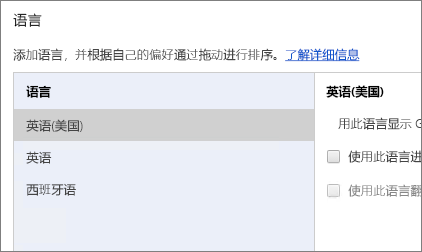
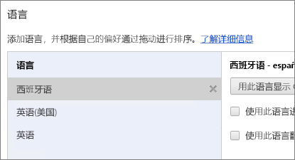
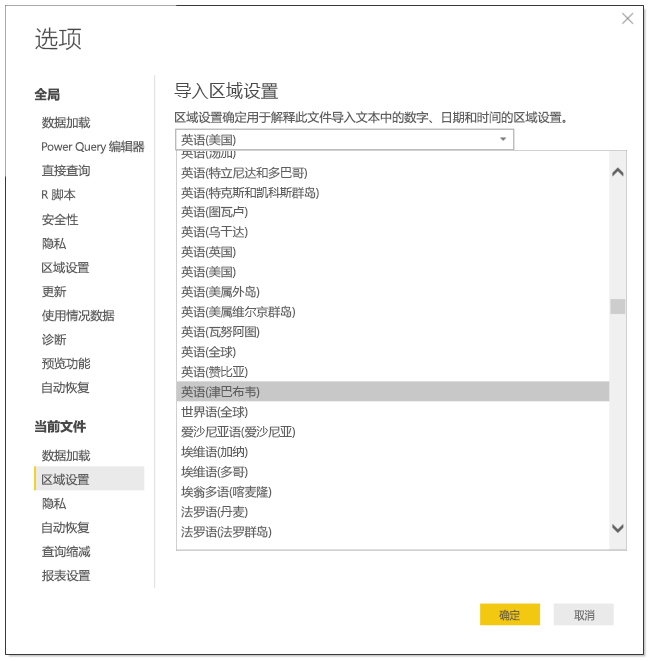
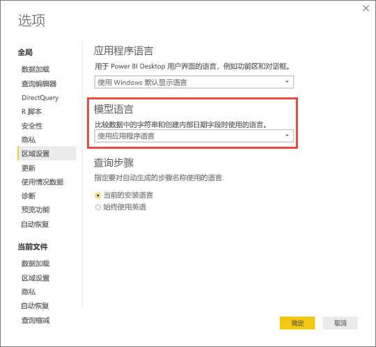

# Power BI 支持的语言和国家/地区

本为介绍了 Power BI 服务、Power BI Desktop 和 Power BI 文档支持的语言和国家/地区。

## 可使用 Power BI 的国家和地区
有关可使用 Power BI 的国家和地区的列表，请参阅[国际可用性列表](https://products.office.com/business/international-availability)。 

## Power BI 服务的语言
Power BI 服务（在浏览器中）具有以下 44 种语言版本：

* 阿拉伯语
* 巴斯克语 - Basque
* 保加利亚语 - Български
* 加泰罗尼亚语 - català
* 中文（简体）- 中文（简体）
* 中文（繁体）- 中文（繁體）
* 克罗地亚语 - hrvatski
* 捷克语 - čeština
* 丹麦语 - dansk
* 荷兰语 - Nederlands
* 英语 - English
* 爱沙尼亚语 - eesti
* 芬兰语 - suomi
* 法语 - français
* 加利西亚语 - galego
* 德语 - Deutsch
* 希腊语 - Ελληνικά
* 希伯来语
* 北印度语 - हिंदी
* 匈牙利语 - magyar
* 印度尼西亚语 - Bahasa Indonesia
* 意大利语 - italiano
* 日语 - 日本語
* 哈萨克语 - Қазақ
* 朝鲜语 - 한국어
* 拉脱维亚语 - latviešu
* 立陶宛语 - lietuvių
* 马来语 - Bahasa Melayu
* 挪威语（挪威）- norsk (bokmål)
* 波兰语 - Polski
* 葡萄牙语（巴西）- Português
* 葡萄牙语（葡萄牙）- Português
* 罗马尼亚语 - română
* 俄罗斯语 - Русский
* 塞尔维亚语（西里尔文）- српски
* 塞尔维亚语（拉丁文）- srpski
* 斯洛伐克语 - slovenčina
* 斯洛文尼亚语 - slovenski
* 西班牙语 - español
* 瑞典语 - svenska
* 泰语 - ไทย
* 土耳其语 - Türkçe
* 乌克兰语 - українська
* 越南语 - Tiếng Việt

### 翻译了什么
Power BI 可将菜单、按钮、消息和其他体验元素转换为你的语言。 例如，Power BI 会转换报表内容，如自动生成的标题、筛选器和工具提示。 但不会自动翻译你的数据。 在报表内部，如果你使用的是从右到左的语言（如希伯来语），则视觉对象的布局不会改变。

目前，一些功能仅在英文版中可用：

* 当你连接到 Microsoft Dynamics CRM、Google Analytics、Salesforce 等服务时 Power BI 创建的仪表板和报表。 你仍然可以使用自己的语言创建自己的仪表板和报表。
* 使用问答浏览数据。

我们将为其他语言添加更多功能，敬请期待。 

### 在 Power BI 服务中选择你的语言
1. 在 Power BI 服务中，选择“设置”  图标  > “设置”  。
2. 在**常规**选项卡上选择**语言**。
3. 选择你的语言，然后单击**应用**。

### 在浏览器中选择你的语言
Power BI 根据你的计算机上的语言首选项检测你的语言。 你访问和更改这些首选项的方式可能因操作系统和浏览器而异。 下面介绍了如何从 Internet Explorer 和 Google Chrome 访问这些首选项。

#### Internet Explorer（版本 11）
1. 单击浏览器窗口右上角的“工具”  按钮：
   
   
2. 单击 **Internet 选项**。
3. 在“Internet 选项”对话框中，在“常规”选项卡的“外观”下面，单击**语言**按钮。

#### Google Chrome（版本 42）
1. 单击浏览器窗口右上角的“menu（菜单）”按钮：
   
   
2. 单击**设置**。
3. 单击**显示高级设置**。
4. 在“Languages（语言）”下面单击**语言和输入的设置**按钮。
5. 单击**添加**，选择一种语言，然后单击**确定**。
   
   
   
   新的语言位于列表末尾处。 
6. 将新语言拖到列表顶部，单击**使用该语言显示 Google Chrome**。
   
   
   
   你可能需要关闭并重新打开浏览器才能看见更改。

## 选择 Power BI Desktop 的语言或区域设置
有两种方法可以获取 Power BI Desktop：可以作为独立安装程序下载它，也可以从 Windows 应用商店进行安装。

* 如果通过 Windows 应用商店安装 Power BI Desktop，则会将安装所有语言，并默认显示与 Windows 默认语言对应的语言。
* 将 Power BI Desktop 作为独立安装程序下载时，可以在运行安装程序时选择默认语言。 可在以后更改语言。
* 还可以在为特定报表[导入数据时选择要使用的区域设置](#choose-the-locale-for-importing-data-into-power-bi-desktop)。

> [!NOTE]
> 如果要安装针对 Power BI 报表服务器进行了优化的 Power BI Desktop 版本，请选择在下载时所用的语言。 有关详细信息，请参阅[安装更适合 Power BI 报表服务器的 Power BI Desktop](../report-server/install-powerbi-desktop.md)。

### 选择 Power BI Desktop 的语言 
1. [通过 Windows 应用商店](https://aka.ms/pbidesktopstore)安装 Power BI Desktop，或作为[独立安装程序](https://aka.ms/pbiSingleInstaller)进行安装。
2. 要更改语言，请在 Windows 菜单中选择“设置”  。

3. 在“Windows 设置”中，选择“时间和语言”   。
   
     
4. 选择“语言”，然后选择一种语言  。 如果需要，还可选择“在 Microsoft Store 中添加 Windows 显示语言”  。
   
     
   
     下次启动 Power BI Desktop 时，它将使用被设置为默认值的语言。 

要覆盖默认设置并使用 Windows 语言以外的语言来使用 Power BI Desktop，请执行以下操作。
1. 在 Power BI Desktop 中，依次转到“文件”   > “选项和设置”   > “选项”  。
2. 在“全局设置”下面，选择“区域设置”   。
3. 在“应用程序语言”框中，选择不同的区域设置  。 

Power BI Desktop 中的语言支持仅限于“应用程序语言”下拉列表中显示的语言。

### 验证 Power BI Desktop 的默认数字和日期格式设置

Power BI Desktop 从 Windows 区域设置中获取其默认数字和日期格式。 如果需要，可以检查或更改这些设置。

1. 在 Windows 菜单上，选择“设置”  。

2. 在“Windows 设置”中，选择“时间和语言”   。
   
     

3. 选择“区域” > “其他日期、时间和区域设置”   。

    :::image type="content" source="media/supported-languages-countries-regions/power-bi-service-region-settings.png" alt-text="其他日期、时间和区域设置":::

4. 在“时钟和区域”中，选择“更改日期、时间或数字格式”   。

    :::image type="content" source="media/supported-languages-countries-regions/power-bi-service-check-region-settings.png" alt-text="时钟和区域设置":::

5. 请确保选中“匹配 Windows 显示语言”，或根据需要进行更改  。

    :::image type="content" source="media/supported-languages-countries-regions/power-bi-service-match-windows.png" alt-text="匹配 Windows 显示语言":::

### 选择将数据导入 Power BI Desktop 时要使用的区域设置
无论是直接下载 Power BI Desktop，还是通过 Windows 应用商店安装它，都可以为特定报表选择不同于 Power BI Desktop 版本所用区域设置的区域设置。 区域设置更改了从数据源导入数据时 Power BI 解释数据的方式。 例如，“3/4/2017”被解释为 4 月 3 日或 3 月 4日。

1. 在 Power BI Desktop 中，依次转到“文件”   > “选项和设置”   > “选项”  。
2. 在“**当前文件**下，选择“**区域设置**”。
3. 在“导入的区域设置”  框中选择不同的区域设置。 
   
   
4. 选择“确定”。 

### 在 Power BI Desktop 中选择模型的语言

除了设置 Power BI Desktop 应用程序的语言以外，还可以设置模型语言。 模型语言主要影响两个方面：

- 如何比较和排序字符串。 例如，由于土耳其语有两个字母 i，根据数据库的排序规则，这两个字母在排序时可能出现不同的顺序。 
- 从日期字段创建隐藏的日期表时，将使用 Power BI Desktop 语言。 例如，字段名为 Month/Monat/Mois 等。

> [!NOTE]
> Power BI 模型当前使用不区分大小写（或不区分假名）的区域设置，因此“ABC”和“abc”将被视为等效项。 如果“ABC”首先加载到数据库，其他仅在大小写上不同的字符串（例如“Abc”）将不会作为单独值加载。
> 
>

下面介绍如何设置模型语言。

1. 在 Power BI Desktop 中，依次转到“文件”   > “选项和设置”   > “选项”  。
2. 在“全局”下面，选择“区域设置”   。
3. 在“模型语言”框中选择不同的语言  。 

    

> [!NOTE]
> 一旦创建，Power BI 模型的语言将不能更改。
> 
>

## 帮助文档的语言
帮助已本地化为以下 10 种语言： 

* 中文（简体）- 中文（简体）
* 中文（繁体）- 中文（繁體）
* 法语 - français
* 德语 - Deutsch
* 意大利语 - italiano
* 日语 - 日本語
* 朝鲜语 - 한국어
* 葡萄牙语（巴西）- Português
* 俄罗斯语 - Русский
* 西班牙语 - español

## 后续步骤
* 使用的是 Power BI 移动应用之一？ 有关详细信息，请参阅 [Power BI 移动应用中支持的语言](../consumer/mobile/mobile-apps-supported-languages.md)。
* 是否有任何问题? 请尝试在 [Power BI 社区](https://community.powerbi.com/)中提问
* 仍有问题？ 访问 [Power BI 支持页](https://powerbi.microsoft.com/support/)。
