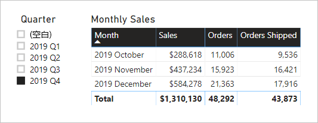

# <a name="active-vs-inactive-relationship-guidance"></a>活动与非活动关系指南

本文面向使用 Power BI Desktop 的数据建模者。 它指导你何时创建活动或非活动模型关系。 默认情况下，活动关系将筛选器传播到其他表。 然而，非活动关系只有在 DAX 表达式激活（使用）此关系时，才传播筛选器。

[!INCLUDE [relationships-prerequisite-reading](includes/relationships-prerequisite-reading.md)]

## <a name="active-relationships"></a>活动关系

通常，建议尽可能定义活动关系。 此类关系扩大了报表作者和使用问答的用户使用模型的范围和可能性。

例如，假设有一个导入模型，旨在分析航空公司航班准点率 (OTP)。 此模型包含 Flight 表，这是一个事实类型表，每个航班存储一行。 每行记录航班日期、航班号、出发和到达机场以及任何延误时间（以分钟为单位）。 还有一个 Airport 表，这是维度类型表，每个机场存储一行。 每行记录机场代码、机场名称和国家/地区。

下面展示了这两个表的部分模型图。


Flight 表与 Airport 表之间有两种模型关系。 在 Flight 表中，DepartureAirport 和 ArrivalAirport 列与 Airport 表的 Airport 列关联。 在星型架构设计中，Airport 表被描述为[角色扮演维度](star-schema.md#role-playing-dimensions)。 在此模型中，两个角色分别为“出发机场”和“到达机场”。

虽然这种设计对于关系星型架构设计很有效，但是对于 Power BI 模型却不行。 这是因为模型关系是筛选器传播路径，而这些路径必须是确定的。 因此，一个模型不能在两个表之间有多个活动关系。 所以，正如此示例中所述，一种关系是活动的，而另一种关系则是非活动的（由虚线表示）。 具体而言，与 ArrivalAirport 列之间的关系是活动的。 也就是说，应用于 Airport 表的筛选器会自动传播到 Flight 表的 ArrivalAirport 列。

此模型设计对数据的报表生成方式施加了很大限制。 具体而言，无法通过筛选 Airport 表来自动隔离出发机场的航班详细信息。 由于报表要求涉及同时按出发机场和到达机场进行筛选（或分组），因此需要两个活动关系。 将此要求转换为 Power BI 模型设计意味着，模型必须包含两个机场表。

下面展示了改进后的模型设计。


现在，此模型包含两个机场表：Departure Airport 和 Arrival Airport。 这两个机场表与 Flight 表之间的模型关系是活动的。 另请注意，Departure Airport 和 Arrival Airport 表中的列名分别以 Departure 和 Arrival 这两个词为前缀。

改进后的模型设计支持生成以下报表设计。


报表页按“墨尔本”作为出发机场进行筛选，表视觉对象按到达机场进行分组。

> [!NOTE]
> 对于导入模型，附加表不仅增大了模型大小，还延长了刷新时间。 因此，它与[导入建模的数据缩减方法](import-modeling-data-reduction.md)一文中所述的建议相矛盾。 不过，在此示例中，只包含活动关系的要求比这些建议更重要。
>
> 此外，相对于事实类型表的行计数，维度类型表的行计数通常较少。 因此，模型大小增加和刷新时间延长都不太可能会太多。

### <a name="refactoring-methodology"></a>重构方法

下面介绍了一种方法，可将模型从一个角色扮演维度类型表重构为，采用每个角色一个表的设计。

1. 删除所有非活动关系。
2. 不妨重命名角色扮演维度类型表，以更好地描述它的角色。 在此示例中，Airport 表与 Flight 表的 ArrivalAirport 列关联，因此将它重命名为 Arrival Airport。
3. 创建角色扮演表的副本，同时为它命名可反映其角色的名称。 如果是导入表，建议定义计算表。 如果是 DirectQuery 表，可以复制 Power Query 查询。

    在此示例中，Departure Airport 表是使用以下计算表定义进行创建。

    ```dax
    Departure Airport = 'Arrival Airport'
    ```

4. 创建活动关系来关联新表。
5. 不妨重命名表中的列，以准确反映它们的角色。 在此示例中，所有列都以 Departure 或 Arrival 一词为前缀。 默认情况下，这些名称可确保报表视觉对象具有自描述的明确标签。 同时还能改进问答体验，便于用户轻松编写问题。
6. 不妨向角色扮演表添加说明。 （在“字段”窗格中，当报表作者将光标悬停在表上方时，工具提示中会显示说明。）通过这种方式，可以向报表作者传达其他任何筛选器传播详细信息。

## <a name="inactive-relationships"></a>非活动关系

在特定情况下，非活动关系可以满足特殊报表需求。

现在来看看不同的模型和报表要求：

- 销售模型包含 Sales 表，表中有两个日期列：OrderDate 和 ShipDate
- Sales 表中的每行都记录一个订单
- 日期筛选器几乎总是应用于 OrderDate 列，其中始终存储有效日期
- 只有一个度量值要求将日期筛选器传播到 ShipDate 列，其中可能包含BLANK（即在订单发货前）
- 不要求同时按订购日期和发货日期进行筛选（或分组）

下面展示了这两个表的部分模型图。


Sales 表与 Date 表之间有两种模型关系。 Sales 表中的 OrderDate 和 ShipDate 列与 Date 表的 Date 列关联。 在此模型中，Date 表的两个角色分别为“订购日期”和“发货日期”。 与 OrderDate 列之间的关系是活动的。

除了一个之外，其余所有五个度量值都必须按 OrderDate 列进行筛选。 这个例外的度量值就是“已发货订单数”，它必须按 ShipDate 列进行筛选。

下面展示了“订单数”度量值定义。 它只计算筛选器上下文中的 Sales 表行数。 所有应用于 Date 表的筛选器都会传播到 OrderDate 列。

```dax
Orders = COUNTROWS(Sales)
```

下面展示了“已发货订单数”度量值定义。 它使用 [USERELATIONSHIP](/dax/userelationship-function-dax) DAX 函数，仅在表达式求值期间才激活特定关系的筛选器传播。 在此示例中，使用的是与 ShipDate 列之间的关系。

```dax
Orders Shipped =
CALCULATE(
    COUNTROWS(Sales)
    ,USERELATIONSHIP('Date'[Date], Sales[ShipDate])
)
```

此模型设计支持生成以下报表设计。



报表页按 2019 年第 4 季度进行筛选。 表视觉对象按月份进行分组，并显示各种销售统计信息。 “订单数”和“已发货订单数”度量值的结果不同。 它们都使用相同的摘要逻辑（统计 Sales 表中的行数），但使用的 Date 表筛选器传播却不同。

请注意，“季度”切片器包含 BLANK 项。 此切片器项作为[表扩大](../desktop-relationships-understand.md#strong-relationships)的结果显示。 虽然 Sales 表的每行都有订购日期，但某些行的发货日期显示为 BLANK（即这些订单尚未发货）。 表扩大也考虑非活动关系，因此显示 BLANK 可能是因为关系的“多”端包含 BLANK，也可能是因为出现数据完整性问题。

## <a name="recommendations"></a>建议

总之，建议尽可能定义活动关系。 此类关系扩大了报表作者和使用问答的用户使用模型的范围和可能性。 也就是说，应在模型中复制角色扮演维度类型表。

不过，在特定情况下，可以为角色扮演维度类型表定义一个或多个非活动关系。 在以下情况下，可以考虑这种设计：

- 不要求报表视觉对象同时按不同角色进行筛选
- 使用 USERELATIONSHIP DAX 函数激活特定关系，以进行相关模型计算

## <a name="next-steps"></a>后续步骤

有关本文的详细信息，请参阅以下资源：

- [Power BI Desktop 中的模型关系](../desktop-relationships-understand.md)
- [了解星型架构及其对 Power BI 的重要性](star-schema.md)
- [关系故障排除指南](relationships-troubleshoot.md)
- 是否有任何问题? [尝试咨询 Power BI 社区](https://community.powerbi.com/)
- 建议？ [提出改进 Power BI 的想法](https://ideas.powerbi.com/)
