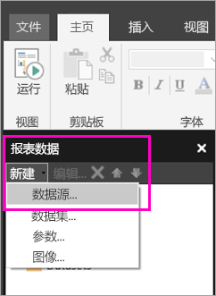

# 在 Power BI 服务中为分页报表创建嵌入数据源

本文介绍如何在 Power BI 服务中为分页报表创建和修改嵌入数据源。 可以在单个报表中定义嵌入数据源，并且仅在该报表中使用它。 目前，发布到 Power BI 服务的分页报表需要嵌入的数据集和嵌入的数据源，并且可以连接到这些数据源：

- Azure Analysis Services
- Azure SQL 数据库 
- Azure SQL 数据仓库
- SQL Server
- SQL Server Analysis Services
- Oracle 
- Teradata 

对于以下数据源，请使用[SQL Server Analysis Services 连接](../service-premium-connect-tools.md)选项：

- Power BI Premium 数据集

分页报表通过 [Power BI 网关](../service-gateway-onprem.md)连接到本地数据源。 将报表发布到 Power BI 服务后，可以设置网关。

有关更多详细信息，请参阅 [Power BI 报表生成器中的报表数据](report-builder-data.md)。

## 创建嵌入的数据源
  
1. 打开 Power BI 报表生成器。

1. 在“报表数据”窗格中的工具栏上，选择“新建”   > “数据源”  。 随即将打开“数据源属性”  对话框。

    
  
2.  在“名称”  文本框中，键入数据源的名称或接受默认名称。  
  
3.  选择“使用我的报表中嵌入的连接”  。  
  
1.  从“选择连接类型”  列表中，选择数据源类型。 

1.  使用下列方法之一指定连接字符串：  
  
    -   在“连接字符串”  文本框中直接键入连接字符串。 
  
     -   选择“构建”  以打开在步骤 2 中选择的数据源的“连接属性”  对话框。  
  
        根据数据源类型，填写“连接属性”  对话框中的字段。 连接属性包括数据源类型、数据源名称和要使用的凭据。 在此对话框中指定值后，选择“测试连接”  以验证数据源是否可用，以及指定的凭据是否正确。  
  
4.  选择“凭据”  。  
  
     指定要用于此数据源的凭据。 数据源的所有者将选择支持的凭据类型。 有关详细信息，请参阅[指定报表数据源的凭据和连接信息](https://docs.microsoft.com/sql/reporting-services/report-data/specify-credential-and-connection-information-for-report-data-sources)。
  
5.  选择“确定”。   
  
     “报表数据”窗格中将显示数据源。  
     
## 限制和注意事项

连接到 Power BI 数据集的分页报表需遵循 Power BI 中针对共享数据集的规则（略作更改）。  为保证用户通过 Power BI 数据集正确查看分页报表，同时确保已为查看者启用和强制实施行级别安全性 (RLS)，请确保遵守以下规则：

### 经典应用和工作区

- 与数据集位于同一工作区（所有者相同）的 .rdl：支持
- 与数据集位于不同工作区（所有者相同）的 .rdl：支持
- 共享的 .rdl：需要在数据集级别为查看报表的每位用户分配读取权限
- 共享应用：需要在数据集级别为查看报表的每位用户分配读取权限
- 与数据集位于同一工作区（所有者不同）的 .rdl：支持
- .rdl 与数据集位于不同工作区（不同用户）：需要在数据集级别为查看报表的每位用户分配读取权限
- 角色级别安全性：需要在数据集级别为查看报表的每位用户分配读取权限，以便强制执行。

### 新体验应用和工作区

- 与数据集位于同一工作区的 .rdl：支持
- 与数据集位于不同工作区（所有者相同）的 .rdl：支持
- 共享的 .rdl：需要在数据集级别为查看报表的每位用户分配读取权限
- 共享应用：需要在数据集级别为查看报表的每位用户分配读取权限
- 与数据集位于同一工作区（所有者不同）的 .rdl - 支持
- 与数据集位于不同工作区（所有者不同）的 .rdl：需要在数据集级别为查看报表的每位用户分配读取权限
- 角色级别安全性：需要在数据集级别为查看报表的每位用户分配读取权限，以便强制执行

## 后续步骤

- [在 Power BI 服务中为分页报表创建嵌入数据集](paginated-reports-create-embedded-dataset.md)
- [Power BI Premium 中的分页报表是什么？](paginated-reports-report-builder-power-bi.md)
