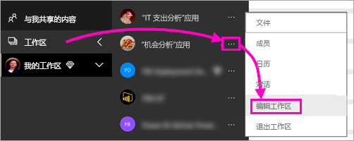
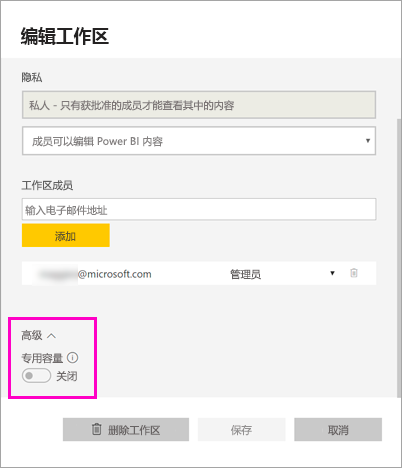
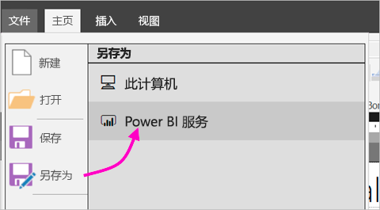
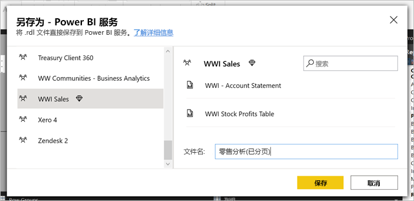
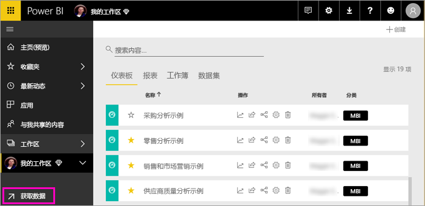
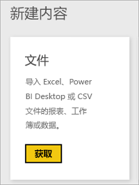
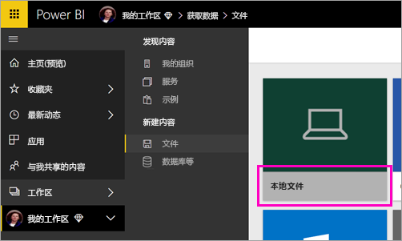
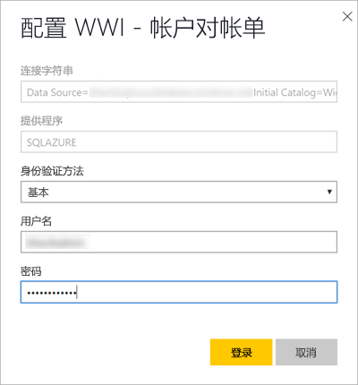

# 将分页报表发布到 Power BI 服务

本文介绍如何通过从本地计算机上传分页报表将其发布到 Power BI 服务。 只要工作区位于高级容量中，就可以将分页报表上传到“我的工作区”或任何其他工作区。 请查找工作区名称旁边的钻石型图标  。 

如果你的报表数据源位于本地环境中，需要在上传报表后创建网关。 请参阅本文后的[创建网关](#create-a-gateway)部分。

## 将工作区添加到高级容量

如果工作区名称旁边中没有钻石形图标  ，需要将工作区添加到高级容量。 

1. 选择“工作区”  ，然后选择工作区名称旁边的省略号 (...  )，再选择“编辑工作区”  。

    

1. 在“编辑工作区”  对话框中，展开“高级”  ，然后将“专用容量”  的滑块滑动到“开”  。

    

   你可能无法更改它。 如果是这样，请联系你的 Power BI 高级容量管理员，为你提供将工作区添加到高级容量的分配权限。

## 从报表生成器中发布分页报表

1. 在报表生成器中创建分页报表，并将其保存到本地计算机。

1. 在报表生成器“文件”菜单中，选择“另存为”   。

    

    如果尚未登录到 Power BI，现在需要登录或创建帐户。 在报表生成器的右上角，选择“登录”并完成步骤  。

2. 在左侧的工作列表中，选择名称旁带有菱形图标的工作区。 在框中键入“文件名”>“保存”   。 

    

4. 在浏览器中打开 Power BI 服务，然后浏览到要在其中发布分页报表的“高级”工作区。 在“报表”选项卡上，可以看到你的报表  。

    

5. 选择分页报表并在 Power BI 服务中将其打开。 如果此报表包含参数，需要选择这些参数才能查看报表。

    

6. 如果报表数据源在本地，请阅读本文，了解如何[创建网关](#create-a-gateway)以访问数据源。

## 从 Power BI 服务中上传分页报表

还可以从 Power BI 服务开始并上传分页报表。

1. 在报表生成器中创建分页报表，并将其保存到本地计算机。

1. 在浏览器中打开 Power BI 服务，然后浏览到要在其中发布报表的“高级”工作区。 请注意名称旁边的钻石形图标  。 

1. 选择“获取数据”  。

    

1. 在**文件**框中，选择**获取**。

    

1. 选择“本地文件”  ，浏览到分页报表，然后选择“打开”  。

    

1. 选择“继续”   > “编辑凭据”  。

    

1. 配置凭据，然后单击“登录”  。

    

   在“报表”选项卡上，可以看到你的报表  。

    

1. 选择此报表，并在 Power BI 服务中打开它。 如果此报表包含参数，需要选择这些参数才能查看报表。
 
    

6. 如果报表数据源在本地，请阅读本文，了解如何[创建网关](#create-a-gateway)以访问数据源。

## 创建网关

同任何其他 Power BI 报表一样，如果报表数据源位于本地环境中，则需要创建或连接到网关才能访问数据。

1. 在报表名称旁边，选择“管理”  。

   

1. 请参阅 Power BI 服务文章[本地数据网关是什么](../service-gateway-onprem.md)，了解详细信息和后续步骤。

## 后续步骤

- [在 Power BI 服务中查看分页报表](../consumer/paginated-reports-view-power-bi-service.md)
- [Power BI Premium 中的分页报表是什么？](paginated-reports-report-builder-power-bi.md)
- [教程：在应用程序中为客户 ](../developer/embed-paginated-reports-customers.md) 嵌入 Power BI 分页报表

