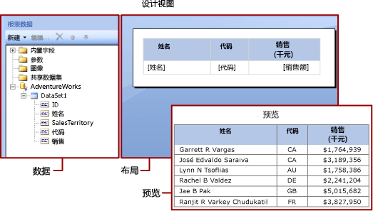

# Power BI 报表生成器中的表达式
  表达式在 Power BI Report Builder 分页报表中被广泛用于检索、计算、显示、分组、排序、筛选、参数化和格式化数据。 
  
  许多报表项属性可设置为表达式。 表达式可帮助控制报表内容、设计和交互性。 表达式用 Microsoft Visual Basic 编写，保存在报表定义中，并在运行报表时由报表处理器进行计算。  
  
 与直接在工作表中处理数据的 Microsoft Office Excel 等应用程序不同，在报表中可以将表达式用作数据占位符。 要查看计算表达式中的实际数据，必须预览报表。 运行报表时，报表处理器会在合并报表数据和报表布局元素（如表格和图表）时计算每个表达式。  
  
 设计报表时，会设置许多报表项的表达式。 例如，将字段从数据窗格拖到报表设计图面上的表单元格时，文本框值将设置为该字段的简单表达式。 在下图中，“报表数据”窗格显示数据集字段 ID、名称、SalesTerritory、代码和销售额。 表中已添加三个字段：[Name]、[Code] 和 [Sales]。 设计图面上的符号 [Name] 表示基础表达式 `=Fields!Name.Value`。  
  

  
 预览报表时，报表处理器将表数据区域与数据连接中的实际数据合并在一起，并将结果集中的每一行显示为表中的一行。  
  
 要手动输入表达式，请在设计图面上选择某个项，然后使用快捷方式菜单和对话框来设置该项的属性。 在下拉列表中看到 (fx) 按钮或值 `<Expression>` 时，可以将属性设置为表达式。 
  
##   了解简单和复杂表达式  
 表达式以等号 (=) 开头且用 Microsoft Visual Basic 编写。 表达式可以包含常量、运算符和对内置值（字段、集合和函数）及外部或自定义代码的引用，以及这些内容的组合。  
  
 可以使用表达式指定多个报表项属性的值。 最常见属性是文本框和占位符文本的值。 通常，如果文本框仅包含一个表达式，则表达式是文本框属性的值。 如果文本框包含多个表达式，则每个表达式都是文本框中占位符文本的值。  
  
 默认情况下，表达式在报表设计图面上显示为简单或复杂表达式   。  
  
-   **简单** 简单表达式包含对内置集合中单个项（例如，数据集字段、参数或内置字段）的引用。 在设计图面上，简单表达式会用括弧括起来。 例如，`[FieldName]` 对应基础表达式 `=Fields!FieldName.Value`。 在创建报表布局和将项从“报表数据”窗格拖动到设计图面时，会自动创建简单表达式。 有关不同内置集合的符号的详细信息，请参阅[了解简单表达式的前缀符号](#DisplayText)。  
  
-   **复杂** 复杂表达式包含对多个内置引用、运算符和函数调用的引用。 当表达式值包括多个简单引用时，复杂表达式显示为 <\<Expr>>。 要查看表达式，请将鼠标悬停在其上方并使用工具提示。 要编辑表达式，请在“表达式”对话框中将其打开  。  
  
 下图显示了典型的用于文本框和占位符文本的简单和复杂表达式。  
  
 
  
 要显示示例值而不显示表达式的文本，请将格式设置应用于文本框或占位符文本。 下图显示了报表设计图面切换为显示示例值：  
  
  

##  了解简单表达式中的前缀符号  

简单表达式使用符号来指示引用的是指字段、参数、内置集合还是 ReportItems 集合。 下表显示了显示文本和表达式文本的示例：  
  
|项|显示文本示例|表达式文本示例|  
|----------|--------------------------|-----------------------------|  
|数据集字段|`[Sales]`   `[SUM(Sales)]`   `[FIRST(Store)]`|`=Fields!Sales.Value`   `=Sum(Fields!Sales.Value)`   `=First(Fields!Store.Value)`|  
|报表参数|`[@Param]`   `[@Param.Label]`|`=Parameters!Param.Value`   `=Parameters!Param.Label`|  
|内置字段|`[&ReportName]`|`=Globals!ReportName.Value`|  
|用于显示文本的文本字符|`\[Sales\]`|`[Sales]`|  
  
##   编写复杂表达式  
 表达式可以包括对函数、运算符、常量、字段、参数、内置集合中的项以及嵌入的自定义代码或自定义程序集的引用。  
  
 下表列出了可以包含在表达式中的引用类型：  
  
|参考|说明|示例|  
|----------------|-----------------|-------------|  
|常量|描述可以交互式方式访问的属性常量，这些属性需要常量值（如字体颜色）。|`="Blue"`|  
|运算符|描述可用于合并表达式中的引用的运算符。 例如，& 运算符用于串联字符串  。|`="The report ran at: " & Globals!ExecutionTime & "."`|  
|内置集合|描述可以包含在表达式中的内置集合（如 `Fields`、`Parameters` 和 `Variables`）。|`=Fields!Sales.Value`   `=Parameters!Store.Value`   `=Variables!MyCalculation.Value`|  
|内置报表函数和聚合函数|描述可以通过表达式访问的内置函数（如 `Sum` 或 `Previous`）。|`=Previous(Sum(Fields!Sales.Value))`|  
|报表生成器的表达式中的自定义代码和程序集引用 |描述如何访问内置 CLR 类 `xref:System.Math` 和 `xref:System.Convert`、其他 CLR 类、Visual Basic 运行时库函数或外部程序集中的方法。   描述如何访问报表中嵌入的自定义代码，或同时在报表客户端和报表服务器上编译和安装为自定义程序集的自定义代码。|`=Sum(Fields!Sales.Value)`   `=CDate(Fields!SalesDate.Value)`   `=DateAdd("d",3,Fields!BirthDate.Value)`   `=Code.ToUSD(Fields!StandardCost.Value)`|  
   
##   验证表达式  
 为特定报表项属性创建表达式时，可以包含在表达式中的引用取决于报表项属性可以接受的值以及属性计算时所适用范围。 例如：  
  
-   默认情况下，表达式 [Sum] 计算表达式计算时范围内的数据的总和。 对于表单元格，范围取决于行和列组的成员身份。 
  
-   对于 Font 属性的值，值必须计算为字体的名称。  
  
-   设计时会验证表达式语法。 发布报表时会进行表达式范围验证。 对于依赖于实际数据的验证，只能在运行时检测错误。 其中一些表达式在呈现的报表中会生成错误消息 #Error。 

## 后续步骤

- [Power BI Premium 中的分页报表是什么？](paginated-reports-report-builder-power-bi.md)
