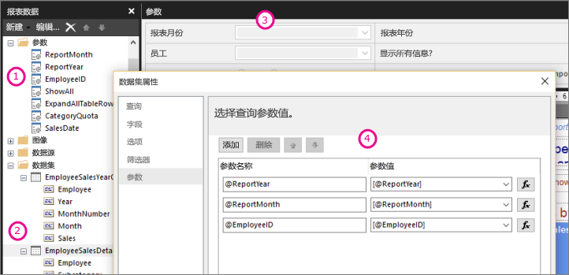

# Power BI 报表生成器中的报表参数

本主题介绍了 Power BI Report Builder 报表参数的常见用法、可以设置的属性等内容。 使用报表参数，可以控制报表数据，将相关报表连接在一起以及更改报表显示。 可以在报表生成器中创建的分页报表中使用报表参数。

## 参数的常见用法

 以下是一些使用参数的最常见方式。  
  
**控制分页报表数据**
  
- 通过编写包含变量的数据集查询来筛选数据源中的分页报表数据。  
  
- 用户能够指定值以自定义分页报表中的数据。 例如，提供两个参数，分别用于销售数据的开始日期和结束日期。  
  
**更改报表显示**
  
- 用户能够指定值来帮助其自定义报表的外观。 例如，提供一个布尔参数以指示是否展开或折叠表中所有的嵌套行组。  
  
- 用户能够通过在表达式中包含参数来自定义报表的数据和外观。  
  
## 查看包含参数的报表

查看包含参数的报表时，报表查看器工具栏会显示每个参数，以便以交互方式指定值。 下图显示了包含 @ReportMonth、@ReportYear、@EmployeeID、@ShowAll、@ExpandTableRows、@CategoryQuota 和 @SalesDate 参数的报表参数区域。  

  
1. **参数窗格**报表查看器工具栏显示提示和每个参数的默认值。 可以在参数窗格中自定义参数的布局。  
  
2. **@SalesDate 参数** 参数 @SalesDate 是 DateTime 数据类型  。 文本框旁显示“选择日期”提示信息。 若要修改日期，在文本框中键入新的日期或使用日历控件。  
  
3. **@ShowAll 参数** 参数 @ShowAll 是布尔数据类型  。 使用单选按钮来指定“True”  或“False”  。  
  
4. **显示或隐藏参数区域句柄** 在报表查看器工具栏上，单击此箭头以显示或隐藏参数窗格。  
  
5. **@CategoryQuota 参数** 参数 @CategoryQuota 是 Float 数据类型  ，因此它采用数字值。  @CategoryQuota 设置为允许多个值。  
  
6. **查看报表** 输入参数值后，单击“查看报表”  以运行报表。 如果所有参数都具有默认值，报表将在第一个视图上自动运行。  
  
## 创建参数

可以用几种不同的方式来创建报表参数。
  
> [!NOTE]
>  并非所有数据源都支持参数。
  
**含有参数的数据集查询或存储过程**
  
 添加包含变量的数据集查询或包含输入参数的数据集存储过程。 会为每个变量或输入参数创建数据集参数，并为每个数据集参数创建报表参数。  
  

  
 报表生成器中的此图像显示了：  
  
1.  “报表数据”窗格中的报表参数。  
  
2.  含有参数的数据集。  
  
3.  “参数”窗格。  
  
4.  “数据集属性”对话框中列出的参数。  
  
**手动创建参数**
  
从“报表数据”窗格手动创建参数。 可以配置报表参数，使用户能以交互方式键入值来帮助自定义报表的内容或外观。 还可以配置报表参数以使用户无法更改预配置的值。  
  
> [!NOTE]  
>  因为参数在服务器上是单独管理的，重新发布含有新参数设置的主报表不会覆盖报表上现有的数据设置。  

### 参数值

 以下是用于在报表中选择参数值的选项。  
  
- 从下拉列表选择单一参数值。  
  
- 从下列列表选择多个参数值。  
  
- 从下拉列表中为一个参数选择一个值，该参数决定了另一个参数的下拉列表中可用的值。 这些是级联参数。 使用级联参数可将参数值从数千个值连续筛选限定到一个可管理的量。 有关详细信息，请参阅[在分页报表中使用级联参数](../guidance/paginated-report-cascading-parameter.md)。
  
- 运行报表时不必先选择参数值，因为已为参数创建默认值。  
  
## 报表参数属性

 可以使用“报表属性”对话框来更改报表参数属性。 下表总结了可以为每个参数设置的属性：  
  
|属性|说明|  
|--------------|-----------------|  
|名称|为参数键入区分大小写的名称。 名称必须以字母开头，可以包含字母、数字、下划线 (_)。 名称不能包含空格。 对于自动生成的参数，其名称与数据集查询中的参数一致。 默认情况下，手动创建的参数与 ReportParameter1 类似。|  
|提示|报表查看器工具栏上参数旁边显示的文本。|  
|数据类型|报表参数必须为以下数据类型之一：   **Boolean**。 用户从单选按钮选择“True”或“False”。   **DateTime**。 用户从日历控件中选择一个日期。   **Integer**。 用户在文本框中键入值。   **Float**。 用户在文本框中键入值。   **Text**。 用户在文本框中键入值。   为参数定义可用值时，用户从下拉列表中选择值，即使数据类型为 DateTime  也是如此。|  
|允许空白值|如果参数的值可以为空字符串或空白，请选择此选项。   如果为参数指定有效值，且希望空白值是有效值，则必须将其作为指定的值包含在内。 选择此选项不会自动将空白包含为可用值。|  
|允许 null 值|如果参数的值可为 null，请选择此选项。   如果为参数指定有效值，且希望 null 是有效值，则必须将 null 作为指定的值包含在内。 选择此选项不会自动将 null 包含为可用值。|  
|允许多个值|提供可用值，创建用户可以从中选择的下拉列表。 这是一个确保数据集查询中只会提交有效值的好办法。   如果参数的值可以是下拉列表中显示的多个值，请选择此选项。 不允许使用 null 值。 选中此选项后，会将一个复选框添加到参数下拉列表中的可用值中。 列表顶部包含一个“全选”  复选框。 用户可以勾选所需的值。   如果提供值的数据变化较快，用户看到的列表可能不是最新的。|  
|可见的|选择此选项可在报表运行时在报表顶部显示报表参数。 通过此选项，用户可在运行时选择参数值。|  
|隐藏|选择此选项可隐藏发布的报表中的报表参数。 仍然可以在报表 URL 中、订阅定义中或报表服务器上设置报表参数值。|  
|内部|选择此选项可隐藏报表参数。 在已发布的报表中，仅能在报表定义中查看报表参数。|  
|可用值|如果已为参数指定可用值，那么有效值总是以下拉列表的形式出现。 例如，如果为 DateTime  参数提供可用值，参数窗格中会显示日期下拉列表而不是日历控件。   若要确保报表和子报表的值列表是一致的，可在数据源上设置选项，以便为与数据源关联的数据集中的所有查询使用单个事务。   **安全说明** 在任何包含 Text  数据类型参数的报表中，请务必使用可用值列表（也称为有效值列表），并确保任何运行报表的用户仅拥有必要的报表数据查看权限。|  
|默认值|从查询或静态列表中设置默认值。   若每个参数都具有默认值，报表将在第一个视图上自动运行。|  
|高级|设置报表定义属性 UsedInQuery  ，该值指示此参数是直接还是间接影响报表中的数据。   **自动确定刷新时间**  如果希望报表处理器确定此值的设置，请选择此选项。 如果报表处理器检测到某个数据集查询直接或间接引用此参数，或报表具有子报表，则值为“True”  。   **始终刷新**  如果在数据集查询或参数表达式中直接或间接使用报表参数，请选择此选项。 此选项将 UsedInQuery  设置为“True”。   **从不刷新**  如果不在数据集查询或参数表达式中直接或间接使用报表参数，请选择此选项。 此选项将 UsedInQuery  设置为“False”。   **注意** 应谨慎使用“从不刷新”  。 在报表服务器上，UsedInQuery  用于帮助控制报表数据和呈现的报表的缓存选项，以及控制快照报表的参数选项。 如果错误地设置了“从不刷新”  ，可能会导致缓存不正确的报表数据或报表，或者导致快照报表具有不一致的数据。 |  
  
##  数据集查询  
 若要筛选数据集查询中的数据，可以含入一个限制子句，通过指定要在结果集中包含或排除的值来限制检索到的数据。  
  
 为数据源使用查询设计器来帮助生成参数化查询。  
  
-   对于 Transact-SQL 查询，不同的数据源支持不同的参数语法。 支持的范围包括查询中按位置或名称标识的参数。 在关系查询设计器中，必须为筛选器选择参数选项来创建参数化查询。   
  
-   对于基于 Microsoft SQL Server Analysis Services 等多维数据源的查询，可以指定是否基于查询设计器中指定的筛选器来构建参数。 
  
##  已发布的报表的参数管理  
 设计报表时，报表参数保存在报表定义中。 发布报表时，报表参数与报表定义分开保存和管理。  
  
 对已发布的报表，可以使用：  
  
-   **报表参数属性。** 独立于报表定义直接在报表服务器上更改报表参数值。  
  
-   **报表订阅。** 可指定参数值以筛选数据，并通过订阅交付报表。 
  
 如果重新发布报表定义，会保留为已发布的报表的参数属性。 如果重新发布的报表定义代表同一报表，并且参数名和数据类型不变，则属性设置将保留不变。 如果添加或删除报表定义中的参数或更改现有参数的数据类型或名称，可能需要更改已发布的报表中的参数属性。  
  
 并非所有参数在任何情况下都可修改。 如果报表参数从数据集查询中获得默认值，则不能为已发布的报表修改该值，也不能从报表服务器修改该值。 运行时使用的值在运行查询时确定，对于基于表达式的参数，在计算表达式时确定。  
  
 报表执行选项会影响参数的处理方式。 作为快照运行的报表不能使用源自查询的参数，除非该查询包含参数的默认值。  
  
##  订阅的参数  
 可以根据需要或为快照定义订阅，并指定在订阅处理期间使用的参数值。  
  
-   **按需报表。**  对于按需报表，可以为列出的每个报表参数指定不同于已发布的值的参数值。 例如，假设有一个呼叫服务报表，它使用 Time Period  参数返回当前日、周或月的客户服务请求。 如果报表的默认参数值设置为“今天”  ，订阅可以使用不同的参数值（如“周”  或“月”  ）来生成包含每周或每月数据的报表。  
  
## 后续步骤

- [Power BI Premium 中的分页报表是什么？](paginated-reports-report-builder-power-bi.md)  
- [在分页报表中使用级联参数](../guidance/paginated-report-cascading-parameter.md)
