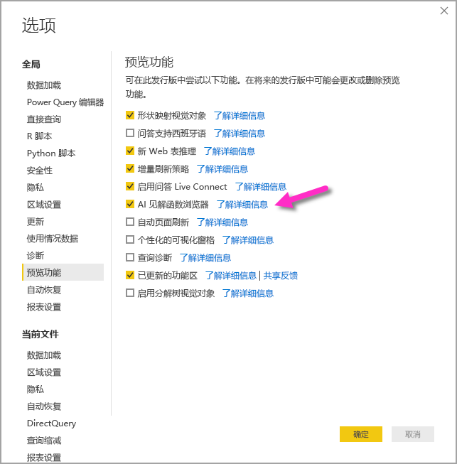
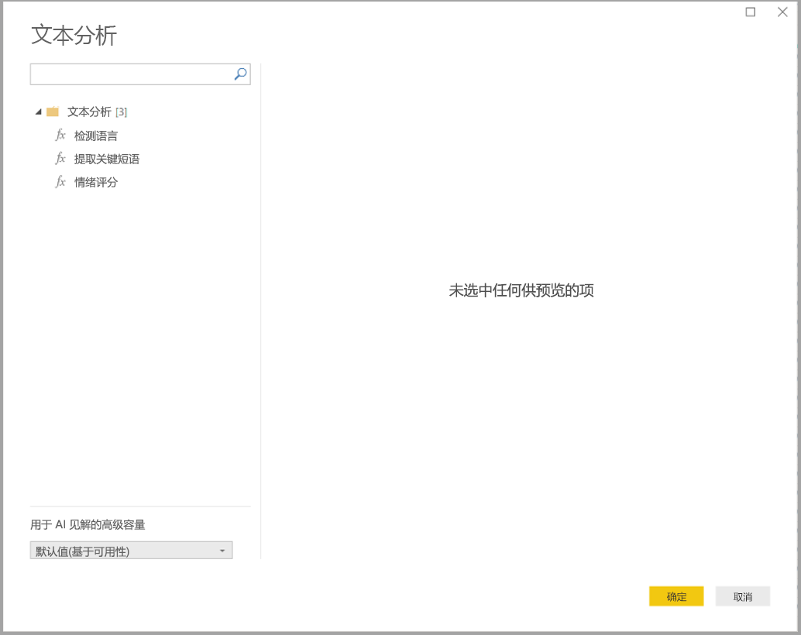
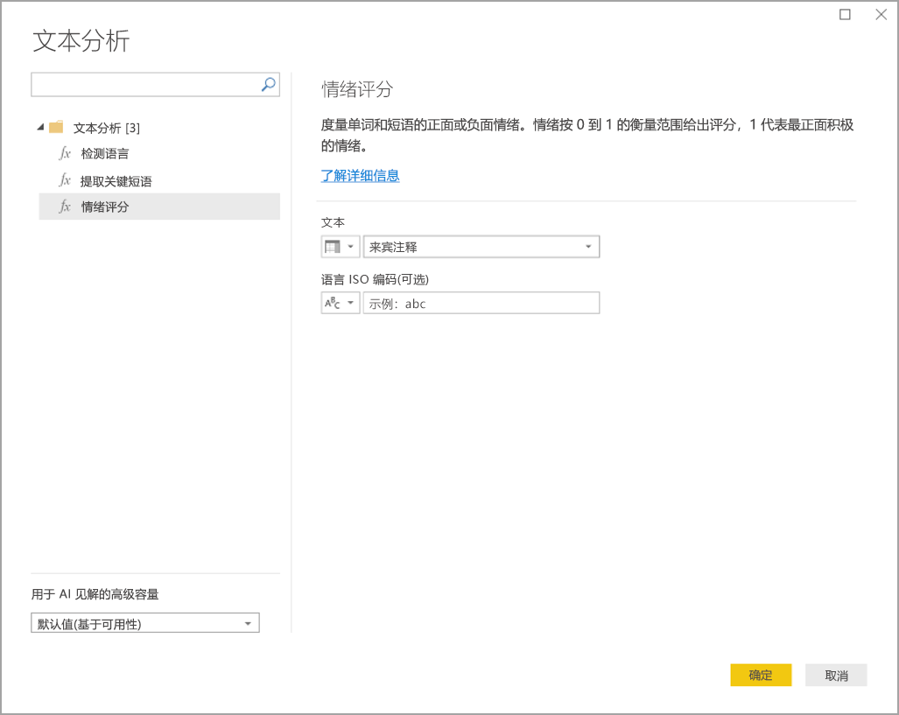
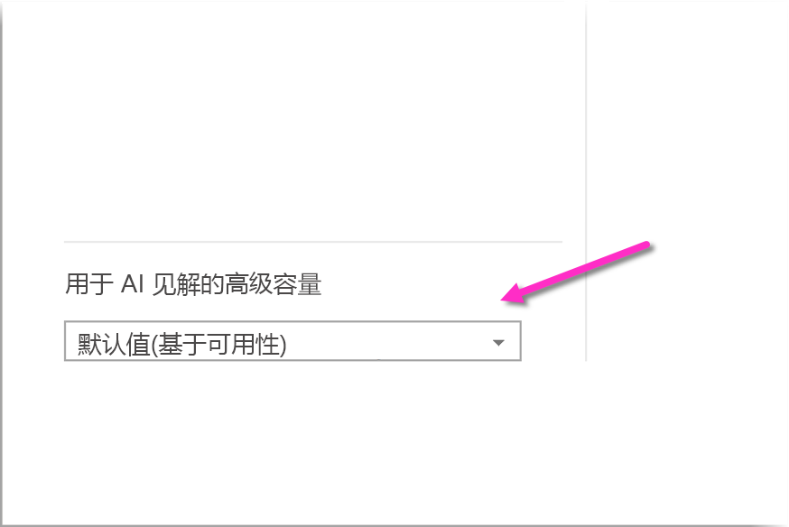
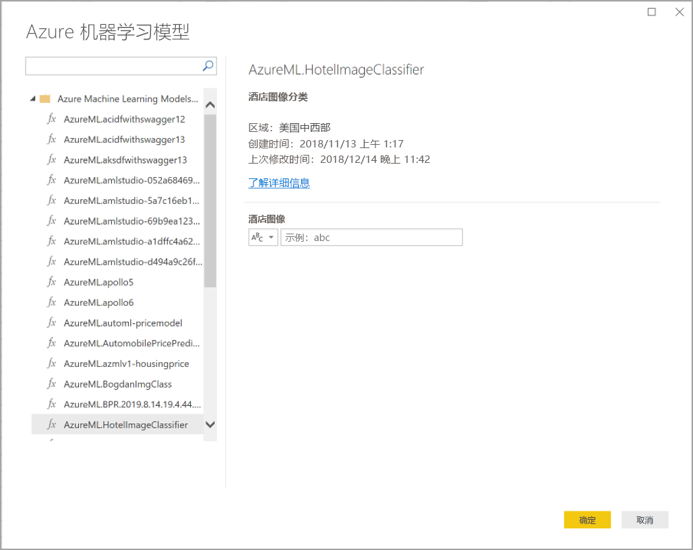

# 在 Power BI Desktop 中使用 AI 见解（预览）

在 Power BI 中，可以使用 AI 见解获得预先训练的机器学习模型的集合的访问权限，从而增强你的数据准备工作效果。 可在 Power Query 编辑器中访问 AI 见解，通过 Power Query 编辑器中的“主页”和“添加列”选项卡访问其关联的功能和函数     。 

本文介绍适用于 Azure 认知服务中的文本分析和视觉函数的函数。 本文中还描述了 Azure 机器学习 Power BI 中可用的自定义函数。

## 如何启用 AI 见解

Power BI 中的 AI 见解是预览功能，必须启用。 若要启用该功能，请选择“文件”>“选项和设置”>“选项”，然后从左侧列中选择“预览功能”   。 在右侧窗格中，有一个“AI 见解函数浏览器”选项  。 选中“AI 见解函数浏览器”旁的框，以启用预览功能  。 需要重新启动 Power BI Desktop 才能使预览功能更改生效。

## 使用文本分析和视觉

借助 Power BI 中的文本分析和视觉，可以应用 [Azure 认知服务](https://azure.microsoft.com/services/cognitive-services/)中的不同算法来丰富 Power Query 中的数据。

目前支持的服务如下：

* [情绪分析](https://docs.microsoft.com/azure/cognitive-services/text-analytics/how-tos/text-analytics-how-to-sentiment-analysis)
* [关键短语提取](https://docs.microsoft.com/azure/cognitive-services/text-analytics/how-tos/text-analytics-how-to-keyword-extraction)
* [语言检测](https://docs.microsoft.com/azure/cognitive-services/text-analytics/how-tos/text-analytics-how-to-language-detection)
* [图像标记](https://docs.microsoft.com/azure/cognitive-services/computer-vision/concept-tagging-images)。 

转换在 Power BI 服务上执行，无需 Azure 认知服务订阅。 

> [!IMPORTANT]
> 
> 使用文本分析或视觉功能需要 Power BI Premium。

### 在高级容量上启用文本分析和视觉

高级容量节点 EM2、A2 或 P1 及更高版本均支持认知服务。 容量上的单独 AI 工作负载用于运行认知服务。 在这些功能的公共预览期间（2019 年 6 月之前），默认情况下禁用此工作负载。 在 Power BI 中使用认知服务之前，必须在管理门户的容量设置中启用 AI 工作负载  。 可以在工作负载部分启用 AI 工作负载，并定义希望此工作负载使用的最大内存量   。 建议的内存限制为 20%。 超过此限制会导致查询速度变慢。

### 可用函数

本部分介绍 Power BI 中认知服务的可用函数。

#### 检测语言

语言检测函数评估文本输入，并为每个字段返回语言名称和 ISO 标识符。 此函数对于收集未知语言的任意文本的数据列很有用。 该函数应以文本格式的数据作为输入。

文本分析可识别多达 120 种语言。 有关详细信息，请参阅[支持的语言](https://docs.microsoft.com/azure/cognitive-services/text-analytics/text-analytics-supported-languages)。

#### 提取关键短语

关键短语提取函数评估非结构化的文本，并为每个文本字段返回一个关键短语列表  。 该函数需要一个文本字段作为输入，并接受“区域性信息”的可选输入  。

提供更大的文本块进行处理时，最适合使用关键短语提取。 这与情绪分析相反，情绪分析处理较小文本块的效果更好。 若要使两个操作都获得最佳结果，请考虑相应地重构输入。

#### 情绪评分

情绪评分函数计算文本输入，并为每个文档返回一个范围从 0（消极）到 1（积极）的情绪分数  。 此函数对于检测社交媒体、客户评论和论坛中的积极和消极情绪非常有用。

文本分析使用机器学习分类算法生成 0 到 1 之间的情绪分数。 接近 1 的分数表示积极情绪，接近 0 的分数表示消极情绪。 该模型经过预先训练，包含具有情绪关联的大量文本。 目前，无法提供你自己的训练数据。 该模型在文本分析过程中使用了多种技术，包括文本处理、词性分析、字词放置和字词关联。 有关算法的详细信息，请参阅[文本分析简介](https://blogs.technet.microsoft.com/machinelearning/2015/04/08/introducing-text-analytics-in-the-azure-ml-marketplace/)。

对整个输入字段执行情绪分析，而不是提取文本中特定实体的情绪。 事实上，当文档包含一个或两个句子而不是大块文本时，评分准确性会呈现提升趋势。 在客观性评估阶段，模型确定某个输入字段整体上是客观的还是包含情绪。 总体客观的输入字段不会进入到情绪检测短语阶段，结果是 0.50 分，无需进一步处理。 对于在管道中继续处理的输入字段，下一阶段将生成一个高于或低于 0.50 的分数，具体取决于在输入字段中检测到的情绪程度。

目前，情绪分析支持英语、德语、西班牙语和法语这几种语言。 其他语言均为预览版。 有关详细信息，请参阅[支持的语言](https://docs.microsoft.com/azure/cognitive-services/text-analytics/text-analytics-supported-languages)。

#### 标记图像

标记图像函数基于超过两千个可识别物体、生物、风景和动作返回标记  。 如果标记不明确或不常见，输出会提供“提示”，以便在已知环境的上下文中阐明标记的含义  。 标记不是作为分类法组织的，并且不存在继承层次结构。 内容标记的集合构成图像“说明”的基础，图像“说明”显示为完整句子格式的人类可读语言  。

上传图像或指定图像 URL 后，计算机视觉算法会根据图像中标识的物体、生物和动作输出标记。 标记不局限于主要主题（例如前景中的人物），它还可以包括背景（室内或室外）、家具、工具、植物、动物、配饰，小配件等元素。

此函数需要图像 URL 或 base-64 字段作为输入。 目前，图像标记支持英语、西班牙语、日语、葡萄牙语和简体中文。 有关详细信息，请参阅[支持的语言](https://docs.microsoft.com/rest/api/cognitiveservices/computervision/tagimage/tagimage#uri-parameters)。

### 在 Power Query 中调用文本分析或视觉函数

若要利用文本分析或视觉函数丰富数据，请打开 Power Query 编辑器  。 此示例演示如何为文本的情绪评分。 可以使用相同的步骤来提取关键短语、检测语言和标记图像。

在“主页”或“添加列”功能区中选择“文本分析”按钮    。 系统将提示你登录。

登录后，在弹出窗口中选择要使用的函数和要转换的数据列。

Power BI 选择要在其上运行函数的高级容量，并将结果发送回 Power BI Desktop。 所选容量仅用于应用程序中的文本分析和视觉功能，并在 Power BI Desktop 中刷新。 发布报表后，将在报表发布到的工作区的高级容量上运行刷新。 可以在弹出窗口左下角的下拉列表中更改用于所有认知服务的容量。

Cultureinfo 是一个可选输入，用于指定文本的语言  。 此字段中是 ISO 代码。 可以使用一个列作为 Cultureinfo 的输入，也可以使用静态字段。 在本例中，将整个列的语言指定为“英语 (en)”。 如果将此字段留空，Power BI 会在应用该函数之前自动检测语言。 接下来，选择“应用”  。

首次在新数据源上使用 AI 见解时，系统将提示你设置数据的隐私级别。

> [!NOTE]
> Power BI 中的数据集刷新将仅适用于隐私级别设置为“公共”或“组织”的数据源。

调用该函数后，结果将作为新列添加到表中。 还会添加转换作为查询中的一个应用步骤。

在图像标记和关键短语提取的情况下，结果可以返回多个值。 在原始行的副本上返回每个单个结果。

### 使用文本分析或视觉函数发布报表

在 Power BI Desktop 中编辑 Power Query 和执行刷新时，文本分析和视觉使用 Power Query 编辑器中选择的高级容量。 将报表发布到 Power BI 后，它将使用其所发布到的工作区的高级容量。

应用了文本分析和视觉函数的报表应发布到不在高级容量中的工作区，否则刷新数据集将会失败。

### 管理对高级容量的影响

以下部分介绍如何管理文本分析和视觉对容量的影响。

#### 选择容量

报表作者可以选择要对其运行 AI 见解的高级容量。 默认情况下，Power BI 会选择用户有权访问的第一个创建的容量。

#### 利用容量指标应用进行监视

高级容量所有者可以使用 [Power BI Premium 容量指标应用](../admin/service-admin-premium-monitor-capacity.md)来监视文本分析和视觉函数对容量的影响。 该应用提供容量内有关 AI 工作负载运行状况的详细指标。 顶部图表显示 AI 工作负载的内存占用。 高级容量管理员可设置每个容量的 AI 工作负载的内存限制。 当内存使用量达到限制时，可以考虑增加内存限制或将某些工作区移动到其他容量。

### 将 Power Query 与 Power Query Online 进行比较

Power Query 和 Power Query Online 中使用的文本分析和视觉函数是相同的。 体验之间的唯一差别如下：

* Power Query 为文本分析、视觉和 Azure 机器学习提供了不同的按钮。 在 Power Query Online 中，它们合并在一个菜单中。
* 在 Power Query 中，报表作者可以选择用于运行函数的高级容量。 这在 Power Query Online 中不是必需的，因为数据流已经在特定容量上。

### 文本分析的注意事项和限制

使用文本分析时，需要牢记几个注意事项和限制。

* 支持增量刷新，但在使用 AI 见解进行查询时可能会造成性能问题。
* 不支持直接查询。

## 使用 Azure ML

许多组织都使用机器学习  模型，以获得有关其业务的更好的见解和预测。 在报表、仪表板和其他分析中可视化和调用这些模型中的见解的功能可有助于将这些见解传播到最需要它们的业务用户。 Power BI 通过使用简单的点击手势可轻松整合托管在 Azure 机器学习上的模型中的见解。

若要使用此功能，数据科学家只需使用 Azure 门户向 BI 分析师授予访问 Azure ML 模型的权限。 然后，在每个会话开始时，Power Query 将发现用户具有访问权限的所有 Azure ML 模型，并将其作为动态 Power Query 函数公开。 然后，用户可以通过从 Power Query 编辑器中的功能区中访问这些函数来调用它们，或通过直接调用 M 函数来调用这些函数。 在为一组行调用 Azure ML 模型时，Power BI 还自动批处理访问请求，以实现更好的性能。

此功能在 Power BI Desktop、Power BI 数据流以及 Power BI 服务中的联机 Power Query 中受支持。

若要了解有关数据流的详细信息，请参阅 [Power BI 中的自助服务数据准备](service-dataflows-overview.md)。

若要了解有关 Azure 机器学习的详细信息，请参阅以下文章：

- 概述：[什么是 Azure 机器学习？](https://docs.microsoft.com/azure/machine-learning/service/overview-what-is-azure-ml)
- Azure 机器学习的快速入门和教程：[Azure 机器学习文档](https://docs.microsoft.com/azure/machine-learning/)

### 授予对 Azure ML 模型的访问权限

若要从 Power BI 访问 Azure ML 模型，用户必须具有对 Azure 订阅的读取  权限。 此外，它们必须具有以下各项：

- 对于机器学习工作室（经典）模型，具有对机器学习工作室（经典）Web 服务的读取权限 
- 对于机器学习模型，具有对机器学习工作区的读取权限 

此部分中的步骤介绍了如何向 Power BI 用户授予对托管在 Azure ML 服务上的模型的访问权限，以便他们可以将此模型作为 Power Query 函数进行访问。 有关更为详细的信息，请参阅[使用 RBAC 和 Azure 门户管理访问](https://docs.microsoft.com/azure/role-based-access-control/role-assignments-portal)。

1. 登录 [Azure 门户](https://portal.azure.com/)。
2. 转到“订阅”  页。 可以通过 Azure 门户左侧导航菜单中的“所有服务”  列表找到“订阅”  页。
3. 选择订阅
4. 选择“访问控制(IAM)”  ，然后选择“添加”  按钮。
5. 选择“读取器”  作为角色。 选择想要授予其访问 Azure AL 模型权限的 Power BI 用户。
6. 选择“保存” 
7. 重复第三步至第六步的操作，以向用户授予对特定机器学习工作室（经典）Web 服务或托管模型的机器学习工作区的读者访问权限   。

### 机器学习模型的架构发现

数据科学家主要使用 Python 来为机器学习开发甚至部署其机器学习模型。 与机器学习工作室（经典）（有助于自动执行创建模型的架构文件的任务）不同，在机器学习中，数据科学家必须使用 Python 显式生成架构文件。

此架构文件必须包含在为机器学习模型部署的 Web 服务中。 若要自动生成 Web 服务的架构，必须在已部署模型的条目脚本中提供输入/输出的示例。 请参阅 [Azure 机器学习服务文档的部署模型中关于（可选）自动生成 Swagger 架构](https://docs.microsoft.com/azure/machine-learning/how-to-deploy-and-where#optional-define-model-web-service-schema)的子节。 该链接包括示例条目脚本以及架构生成的语句。

具体来说，条目脚本中的 @input\_schema 和 @output\_schema 函数引用了 input\_sample 和 output\_sample 变量中的输入和输出示例格式，并在部署期间使用这些示例为 Web 服务生成 OpenAPI (Swagger) 规范     。

通过更新条目脚本生成架构的这些说明还必须应用于在自动化机器学习试验中使用 Azure 机器学习 SDK 创建的模型。

> [!NOTE]
> 使用 Azure 机器学习可视化界面创建的模型当前不支持架构生成，但后续版本将提供支持。
> 
### 调用 Power Query 中的 Azure ML 模型

你可以从 Power Query 编辑器中直接调用已授予访问权限的任何 Azure ML 模型。 若要访问 Azure ML 模型，请选择 Power Query 编辑器的“主页”或“添加列”功能区中的“Azure 机器学习”按钮    。

有权访问的所有 Azure ML 模型都在此处作为 Power Query 函数列出。 此外，会将 Azure ML 模型的输入参数自动映射为相应的 Power Query 函数的参数。

若要调用 Azure ML 模型，可以从下拉列表中将任一选定的实体的列指定为输入。 此外，还可以通过将列图标切换到输入对话框左侧来指定要用作输入内容的常量值。

选择“确定”  以查看作为实体表中新列的 Azure ML 模型的输出预览。 还会将模型调用视作查询的一个应用步骤。

如果模型返回多个输出参数，则会将它们组合在一起作为输出列中的记录。 可以展开列，以在单个列中生成单独的输出参数。

### Azure ML 的注意事项和限制

以下注意事项和限制适用于 Power BI Desktop 中的 Azure ML。

* 使用 Azure 机器学习可视化界面创建的模型当前不支持架构生成。 预计后续版本中会提供支持。
* 支持增量刷新，但在使用 AI 见解进行查询时可能会造成性能问题。
* 不支持直接查询。

## 后续步骤

本文提供了将机器学习集成到 Power BI Desktop 的概述。 以下文章也应该会非常有趣且实用。

- [教程：在 Power BI 中调用机器学习工作室（经典）模型](../connect-data/service-tutorial-invoke-machine-learning-model.md)
- [教程：在 Power BI 中使用认知服务](../connect-data/service-tutorial-use-cognitive-services.md)
- [Power BI 中的认知服务](service-cognitive-services.md)
- [Power BI 中的 Azure 机器学习集成](service-machine-learning-integration.md)
- [通过应用监视高级容量](../admin/service-admin-premium-monitor-capacity.md)
- [高级容量指标应用中的 AI 指标](https://powerbi.microsoft.com/blog/ai-metrics-now-available-in-power-bi-premium-capacity-metrics-app/)
