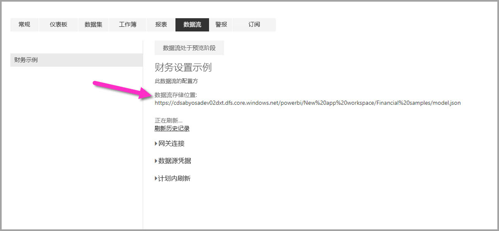

# 在 Power BI Desktop 中连接到 Power 平台数据流创建的数据
在 Power BI Desktop 中，可以连接到 Power 平台数据流创建的数据，就像在 Power BI Desktop 中连接任何其他数据源一样 。

通过 Power 平台数据流连接器，可以连接到 Power BI 服务中的数据流创建的实体。 

## 注意事项和限制

若要使用 Power 平台数据流连接器，必须运行最新版本的 Power BI Desktop。 可随时[下载 Power BI Desktop](../fundamentals/desktop-get-the-desktop.md) 并将其安装到计算机上，以确保使用最新版本。  

> [!NOTE]
> 旧版 Power 平台数据流连接器需要下载一个 .MEZ 文件并将其放入文件夹中。 当前版本的 Power BI Desktop 包括 Power 平台数据流连接器，因此不再需要该文件，并且它可能导致与所包含的连接器版本冲突。 如果手动将该 .MEZ 文件放入文件夹，必须从“文档”>“Power BI Desktop”>“自定义连接器”文件夹删除下载的那个 .MEZ 文件，避免出现冲突。 

## 桌面性能
Power BI Desktop 在安装它的计算机上本地运行。 数据流的引入性能由多种因素决定。 这些因素包括数据大小、计算机的 CPU 和 RAM、网络带宽、与数据中心之间的距离以及其他因素。

用户可以提高数据流的数据引入性能。 例如，如果引入的数据大小太大，无法在计算机上管理 Power BI Desktop，可以使用数据流中的链接实体和计算实体来聚合数据（数据流内）并仅引入预先准备好的聚合数据。 

通过这种方式，可以在数据流中在线处理大型数据，而不是在 Power BI Desktop 正在运行的实例中本地执行。 这种方法可以让 Power BI Desktop 引入更少量的数据，并使用户始终拥有快速且响应及时的数据流体验。

## 注意事项和限制

大多数数据流驻留在 Power BI 服务租户中。 但是，Power BI Desktop 用户无法访问存储在 Azure Data Lake Storage Gen2 帐户中的数据流，除非他们是数据流的所有者，或者他们已被显式授权访问数据流的 CDM 文件夹。 请考虑以下情况：

1.  Anna 创建了一个新的工作区，并将其配置为存储组织 Data Lake 中的数据流。
2.  Ben 也是 Anna 所创建工作区的成员，他希望利用 Power BI Desktop 和数据流连接器从 Anna 创建的数据流获取数据。
3.  Ben 收到一个错误，因为他没有被添加为 Data Lake 中数据流的 CDM 文件夹的授权用户。

    

要解决此问题，必须授予 Ben 对 CDM 文件夹及其文件的读取权限。 可以在[本文](https://go.microsoft.com/fwlink/?linkid=2029121)中了解有关如何授予 CDM 文件夹访问权限的详细信息。

## 后续步骤
可通过 Power 平台数据流执行各种有趣的操作。 有关详细信息，请参阅下列资源：

* [数据流自助服务数据准备](service-dataflows-overview.md)
* [在 Power BI 中创建和使用数据流](service-dataflows-create-use.md)
* [在 Power BI Premium 上使用计算实体（预览）](service-dataflows-computed-entities-premium.md)
* [将数据流与本地数据源配合使用（预览）](service-dataflows-on-premises-gateways.md)
* [Power 平台数据流的开发人员资源（预览）](service-dataflows-developer-resources.md)

有关与 Azure Data Lake Storage Gen2 集成的详细信息，请参阅以下文章：

* [数据流和 Azure Data Lake 集成（预览）](service-dataflows-azure-data-lake-integration.md)
* [配置工作区数据流设置（预览）](service-dataflows-configure-workspace-storage-settings.md)
* [将 CDM 文件夹添加到 Power BI 作为数据流（预览）](service-dataflows-add-cdm-folder.md)
* [连接 Azure Data Lake Storage Gen2 以存储数据流（预览）](service-dataflows-connect-azure-data-lake-storage-gen2.md)

还有一些关于 Power BI Desktop 的文章，你可能会发现它们很有用：

* [Power BI Desktop 中的数据源](../connect-data/desktop-data-sources.md)
* [使用 Power BI Desktop 调整和合并数据](../connect-data/desktop-shape-and-combine-data.md)
* [直接将数据输入到 Power BI Desktop 中](../connect-data/desktop-enter-data-directly-into-desktop.md)   
