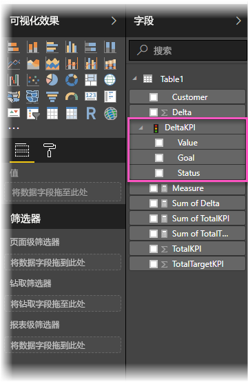
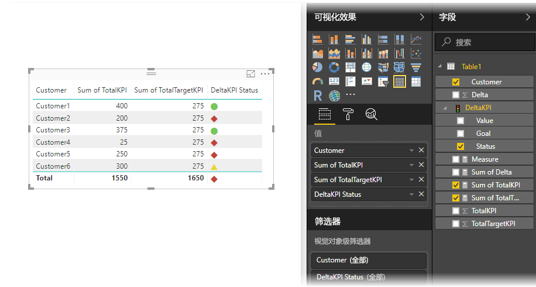

# 在 Power BI 中导入和显示 KPI
借助 Power BI Desktop  ，可以导入并显示表、矩阵和卡片中的 KPI。

按照以下步骤导入并显示 KPI。

1. 启动具有 Power Pivot 模型和 KPI 的 Excel 工作簿。 本练习会使用名为“KPI”的工作簿。 

1. 使用“文件”->“导入”->“Excel 工作簿内容”  ，将 Excel 工作簿导入到 Power BI 中。 也可以 [了解如何导入工作簿](../connect-data/desktop-import-excel-workbooks.md)。 

1. 导入到 Power BI 之后，KPI 将显示在“字段”  窗格中，并标记有图标。 若要在报表中使用 KPI，请确保展开其内容，显示“值”  、“目标”  和“状态”  字段。

    

1. 导入的 KPI 最好在标准可视化效果类型中使用，如“表”  类型。 Power BI 还包括“KPI”  可视化效果类型，应仅用于创建新的 KPI。
   
    

以上是其中包含的全部内容。 KPI 可用于突出显示趋势、进度或其他重要指标。
