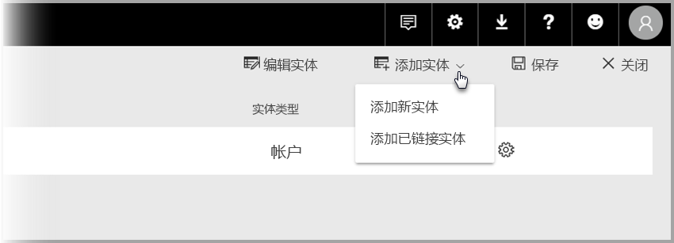

# 在 Power BI 中链接数据流之间的实体

借助 Power BI 中的数据流，可以拥有一个组织数据存储源，业务分析师可以在其中准备和管理一次数据，然后在组织中的不同分析应用之间重复使用。 

链接数据流之间的实体后，可以重复使用已由其他人拥有的其他数据流引入、清理和转换的实体，无需维护该数据。 链接的实体只是指向其他数据流中的实体，不会  复制数据。

链接的实体均为只读  状态。 如果要为链接的实体创建转换，必须创建一个引用链接的实体的新计算实体。

## 链接的实体的可用性

链接的实体需要刷新 [Power BI Premium](../admin/service-premium-what-is.md)订阅。 在 Power BI 高级容量上托管的工作区的任何数据流中都可以使用链接的实体。 对源数据流没有任何限制。

链接的实体只能在新的 Power BI 工作区中正常工作。 可以了解[新 Power BI 工作区](../collaborate-share/service-create-the-new-workspaces.md)的详细信息。 所有链接的数据流必须位于新工作区中才能正常工作。

> [!NOTE]
> 实体分为标准实体和计算实体。 标准实体（通常仅称为实体）可对外部数据源进行查询，例如 SQL 数据库。 计算实体在 Power BI 上需要高级容量，并且可对已位于 Power BI 存储中的数据运行其转换。 
>
>如果数据流不在高级容量工作区中，则只要转换未定义为存储内转换，就仍可以引用单个查询，或合并两个或更多查询。 此类引用被视为标准实体。 若要执行此操作，请为引用的查询关闭“启用加载”  选项，以防止数据具体化和引入到存储。 此后，可以引用这些“启用加载 = false”  查询，并仅针对要进行具体化的生成查询将“启用加载”  设置为  “打开”。

## 如何链接数据流之间的实体

通过几种方法可以在 Power BI 中链接数据流之间的实体。 可以从“数据流”创作工具中选择“添加链接的实体”  ，如下图所示。 

还可以从 Power BI 服务的“添加实体”  菜单项中选择“添加链接的实体”  。

要链接实体，必须使用 Power BI 凭据登录。

登录后将打开“导航器”  窗口，可以选择一组可连接的实体。 显示的实体是你在 Power BI 租户的所有工作区中拥有权限的那些实体。 

选择链接的实体后，这些实体将显示在创作工具中数据流的实体列表中，并带有一个特殊图标，将其标识为链接的实体。

另外，还可以从链接的实体的数据流设置中查看源数据流。

## 链接的实体的刷新逻辑
根据源数据流是否与目标数据流位于同一工作区中，链接实体的默认刷新逻辑也会发生变化。 以下两部分描述了这两种情况下的行为。

### 工作区之间的链接

刷新来自不同工作区中实体的链接的行为类似于外部数据源。 当数据流刷新时，它从源数据流中获取实体的最新数据。 如果源数据流刷新，不会自动影响目标数据流中的数据。

### 同一工作区中的链接

刷新源数据流的数据时，该事件会自动触发同一工作区中所有目标数据流中依赖实体的刷新过程，包括基于这些数据流的任何计算实体。 目标数据流中的所有其他实体根据数据流计划进行刷新。 依赖于多个源的实体会在其任何源成功更新时更新数据。

请务必注意一点：整个刷新过程同时提交。 因此，如果目标数据流刷新失败，源数据流也将无法刷新。

## 查看数据流中的报表的权限

在创建包含基于数据流的数据的 Power BI 报表时，用户只有在有权访问源数据流时才能看到任何链接的实体。

## 限制和注意事项

在使用链接的实体时，请注意一些限制：

* 最多有五个引用跃点
* 不允许链接实体的循环依赖项
* 数据流必须位于[新 Power BI 工作区](../collaborate-share/service-create-the-new-workspaces.md)中
* 链接实体无法与从本地数据源获取数据的常规实体联接
* 当某一查询（例如查询 A）用于数据流中另一个查询（查询 B）的计算时，查询 B 将成为计算实体。 计算实体不能引用本地源。

## 后续步骤

在创建或使用数据流时，下面的文章可能很有用。 

* [Power BI 中的自助服务数据准备](service-dataflows-overview.md)
* [在 Power BI 中创建和使用数据流](service-dataflows-create-use.md)
* [在 Power BI Premium 上使用计算实体](service-dataflows-computed-entities-premium.md)
* [将数据流与本地数据源配合使用](service-dataflows-on-premises-gateways.md)
* [Power BI 数据流的开发人员资源](service-dataflows-developer-resources.md)

有关 Power Query 和计划刷新的详细信息，可以阅读以下文章：
* [Power BI Desktop 中的查询概述](desktop-query-overview.md)
* [配置计划刷新](../connect-data/refresh-scheduled-refresh.md)

有关通用数据模型的详细信息，可以阅读其概述文章：
* [通用数据模型 - 概述](https://docs.microsoft.com/powerapps/common-data-model/overview)
