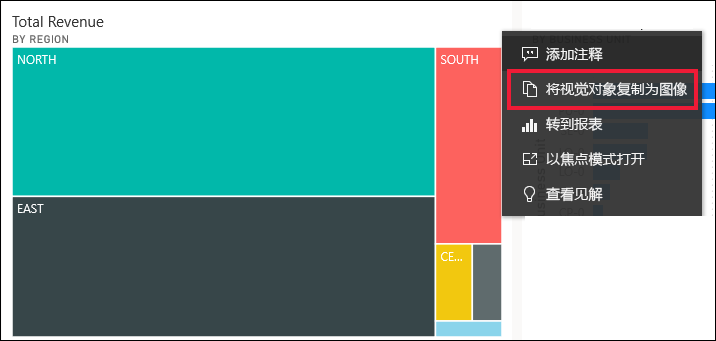
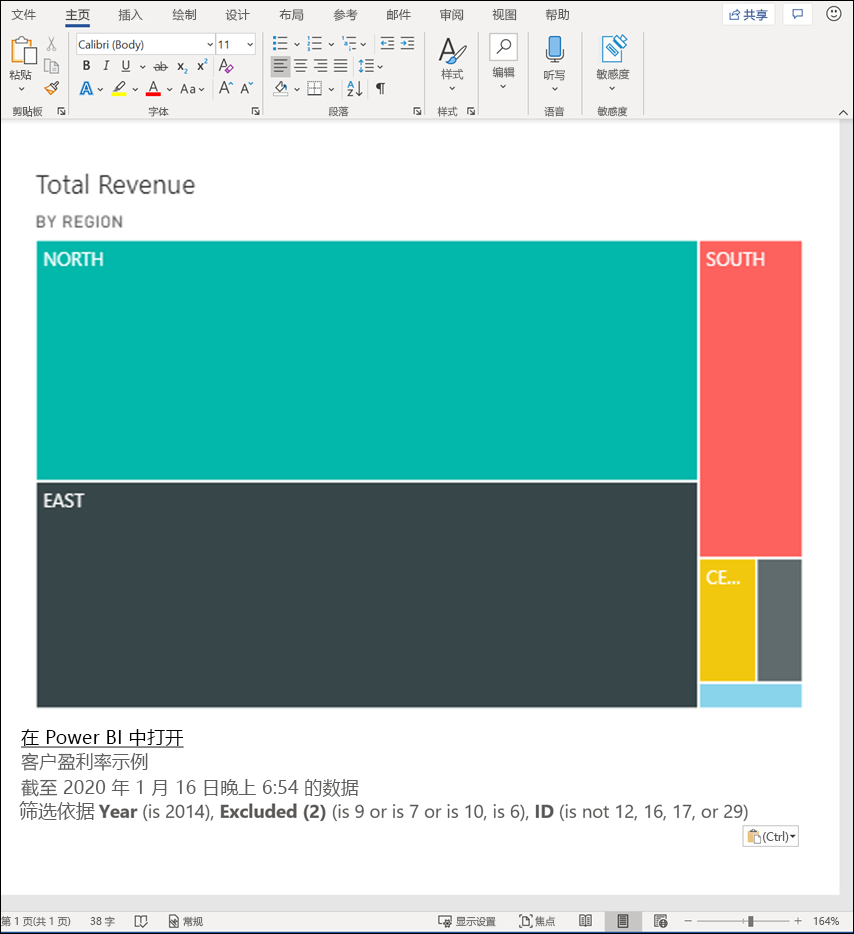
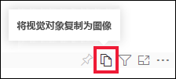
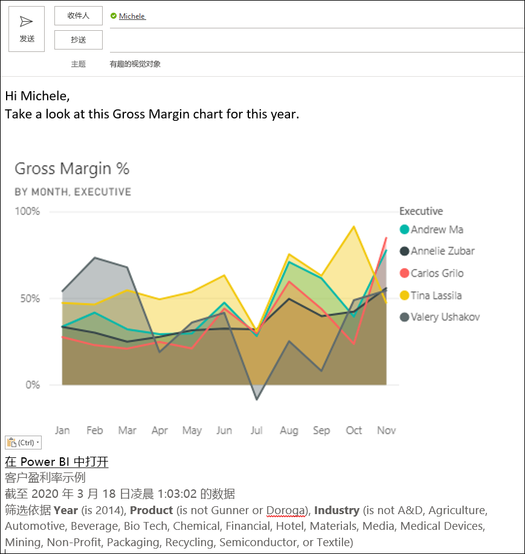
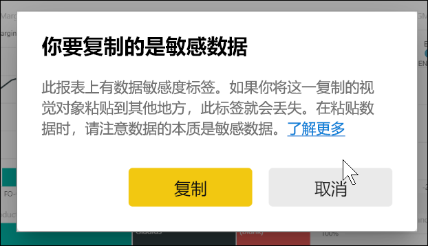
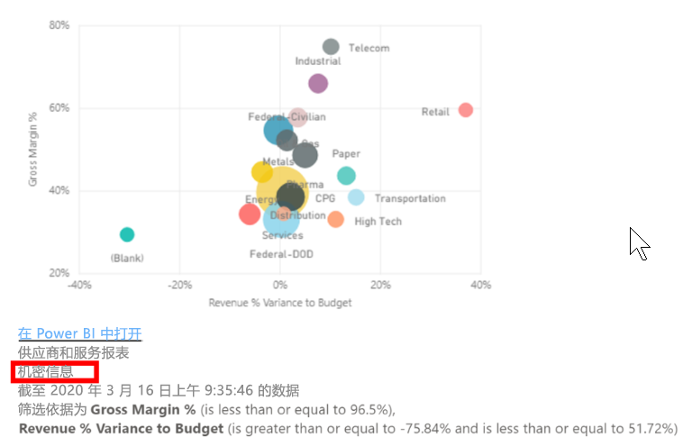
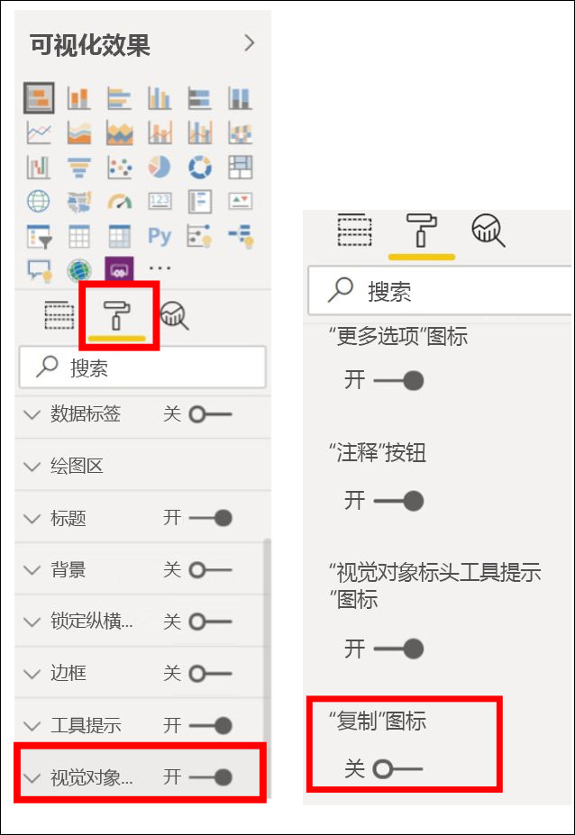
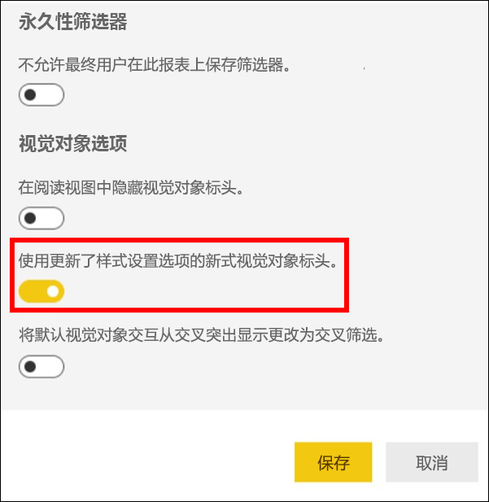
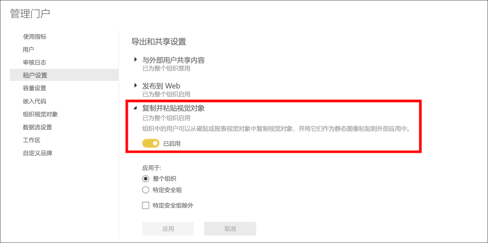
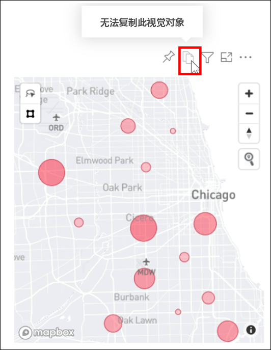

# 复制并粘贴报表可视化效果

[!INCLUDE[consumer-appliesto-yyyn](../includes/consumer-appliesto-yyyn.md)]

本文介绍了用于复制和粘贴视觉对象的两种不同方法。 
* 复制报表中的视觉对象并将其粘贴到其他报表页（需要报表的编辑权限）

* 将视觉对象的图像从 Power BI 复制到剪贴板，并将其粘贴到其他应用程序中

## 在同一报表中复制和粘贴
Power BI 报表中的视觉对象可从报表中的一页复制到同一报表的同一页或另一页。 

复制并粘贴可视化对象需要对报表拥有编辑权限。 在 Power BI 服务中，这意味着会在[编辑视图](../consumer/end-user-reading-view.md)中打开报表。 

仪表板上的可视化效果无法复制并粘贴到 Power BI 报表或其他仪表板上  。

1. 打开至少包含一个可视化对象的报表。  

2. 选择可视化效果，使用 **Ctrl +C** 复制，并使用 **Ctrl +V** 粘贴。      

   

## 将视觉对象作为图像复制到剪贴板

是否曾经想要分享 Power BI 报表或仪表板中的图像？ 现在你可以复制可视化对象并将其粘贴到其他支持粘贴的应用程序中。 

复制视觉对象的静态图像时，你将获得视觉对象的副本以及元数据。 这包括：
* 返回到 Power BI 报表或仪表板的链接
* 报表或仪表板的标题
* 注意图像是否包含机密信息
* 上次更新时间戳
* 应用于视觉对象的筛选器

### 从仪表板磁贴复制

1. 导航到要从中复制的仪表板。

2. 从视觉对象右上角，选择“更多选项(...)”，然后选择“将视觉对象复制为图像”   。 

    

3. “你的视觉对象可以复制了”对话框出现时，请选择“复制到剪贴板”   。

    

4. 视觉对象准备就绪后，请按 Ctrl + V 或单击右键 > 单击“粘贴”，将其粘贴到另一个应用程序中  。 在下面的屏幕截图中，我们将视觉对象粘贴到 Microsoft Word 中。 

    

### 从报表视觉对象中复制 

1. 导航到要从中复制的报表。

2. 从视觉对象右上角，选择“将视觉对象复制为图像”图标  。 

    

3. “你的视觉对象可以复制了”对话框出现时，请选择“复制到剪贴板”   。

    

4. 视觉对象准备就绪后，请按 Ctrl + V 或单击右键 > 单击“粘贴”，将其粘贴到另一个应用程序中  。 在下面的屏幕截图中，我们已将视觉对象粘贴到电子邮件中。

    

5. 如果报表应用了数据敏感度标签，则在选择复制图标时，会收到警告。  

    

    此外，敏感度标签将添加到粘贴的可视对象下方的元数据中。 

    

### 管理将视觉对象复制为图像的使用
如果你拥有内容或是租户的管理员，则可以控制是否可以从报表或仪表板将视觉对象复制为图像。

#### 为特定视觉对象禁用“复制为图像”
如果不希望用户能够复制特定视觉对象，则可以从该视觉对象中删除复制图标。
1. 选择“油漆滚刷”图标，打开“格式设置”窗格。 

1. 打开“视觉对象格式设置”卡  。
1. 向下滚动到“视觉对象标头”，展开此卡，然后关闭“复制”图标   。

    

1. 如果找不到“视觉对象标头”设置，请打开“报表设置”下的新式视觉对象标头选项   。 

    

1. 保存更改。 根据需要重新共享并重新发布。

#### 为一组用户禁用“复制为图像”

如果你拥有内容或是租户的管理员，则可以控制谁可以复制视觉对象。 此设置为用户在 Power BI 租户中访问的所有内容禁用“将视觉对象复制为图像”  。
  
1. 导航到管理门户。

1. 在“租户设置”下，选择“导出并共享设置”   。 

    

1. 为所选用户组禁用“复制并粘贴视觉对象”  。 

1. 保存更改，指定组在整个 Power BI 中都无法使用“将视觉对象复制为图像”  。 
  

## 注意事项和疑难解答

   

问：为什么对视觉对象禁用了“复制”图标？    
答：我们目前支持本机 Power BI 视觉对象和认证视觉对象。 对某些视觉对象的支持有限，其中包括： 
- ESRI 和其他映射视觉对象 
- Python 视觉对象 
- R 视觉对象 
- PowerApps 
- 非认证自定义视觉对象。有关支持的自定义视觉对象，请详细了解[如何认证自定义视觉对象](../developer/visuals/power-bi-custom-visuals-certified.md)。 

问：为什么我的视觉对象无法正确粘贴？    
答：将视觉对象复制为图像存在限制，包括： 
- 对于自定义视觉对象 
    - 具有应用主题和颜色的视觉对象 
    - 粘贴时磁贴缩放 
    - 带有动画的自定义视觉对象 
- 复制约束 
    - 无法复制刚固定的仪表板磁贴 
    - 无法将用户重定向到具有 Odata 筛选器和粘滞状态的内容，如个人书签 
- 有限支持从剪贴板粘贴 HTML 格式内容的应用程序可能无法呈现从视觉对象复制的所有内容 

## 后续步骤
有关 [Power BI 报表中的可视化效果](power-bi-report-visualizations.md)的详细信息

更多问题？ [尝试参与 Power BI 社区](https://community.powerbi.com/)

