# 教程：在 Power BI 报表中嵌入 Power Apps 视觉对象

本教程使用 Power Apps 视觉对象，创建可嵌入到示例 Power BI 报表中的新应用。 此应用可与报表中的其他视觉对象进行交互。

如果没有 Power Apps 订阅，请在开始之前先[创建一个免费帐户](https://web.powerapps.com/signup?redirect=marketing&email=)。

在本教程中，了解如何：
> [!div class="checklist"]
> * 向 Power BI 报表添加 Power Apps 视觉对象
> * 在 Power Apps 中创建一个使用 Power BI 报表中的数据的新应用
> * 在报表中查看 Power Apps 视觉对象并与之交互

## 先决条件

* [Google Chrome](https://www.google.com/chrome/browser/) 或 [Microsoft Edge](https://www.microsoft.com/windows/microsoft-edge) 浏览器
* 安装了[机会分析示例](https://docs.microsoft.com/power-bi/sample-opportunity-analysis#get-the-content-pack-for-this-sample)的 [Power BI 订阅](https://docs.microsoft.com/power-bi/service-self-service-signup-for-power-bi)
* 了解如何[在 Power Apps 中创建应用](https://docs.microsoft.com/powerapps/maker/canvas-apps/data-platform-create-app-scratch)以及如何[编辑 Power BI 报表](https://docs.microsoft.com/power-bi/service-the-report-editor-take-a-tour)

## 创建新应用
在报表中添加 Power Apps 视觉对象时，它会通过 Power Apps 与 Power BI 之间的实时数据连接启动 Power Apps Studio。

1. 打开“机会分析”示例报表，然后选择“临近的机会”  页面。 

2. 移动某些报表磁贴并调整其大小，为新的视觉对象留出空间。

    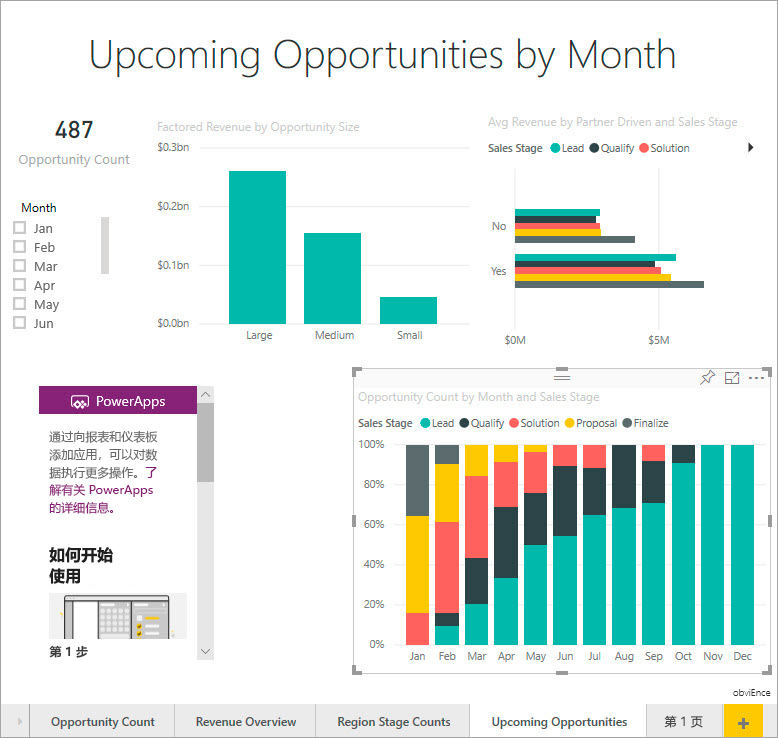

2. 从“可视化效果”窗格中选择“Power Apps”图标，然后调整视觉对象的大小以适合您留出的空间。

    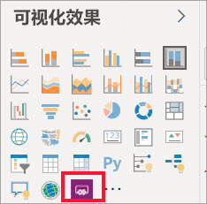

3. 在“字段”窗格中，选择“名称”、“产品代码”和“销售阶段”     。 

    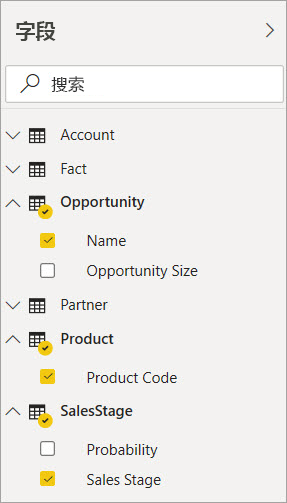

4. 在 Power Apps 视觉对象中，选择想要在其中创建应用的 Power Apps 环境，然后选择“新建”  。

    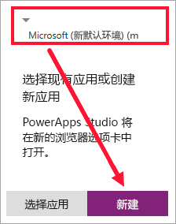

    在 Power Apps Studio 中，会看到已创建一个基本应用，以及一个库  ，显示了在 Power BI 中选择的一个字段。

    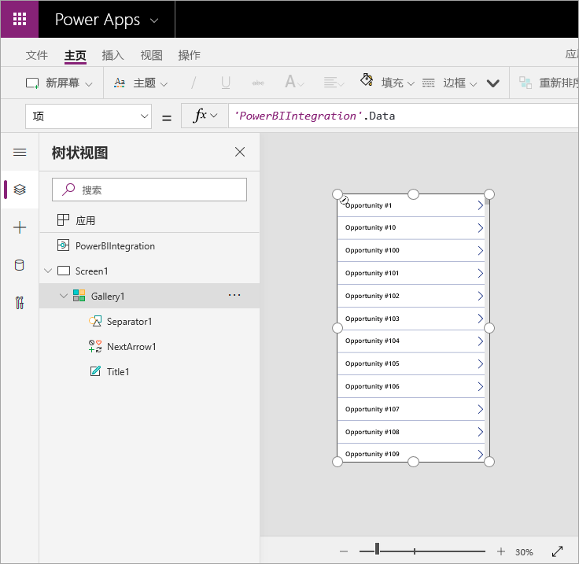

5.  调整库大小使其仅占用屏幕的一半。 

6. 在左窗格中，选择“Screen1”，然后将屏幕的“填充”属性设置为“LightBlue”（以便更好地呈现在报表中）   。

    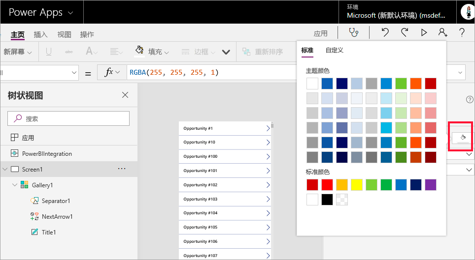

6. 为标签控件腾出空间。 

    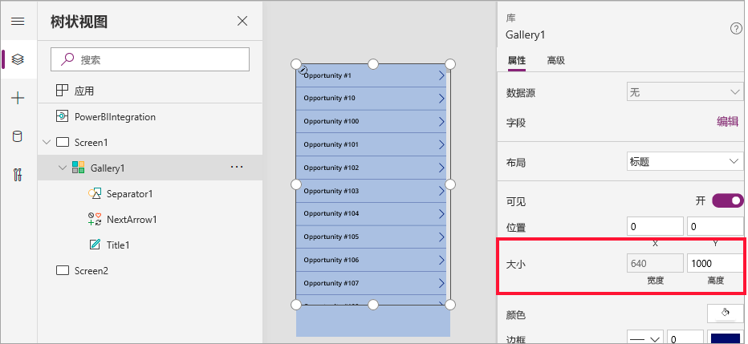

8. 在“库”  下，插入一个文本标签控件。

   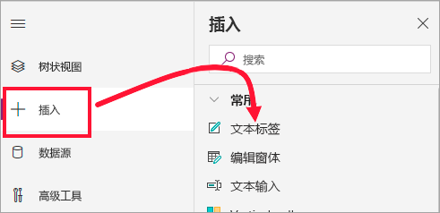

7. 将标签拖到视觉对象的底部。 将“Text”  属性设为 `"Opportunity Count: " & CountRows(Gallery1.AllItems)`。 它现在会显示数据集中的机会的总数。

    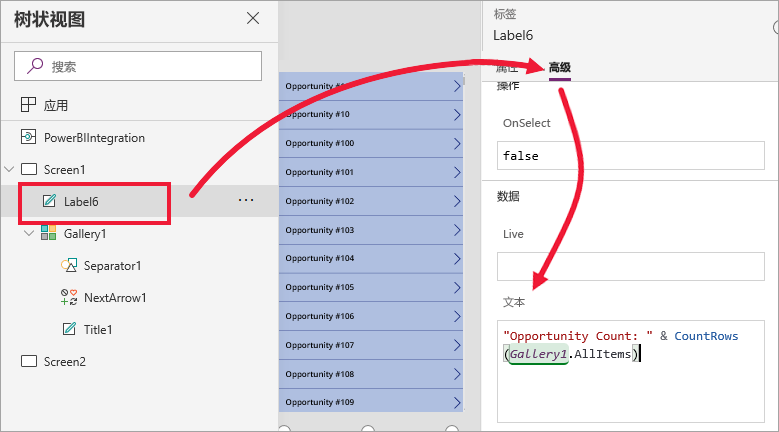

    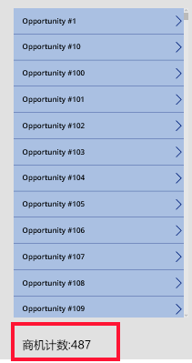

7. 保存应用并命名为“机会应用”。 

    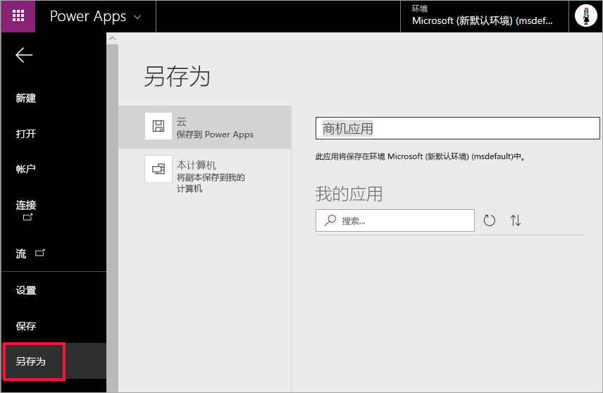

## 在报表中查看应用
应用现已在 Power BI 报表中可用，并且由于共享相同的数据源，所以可与其他视觉对象交互。

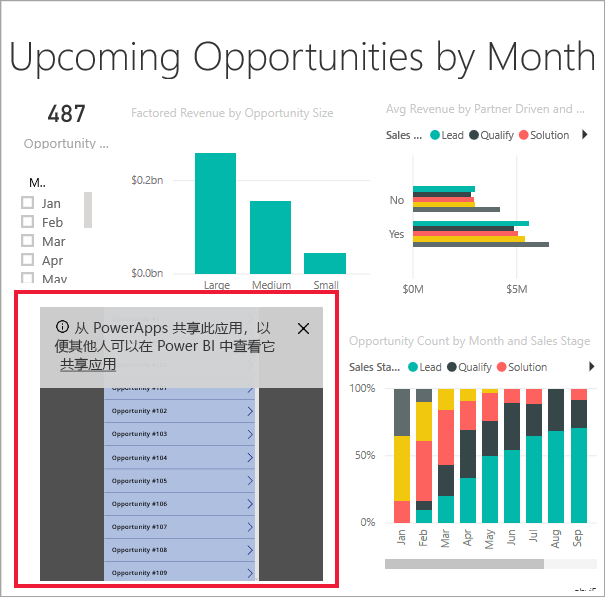

在 Power BI 报表中，选择切片器中的“一月”，这会筛选整个报表（包括应用中的数据）  。

请注意，应用中的机会计数应与报表左上角的计数相匹配。 可以选择报表中的其他项和应用更新中的数据。

## 清理资源
如果不想再使用机会分析示例，可删除仪表板、报表和数据集。

## 后续步骤
[问答视觉对象](power-bi-visualization-types-for-reports-and-q-and-a.md)    
[教程：在 Power BI 报表中嵌入 Power Apps 视觉对象](https://docs.microsoft.com/powerapps/maker/canvas-apps/powerapps-custom-visual)