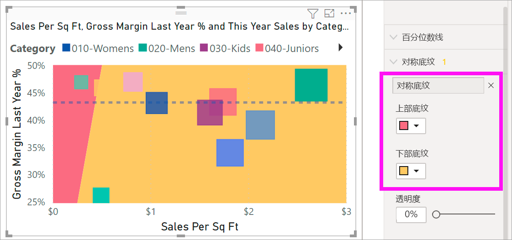

# Power BI 中的散点图、气泡图和点图

[!INCLUDE[consumer-appliesto-nyyn](../includes/consumer-appliesto-nyyn.md)]

[!INCLUDE [power-bi-visuals-desktop-banner](../includes/power-bi-visuals-desktop-banner.md)]

散点图始终有两个数值轴可以显示：一组沿水平轴的数值数据，另一组沿垂直轴的数值数据。 图表在 x 和 y 数值的交叉处显示点，将这些值单独合并到各个数据点。 Power BI 可以跨水平轴均匀或不均匀地分布这些数据点。 具体视散点图表示的数据而定。

可以设置数据点数量，最多 10,000 个。  

## 何时使用散点图、气泡图或点阵图

### 散点图和气泡图

散点图展示了两个数值之间的关系。 气泡图将数据点替换为气泡，用气泡大小  表示附加的第三个数据维度。

以下情况下，散点图是一个不错的选择：

* 若要显示两个数值之间的关系。

* 若要将两组数字绘制成一个 x 和 y 坐标系列。

* 若要更改水平轴的比例尺，但不是要使用折线图。

* 若要将水平轴转换为对数比例尺。

* 若要显示包含值对或已分组值集的工作表数据。

    > [!TIP]
    > 在散点图中，你可以调整轴的自由刻度来显示分组值的详细信息。

* 若要显示大型数据集中的模式，例如要显示线性或非线性趋势、簇状和离群值。

* 若要在不考虑时间的情况下，比较大量数据点。  散点图中包含的数据越多，比较的效果就越好。

除具有上述用途的散点图外，还有气泡图，它是以下情况下的理想之选：

* 如果数据有三个数据系列，每个系列分别包含一组值。

* 若要展示财务数据。  不同的气泡大小对增强特定值的视觉效果很有成效。

* 若要使用象限。

### 点阵图

点阵图类似于气泡图和散点图，不同之处在于其用于沿 X 轴绘制分类数据。

若要沿 X 轴添加分类数据，点阵图是理想之选。

## 先决条件

本教程使用[零售分析示例 PBIX 文件](https://download.microsoft.com/download/9/6/D/96DDC2FF-2568-491D-AAFA-AFDD6F763AE3/Retail%20Analysis%20Sample%20PBIX.pbix)。

1. 在菜单栏的左上方，选择“文件” > “打开”  
   
2. 查找**零售分析示例 PBIX 文件**的副本

1. 在报表视图中打开**零售分析示例 PBIX 文件**。

1. 选择  ，以添加新报表页。

> [!NOTE]
> 与 Power BI 同事共享报表时，你和这位同事都应具有独立的 Power BI Pro 许可证，并且应将报表保存在 Premium 容量中。    

## 创建散点图

1. 从空白报表页入手，在“字段”窗格中选择以下字段  ：

    * “销售额” > “每平方英尺的销售额”  

    * “销售额” > “总销售差额 %”  

    * “地区” > “地区”  

    

1. 在“可视化效果”  窗格中，选择 ， 以将簇状柱形图转换为散点图。

   

1. 将“地区”  从“详细信息”  拖动到  “图例”。

    此时，Power BI 显示散点图，它沿 Y 轴绘制“总销售额差异(%)”  ，并沿 X 轴绘制“销售额/平方英尺”  。 数据点的颜色表示地区：

    

现在让我们添加第三个维度。

## 创建气泡图

1. 在“字段”  窗格中，依次选择“销售额”   > “今年销售额”   > “值”  ，以将“值”拖到“大小”  井中。 数据点扩大到与销售值成正比的量。

   

1. 将鼠标悬停在一个气泡上。 该气泡的大小反映了  “今年销售额”的值。

    

1. 若要设置气泡图中显示的数据点数，请在“可视化效果”  窗格的“格式”  部分中，展开“常规”  ，并调整“数据量”  。

    

    可以将最大数据量设置为 10,000 及以下的任意数量。 随着数据的增加，建议先进行测试，以确保性能良好。

    > [!NOTE]
    > 数据点越多可能意味着加载时间越长。 如果确实选择发布有比例尺上限的报表，请务必也要跨 Web 和移动设备测试报表。 建议确认图表的性能是否符合用户预期。

1. 继续设置可视化颜色、标签、标题、背景等等。 若要[提高可访问性](../desktop-accessibility.md)，请考虑将标记形状添加到每个行。 若要选择标记形状，请展开“形状”  ，并依次选择“标记形状”  和形状。

    

    将标记形状更改为菱形、三角形或正方形。 对每行使用不同的标记形状可便于报表使用者更轻松地区分各行（或区域）。

1. 打开“分析”窗格  将其他信息添加到可视化效果中。  
    - 添加中线。 选择“中线” > “添加”   。 默认情况下，Power BI 为每平方英尺的销售额添加一条中线  。这并不是很有帮助，因为我们可以看到有 10 个数据点，并且知道创建的中值的每侧都有 5 个数据点。 相反，请将“度量值”切换到“总销售差额百分比”   。  

        

    - 添加对称底纹来显示哪些点的 x 轴度量值高于 y 轴度量值，反之亦然。 当在“分析”窗格中打开对称底纹时，Bipe BI 会根据当前轴的上下边界对称地显示散点图的背景。 这是一种确定数据点偏向哪个轴的快速方法，尤其是当 x 轴和 y 轴的轴范围不同时。

        a. 将“总销售差额百分比”字段更改为“去年毛利率百分比”  

        

        b. 在“分析”窗格中，添加“对称底纹”  。 从底纹中我们可以看出，袜类（粉色底纹区域的绿色气泡）是唯一倾向于毛利率而不是其每平方英尺销售额的类别。 

        

    - 继续探索“分析”窗格，以发现数据中有趣的见解。 

        

## 创建点阵图

若要创建点阵图，请将数字“X 轴”  字段替换为分类字段。

在“X 轴”  窗格中，删除“销售额/平方英尺”  ，并改为依次选择“区域”   > “区域经理”  。

## 注意事项和疑难解答

### 散点图只有一个数据点

散点图是否只有一个数据点来聚合 X 和 Y 轴上的所有值？  或者，也许聚合了水平线或垂直线上的所有值？

请将字段添加到“详细信息”  井，以指示 Power BI 如何对值进行分组。 每个要绘制的点必须具有唯一的字段。 简单的行号或 ID 字段即可。

如果数据中没有这些字段，可以创建一个字段，将 X 值和 Y 值全部连接到每个点对应的唯一字段中：

要创建新字段，请[使用 Power BI Desktop 查询编辑器将索引列添加到数据集](../create-reports/desktop-add-custom-column.md)。 然后，将此列添加到可视化效果的“详细信息”  井。

## 后续步骤

你可能还会对以下文章感兴趣：

* [Power BI 散点图中的高密度采样](../create-reports/desktop-high-density-scatter-charts.md)
* [Power BI 中的可视化效果类型](power-bi-visualization-types-for-reports-and-q-and-a.md)
* [关于在 Power BI 报表中排序和分配数据绘图的提示](../guidance/report-tips-sort-distribute-data-plots.md)

更多问题？ [尝试参与 Power BI 社区](https://community.powerbi.com/)
